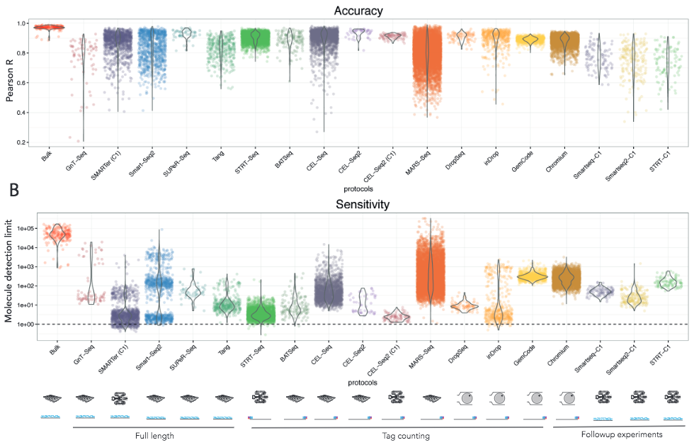

# scRNA-seq介绍 {#introduction_to_single_cell_rna_seq}

```{r, echo=FALSE,warning=FALSE}
library(knitr)
opts_chunk$set(fig.align = "center", echo=FALSE)
```

## Bulk RNA-seq

* 2000年后期取得重大突破，取代微阵列芯片被广泛采用
* 测量大量混合细胞的**平均表达水平**
* 用于比较转录组学，例如比较不同物种同一组织的样本
* 用于量化整体表达特征，例如疾病研究
* **不足:**研究异质性系统，例如早起发育的研究，复杂组织(脑)的研究
* **不能:**呈现基因表达随机性
    
## scRNA-seq

* 一项**新兴**技术，第一篇文章为汤富酬发表在Nature method [@Tang2009-bu]
* 直到[~2014](https://www.ohio.edu/bioinformatics/upload/Single-Cell-RNA-seq-Method-of-the-Year-2013.pdf)年，新测序手段和更低的成本使其流行起来
* 在大量细胞检测每个基因的表达水平
* 可以研究新的生物学问题，其中**转录组的细胞特异性变化是重要的**，比如细胞类型鉴定，细胞响应的异质性，基因表达的随机性，细胞间基因调控网络的推断
* 研究细胞数目从**$10^2$**到*$10^6$*个细胞，而且每年递增
* 目前有不同单细胞的protocol，比如SMART-seq2 [@Picelli2013-sb], CELL-seq [@Hashimshony2012-kd] 和 Drop-seq [@Macosko2015-ix]
* 也有商业平台, 包括 [Fluidigm C1](https://www.fluidigm.com/products/c1-system), [Wafergen ICELL8](https://www.wafergen.com/products/icell8-single-cell-system) 和 [10X Genomics Chromium](https://www.10xgenomics.com/single-cell/)
* 一些计算分析bulk RNA-seq的方法**也适用于** scRNA-seq
* **大多数情况下** scRNA-seq计算分析需要调整已有方法或者开发新方法

## 工作流程

```{r intro-rna-seq-workflow, out.width = '90%', fig.cap="单细胞测序流程 (源自wiki)"}
knitr::include_graphics("figures/RNA-Seq_workflow-5.pdf.jpg")
```

总体而言，scRNA-seq实验protocol和bulk RNA-seq类似，我们将在下一章讨论一些最常用的方法。

## 计算分析

本课程是用scRNA-seq实验获得的数据进行计算分析。

1. 第一步（黄色）对任何高通量测序数据都是通用的；
2. 后续步骤（橙色）需要整合现有的RNA-Seq分析方法和新方法来解决scRNA-Seq的技术差异；
3. 最后步骤（蓝色），用专门为scRNA-Seq开发的方法进行生物学解释。


```{r intro-flowchart, out.width = '65%', fig.cap="scRNA-seq分析流程图"}
knitr::include_graphics("figures/flowchart.png")
```

目前有几篇关于scRNA-seq分析的综述文章，其中包括 [@Stegle2015-uv]

目前，也有许多不同的平台能够执行上述流程图的一步或多个步骤，包括:

* [Falco](https://github.com/VCCRI/Falco/) 云端单细胞RNA-seq处理框架
* [SCONE](https://github.com/YosefLab/scone) (Single-Cell Overview of Normalized Expression), 单细胞RNA-seq数据质量控制和标准化的包.
* [Seurat](http://satijalab.org/seurat/) 用于单细胞RNA-seq数据质量控制，分析和数据探索的R包.
* [ASAP](https://asap.epfl.ch/) (Automated Single-cell Analysis Pipeline) 是一个单细胞分析交互式webserver.
* [Bioconductor](https://master.bioconductor.org/packages/release/workflows/html/simpleSingleCell.html) 是一个分析高通量基因组数据开源，开放式软件项目，包括分析单细胞数据的工具包。


## 挑战

相对于bulk RNA-seq，scRNA-seq最大特点测序文库是由**单个细胞**构成，而不是一群细胞。因此需要倍加重视来自不同细胞（测序文库）之间的结果比较。而文库之间差异的主要来源是:

* **扩增偏好性和扩增效率** （高达1,000,000倍）
* **基因的'dropout'**，即其中一个基因在一个细胞中能够取得中等表达水平，但在另外一个细胞没有检测到[@Kharchenko2014-ts].

在这两种情况下，由于RNA仅来自一个细胞，因此起始数量过低的转录本是导致差异形成的主要原因。所以提高转录本捕获效率和减少扩增偏差是目前活跃的研究领域。从后续的课程我们也可以看到，可以通过适当的标准化和校正方法来缓解这些问题。

## 实验方法

```{r, fig.cap="单细胞转录组学摩尔定律 (图片来自 [Svensson et al](https://arxiv.org/abs/1704.01379))", out.width = '100%'}
knitr::include_graphics("figures/moores-law.png")
```

开发新的scRNA-seq方法和protocol是目前非常活跃的一个研究领域，在过去的几年中已经发表了一些protocol，不完全列表如下:

* CEL-seq [@Hashimshony2012-kd]
* CEL-seq2 [@Hashimshony2016-lx]
* Drop-seq [@Macosko2015-ix]
* InDrop-seq [@Klein2015-kz]
* MARS-seq [@Jaitin2014-ko]
* SCRB-seq [@Soumillon2014-eu]
* Seq-well [@Gierahn2017-es]
* Smart-seq [@Picelli2014-ic]
* Smart-seq2 [@Picelli2014-ic]
* [SMARTer](http://www.clontech.com/US/Products/cDNA_Synthesis_and_Library_Construction/Next_Gen_Sequencing_Kits/Total_RNA-Seq/Universal_RNA_Seq_Random_Primed)
* STRT-seq [@Islam2014-cn]

这些方法可以按照不同方法进行归类，最重要的两个方面是**定量**和**捕获**

定量有两种类型，**全长**和**基于标签**。前者试图达到每个转录本均匀覆盖率；然而基于tag的protocol只捕获每个RNA的5'或3'端。选择不同的定量方法对于分辨数据可以采用什么样类型的分析方法具有重要意义。理论上讲，基于全长的protocol可以对整个转录本进行均匀测序，然而通常测序覆盖有偏差。基于tag的protocol主要优势是其可以和唯一的分子标识符结合使用，提高定量准确性(查看章节 \@ref(umichapter))。相对的，由于测序限制在转录组的一端，比对map率会降低，并且难以区分不同的异构体[@Archer2016-zq]。

捕获的策略决定了通量，细胞如何被选择以及除测序外还可以获得哪种附加信息。三种常用的方法是基于**微孔(microwell)-**，**微流体(microfluidic)-**，**液滴(droplet)-**的方法。

```{r, fig.cap="微孔板 (图片来自wiki)"}

```

对于基于微孔的平台，使用例如移液管或激光捕获分离细胞并置于微流体孔中。 基于微孔的方法的一个优点是它们可以与荧光激活细胞分选（FACS）结合，基于表面标记物分选细胞。 因此，当想要分离特定细胞群体用于测序时，该策略非常有用。 另一个优点是可以拍摄细胞的照片。 该图像提供了额外的细胞形态，适用于识别包含受损细胞或双份细胞的微孔。 这些方法的主要缺点是它们通常是通量低并且每个单细胞所需的工作量可能相当大。


```{r, fig.cap="96孔Fluidigm C1芯片 (图片来自Fluidigm)"}
knitr::include_graphics("figures/fluidigmC1.jpg")
```

微流体平台, 比如 [Fluidigm's C1](https://www.fluidigm.com/products/c1-system#workflow), 提供了更加集成的系统，用于捕获细胞和进行文库制备所需的过程。 因此，它们提供比基于微孔的平台更高的通量。 通常，在微流体平台中仅捕获约10％的细胞，因此不适合处理稀有细胞类型或非常少量的细胞。 此外，芯片相对昂贵，但由于反应可以以较小的体积进行，因此可以节省试剂。

```{r, out.width = '60%', fig.cap="drop-seq方法的原理图 (图片来自Macosko et al)"}
knitr::include_graphics("figures/drop-seq.png")
```

基于液滴的方法将每个单独的细胞与包括建库所需酶的珠子(bead)一起封装在纳升液滴内。每个珠子都包含唯一的条形码(barcode)，加到所有来自该细胞的序列上。因此可以合并所有液滴进行测序，再基于barcode将序列分配给不同的细胞。Droplet平台通常具有最高的通量，因为建库准备成本约为$.05$ 美元/细胞。因而，测序成本成为其主要限制因素，通常实验覆盖率低，仅检测到几千个转录本 [@Ziegenhain2017-cu]。

## 如何选择合适的平台

最合适的平台取决于手头的生物学问题。 例如，如果研究组织的组成，那么将允许捕获非常大量细胞的基于液滴的方法可能是最合适的。 另一方面，如果人们对具有已知表面标记物的稀有细胞类群感兴趣，那么最好使用FACS进行富集，然后对较少数量的细胞进行测序。

显然，如果研究不同的异构体，那么全长转录物定量将更合适。相比之下，UMI只能与基于tag的protocol一起使用，促进基因水平的量化。

来自Enard group [@Ziegenhain2017-cu]和Teichmann group [@Svensson2017-op]最近两项研究比较了几种不同的protocol。Ziegenhain等人在同一小鼠胚胎干细胞样本（mESCs）上比较了五种不同的protocol。通过控制细胞数量和测序深度，作者能够直接比较不同protocol的灵敏度，噪声水平和成本。 他们的结论的一个例子如下图所示，不同protocol检测的基因数量（对于给定的检测阈值）差别很大。drop-seq和Smart-seq2之间几乎有两倍的差异，这表明protocol的选择会对研究有重大影响。

```{r, out.width = '60%', fig.cap="Enard group 研究"}
knitr::include_graphics("figures/ziegenhainEnardFig1.png")
```

Svensson等采用了另外一种方法，通过使用已知浓度的合成转录本（**spike-ins**，后面详细介绍）来测量不同protocol的准确性和灵敏度。通过广泛的比较研究，他们同样发现不同protocol间区别较大。

```{r, out.width = '100%', fig.cap="Teichmann group 研究"}

```

随着实验技术的发展和用于量化技术噪声的计算方法的改进，后续研究有助于我们进一步了解不同方法的优缺点。因为基准测试可以确定哪些策略是最有用的，这些比较研究不仅有助于研究人员决定使用哪种protocol，而且有助于开发新方法。

