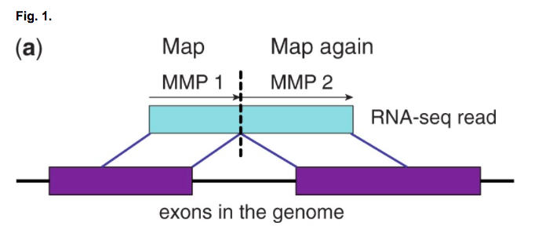
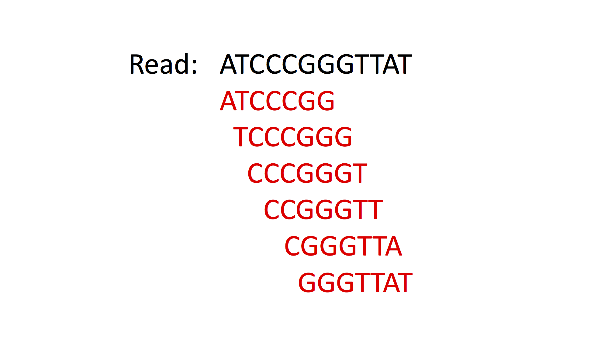
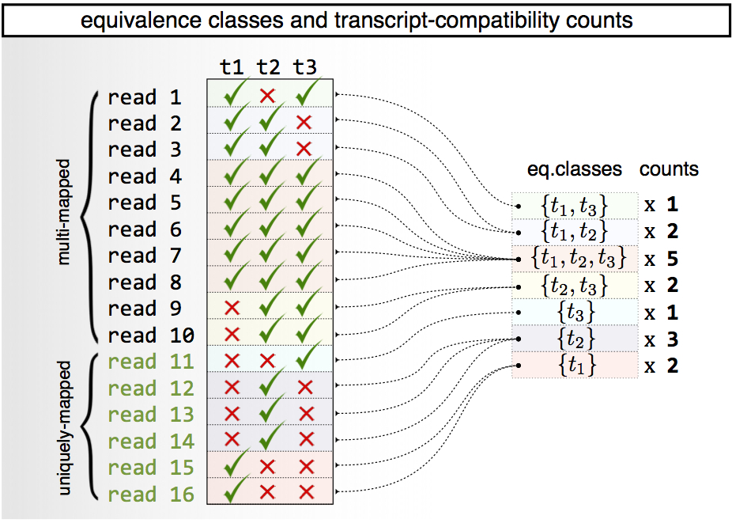

```{r include=FALSE}
library('bookdown')
```

# scRNA-seq原始数据处理 {#processing_raw_scrna_seq_data}

## FastQC

获得单细胞RNA-seq数据后，首先要做的就是检查测序质量，我们使用FastQC来完成此任务。 FastQC是用于测序数据的质量控制工具，既可以用于bulk RNA-seq，也可以用于scRNA-seq。 FastQC将测序数据作为输入，并返回测序质量的报告。访问以下链接获取更多关于FastQC的信息：

[https://www.bioinformatics.babraham.ac.uk/projects/fastqc/](https://www.bioinformatics.babraham.ac.uk/projects/fastqc/)

该网站包含下载和安装FastQC的链接以及生成报告的文档。幸运的是，我们已经为您安装了FastQC^[*译者注:* Docker镜像中已经安装FastQC]，因此这里我们将查看文档。将网页向下滚动到“示例报告”，然后单击"Good Illumina Data"。 这里给出了高质量Illumina测序数据立项报告的示例。

现在让我们自己生成一份FastQC报告。

今天，我们将使用[@Kolodziejczyk2015-xy]生成的mESC单细胞数据集进行分析。细胞使用SMART-seq2 protocol构建测序文库并进行双端测序。这些文件位于`Share`文件夹中。

**注意** 本课程的当前文本是为参加我们课程的人员编写的。您必须下载文件（`ERR522959_1.fastq`和`ERR522959_2.fastq`）并创建`Share`目录才能运行命令。你可以在这里找到这些文件：

[https://www.ebi.ac.uk/arrayexpress/experiments/E-MTAB-2600/samples/](https://www.ebi.ac.uk/arrayexpress/experiments/E-MTAB-2600/samples/)

现在让我们来看看文件:
```{bash, eval=FALSE}
less Share/ERR522959_1.fastq
less Share/ERR522959_2.fastq
```

**任务1**: 尝试找出生成FastQC报告的命令，提示: 尝试执行

```{bash, eval=FALSE, collapse=TRUE}
fastqc -h
```

该命令将告诉您可以传递给FastQC的参数。如果您遇到困难，请随时寻求帮助！ 如果运行成功，则应为正向和反向reads 都会生成.zip和.html文件。运行成功后，请跳到下一节。

### 解决方案并下载报告

如果还没有成功，请使用以下命令生成FastQC报告：

```{bash, eval=FALSE, echo = TRUE}
mkdir fastqc_results
fastqc -o fastqc_results Share/ERR522959_1.fastq Share/ERR522959_2.fastq
```

一旦命令执行完毕，您应该总共有四个文件 - 每个read对应一个zip和html文件，报告位于html文件中。 要查看它，我们需要使用filezilla或scp将它从AWS下载到您的计算机上。

下载到本地后，单击打开您的FastQC报告。记得要查看正向和反向read的质量报告！测序的质量如何？有什么我们应该关注的问题吗？ 我们如何解决这些问题呢？

## 移除接头和低质量碱基

Trim Galore是一个cutadapt的封装，用于移除测序接头序列和测序末端的低质量碱基。

鉴于FastQC报告中存在一些接头污染，最好从数据中移除接头序列。

**任务2**：数据中使用了哪种类型的接头序列？提示：查看FastQC报告"Adapter Contern"图。

现在让我们使用Trim Galore移除那些有问题的接头序列，修剪后再次检查读取质量，使用FastQC生成另一个报告。

**任务3**：找出移除adapter的命令。提示1：您可以使用

```{bash, eval=FALSE}
trim_galore -h
```

查看Trim Galore的参数描述。
提示2：仔细阅读上述命令的输出。本实验中使用的接头序列非常常见。您是否需要知道接头的实际序列才能将其删除？

**任务4**: 为清洗后的数据生成FastQC报告。接头序列污染消失了吗？

一旦您认为您已成功去除接头序列并通过FastQC确认，请使用下一部分核验您的结果。

### Solution

您可以使用以下命令去除Nextera测序接头序列：

```{bash, eval=FALSE}
mkdir fastqc_trimmed_results
trim_galore --nextera -o fastqc_trimmed_results Share/ERR522959_1.fastq Share/ERR522959_2.fastq
```

请记住为清洗后的数据文件重新生成FastQC报告！FastQC现在应该显示'Adaptor Content'为'pass'了。

祝贺您现在已生成测序质量报告并移除接头序列。在下一步中，我们将使用STAR和Kallisto将清洗后的reads比对到参考转录组上。

## 文件格式

### FastQ

FastQ是scRNA-seq数据中最原始数据格式。所有scRNA-seq protocol都使用双端测序，根据使用的protocol，条形码序列(barcode)可能出现在paired-reads中一条或两条上。但是使用唯一分子标识符(UMIs) 的protocol会生成包含细胞和UMI条形码加上接头序列但是没有转录本序列的read。因此虽然是双端测序，但比对时按照单端测序对待。

FastQ文件格式如下:
```{bash,eval=FALSE}
>ReadID
READ SEQUENCE
+
SEQUENCING QUALITY SCORES
```

### BAM

BAM文件以标准且高效的方式存储比对结果。SAM文件为直接可读的，而BAM文件是高度压缩的版本。BAM / SAM文件包含头部信息，通常包括样本制备，测序和比对的信息;后面为每个read的比对结果，以tab作为分隔符。

比对行标准格式如下:

(1) QNAME : read名称(如果为UMI文库，则包括UMI条形码)

(2) FLAG : 数字指示reads比对的类型, [link](https://broadinstitute.github.io/picard/explain-flags.html)该网站有所有可能的类型

(3) RNAME : 参考序列名称 (比如比对到的染色体名称).

(4) POS : 最左边比对位置

(5) MAPQ : 比对质量

(6) CIGAR : 表示reads中匹配/不匹配部分 (可能包括soft-clipping).

(7) RNEXT : mate/next reads比对到的参考序列名称

(8) PNEXT : mate/next reads比对到的第一个碱基位置

(9) TLEN : 模板长度（read比对到的参考区域的长度）

(10) SEQ : read序列

(11) QUAL : read质量

BAM/SAM 文件可通过'samtools'互相转换:

```{bash, eval=FALSE}
samtools view -S -b file.sam > file.bam
samtools view -h file.bam > file.sam
```

一些测序设备会自动将测序reads比对到标准基因组上，并提供BAM或CRAM格式文件。通常基因组中不包含ERCC序列，因此不会又ERCCs reads比对到在BAM / CRAM文件中。 要量化ERCC（或任何其他遗传变异），或者如果您只想使用不同于标准流程的比对算法（通常过时），那么您将需要将BAM / CRAM文件转换回FastQs:

BAM文件可以使用bedtools转为FastQ。为避免比对到多个基因组位置的一个read转换为FastQ多条read，首先将BAM文件按读取名称排序，并使用samtools删除次级比对。[Picard](https://broadinstitute.github.io/picard/index.html)也包含将BAM转换为FastQ文件的方法。

```{bash, eval=FALSE}
# sort reads by name
samtools sort -n original.bam -o sorted_by_name.bam
# remove secondary alignments
samtools view -b -F 256 sorted_by_name.bam -o primary_alignment_only.bam
# convert to fastq
bedtools bamtofastq -i primary_alignment_only.bam -fq read1.fq -fq2 read2.fq
```

### CRAM

[CRAM](https://www.ebi.ac.uk/ena/software/cram-usage)文件类似SAM文件，其头部信息包括比对使用的参考基因组信息，这使得read中和参考基因组一样的碱基可以进一步压缩。与BAM相比，CRAM还支持有损数据压缩方法以进一步优化存储。CRAM主要由Sanger/EBI测序机构使用。

CRAM和BAM文件可以使用最新版本的samtools（> = v1.0）进行格式转换。但是，这种转换可能需要将参考基因组下载到缓存中。 或者，您可以从CRAM文件的头部元数据预先下载参考基因组，或者询问生成CRAM文件的人获得参考基因组，并使用'-T'指定该文件。因此我们建议在执行此操作之前设置特定的缓存位置：

```{bash, eval=FALSE}
export REF_CACHE=/path_to/cache_directory_for_reference_genome
samtools view -b -h -T reference_genome.fasta file.cram -o file.bam
samtools view -C -h -T reference_genome.fasta file.bam -o file.cram
```

### 手动查看文件

有时，手动检查文件可能很有用，例如检查文件的头部信息。'less'和'more'可在命令行查看任何文本文件。管道符`|`可以在多个命令之间传输数据，省却把中间数据存储多个拷贝的过程。

```{bash, eval=FALSE}
less file.txt
more file.txt
# counts the number of lines in file.txt
wc -l file.txt
samtools view -h file.[cram/bam] | more
# counts the number of lines in the samtools output
samtools view -h file.[cram/bam] | wc -l
```

**练习**

现提供cram示例文件: EXAMPLE.cram 

**任务1**: 这个文件是怎么生成的？使用了什么软件？参考基因组时什么？(提示: 检查头部信息)

**任务2**: 有多少reads比对上/没有比对上？总共有多少reads？secondary alignments有多少? (提示: 使用FLAG)

**任务3**: 将CRAM转为Fastq文件。转换后的read只有一个拷贝吗？(将转换后的Fastq文件命名为"10cells_read1.fastq" "10cells_read2.fastq")

如果您遇到问题，可以通过输入命令来显示每个软件的帮助信息 - 例如 'samtools view'，'bedtools'

**答案**

```{bash, eval=FALSE}
samtools view -T data/2000_reference.transcripts.fa -H data/EXAMPLE.cram | more
samtools view -T data/2000_reference.transcripts.fa -f 4 data/EXAMPLE.cram | wc -l # unmapped
samtools view -T data/2000_reference.transcripts.fa -F 260 data/EXAMPLE.cram | wc -l # mapped
samtools view -T data/2000_reference.transcripts.fa -F 256 data/EXAMPLE.cram | wc -l # total
samtools view -T data/2000_reference.transcripts.fa -f 256 data/EXAMPLE.cram | wc -l # secondary alignments

samtools view -b -h -T data/2000_reference.transcripts.fa data/EXAMPLE.cram -o data/EXAMPLE.bam
samtools sort -n data/EXAMPLE.bam -o data/sorted_EXAMPLE.bam
samtools view -b -F 256 data/sorted_EXAMPLE.bam -o data/primary_EXAMPLE.bam 
# convert to fastq
bedtools bamtofastq -i data/primary_EXAMPLE.bam -fq data/10cells_read1.fq -fq2 data/10cells_read2.fq
```

### Genome (FASTA, GTF)

为了比对序列，需要参考基因组和基因组注释文件(GTF或者GFF格式)。模式生物的基因组和注释文件可以从目前主流的基因组数据库下载:
[Ensembl](http://www.ensembl.org/info/data/ftp/index.html), 
[NCBI](ftp://ftp.ncbi.nih.gov/genomes/), 或者 [UCSC Genome Browser](http://hgdownload.soe.ucsc.edu/downloads.html).

GTF文件包括基因，转录本和外显子的注释，格式如下：
(1) seqname : 染色体/scaffold编号
(2) source : 注释来源
(3) feature : 注释信息类型(比如基因，转录本，外显子)
(4) start : 起始位置 (bp)
(5) end : 终止 (bp)
(6) score : 得分
(7) strand : + (正链) or - (负链)
(8) frame : 仅对CDS有效，起始编码位置，或者到达下一个密码子需要跳过的碱基个数 (0 = first base, 1 = second base, etc..)
(9) attribute : `;`分割的键值对来显示其它信息 (比如 names/IDs, biotype)

空字段用"."填充

根据我们的经验，Ensembl是最容易使用的，并且具有最大的注释集。NCBI往往更严格，仅包括置信度高的基因注释。 而UCSC包含多个使用不同标准的基因组注释。

如果您的实验系统包含非标准序列，则必须将这些序列添加到基因组fasta和gtf中来定量它们的表达。 最常见的是针对ERCC spike-ins，CRISPR相关的序列或其他过表达/报告载体。

为了获得最大的可用性/灵活性，我们建议为添加的任何非标准序列创建完整和详细的fasta序列和gtf序列。

目前没有标准化的方法来做到这一点 以下是我们的自定义perl脚本，用于为ERCC创建一个gtf和fasta文件，可以将其附加到基因组中。如果要量化内含子读数时，您可能还需要更改gtf文件以处理内含子中的重复元素。任何脚本语言甚至“awk”或一些文本编辑器都可以用来相对有效地完成这项任务，但它们超出了本课程的范围。

```{bash, eval=FALSE}
# Converts the Annotation file from 
# https://www.thermofisher.com/order/catalog/product/4456740 to 
# gtf and fasta files that can be added to existing genome fasta & gtf files.

my @FASTAlines = ();
my @GTFlines = ();
open (my $ifh, "ERCC_Controls_Annotation.txt") or die $!;
<$ifh>; #header
while (<$ifh>) {
	# Do all the important stuff
	chomp;
	my @record = split(/\t/);
	my $sequence = $record[4];
	$sequence =~ s/\s+//g; # get rid of any preceeding/tailing white space
	$sequence = $sequence."NNNN";
	my $name = $record[0];
	my $genbank = $record[1];
	push(@FASTAlines, ">$name\n$sequence\n");
# is GTF 1 indexed or 0 indexed? -> it is 1 indexed
# + or - strand?
	push(@GTFlines, "$name\tERCC\tgene\t1\t".(length($sequence)-2)."\t.\t+\t.\tgene_id \"$name-$genbank\"; transcript_id \"$name-$genbank\"; exon_number \"1\"; gene_name \"ERCC $name-$genbank\"\n");
	push(@GTFlines, "$name\tERCC\ttranscript\t1\t".(length($sequence)-2)."\t.\t+\t.\tgene_id \"$name-$genbank\"; transcript_id \"$name-$genbank\"; exon_number \"1\"; gene_name \"ERCC $name-$genbank\"\n");
	push(@GTFlines, "$name\tERCC\texon\t1\t".(length($sequence)-2)."\t.\t+\t.\tgene_id \"$name-$genbank\"; transcript_id \"$name-$genbank\"; exon_number \"1\"; gene_name \"ERCC $name-$genbank\"\n");
} close($ifh);

# Write output
open(my $ofh, ">", "ERCC_Controls.fa") or die $!;
foreach my $line (@FASTAlines) {
	print $ofh $line;
} close ($ofh);

open($ofh, ">", "ERCC_Controls.gtf") or die $!;
foreach my $line (@GTFlines) {
	print $ofh $line;
} close ($ofh);
```

## 测序文库拆分

文库拆分根据Protocol不同或构建的流程不同需要有对应的处理方式。我们所知道的最灵活的文库拆分工具是[zUMIs](https://github.com/sdparekh/zUMIs/wiki/Usage)，可用于拆分和比对大多数基于UMI的protocol。对于Smartseq2或其他全长转录本双端测序protocol，数据通常已经被拆分好。诸如GEO或ArrayExpress之类的公共存储库需要在上传之前对基于小规模/基于板的scRNASeq数据拆分，并且许多测序公司在数据返回给您之前自动拆分数据。如果您没有使用已发表的流程，并且数据未被测序公司拆分，则您必须自己对其进行文库拆分。因为不同的建库方案引入的barcode序列的长度和位置不同，通常都需要自己写脚本解决。

对于所有数据类型，文库拆分涉及从一端或双端短序列中识别并移除细胞条形码序列(cell-barcode)。如果提前知道加入的cell-barcodes，比如数据来自基于PCR板的protocol，需要将每个cell-barcode与预期的cell-barcode进行比对，并将其归类于最相近的cell-barcode(根据cell-barcode的设计，一般允许最多1-2错配)。这些数据通常在比对之前进行拆分，从而可以并行比对。

我们提供公开可用[perl](https://github.com/tallulandrews/scRNASeqPipeline)脚本，可以拆分任何有或没有UMI 的plate-based的建库方案生成的数据，用法如下：

```{bash eval=FALSE}
perl utils/1_Flexible_UMI_Demultiplexing.pl data/10cells_read1.fq data/10cells_read2.fq "C12U8" data/10cells_barcodes.txt 2 Ex
```

```{bash, eval=FALSE}
Barcode Structure: 12 bp CellID followed by 8 bp UMI

        Doesn't match any cell: 0
        Ambiguous: 0
        Exact Matches: 400
        Contain mismatches: 0
        Input Reads: 400
        Output Reads: 400
```

```{bash, eval=FALSE}
perl utils/1_Flexible_FullTranscript_Demultiplexing.pl data/10cells_read1.fq data/10cells_read2.fq "start" 12 data/10cells_barcodes.txt 2 Ex
```

```{bash, eval=FALSE}
Doesn't match any cell: 0
Ambiguous: 0
Exact Matches: 400
Contain Mismatches: 0
Input Reads: 400
Output Reads: 400

```
对于包含UMI的数据，文库拆分包括将UMI code附加到包含基因区的序列read名字上。如果数据来自droplet-based protocol或SeqWell，其中预期条形码的数量远远高于预期的细胞数量，为避免生成才能大量的文件么cell-barcode也加到测序read的名字后面。在这些情况下，在量化步骤期间进行文库拆分，以便于识别来源于完整细胞而不是背景噪声的cell-barcode。

### 鉴定含有细胞的液滴/微孔

基于液滴的scRNA-seq方法，只有一部分液滴包含bead和一个完整的细胞。然而生物实验可能不理想，一些RNA会从死细胞/受伤细胞中泄露出去。因此，没有完整细胞的液滴可能捕获少量环境游离RNA，这些RNA将进入测序文库，出现在最终测序结果中。液滴大小，扩增效率和测序的变化将导致“背景”和真实细胞文库大小区别很大。目前已有很多方法用来区分对应真实细胞的cell-barcode 已经使用各种方法来试图区分对应于真实细胞的那些细胞条形码。

大多数方法使用每个barcode的总分子数（可以应用于总reads）并尝试寻找"break point"，区分来自真实细胞较大的文库和来自背景较小的文库。下面加载包含大小文库细胞的示例模拟数据：

```{r}
umi_per_barcode <- read.table("data/droplet_id_example_per_barcode.txt.gz")
truth <- read.delim("data/droplet_id_example_truth.gz", sep=",")
```
**练习**

多少唯一的barcode被检测到？
数据中多少来自真实的细胞？
为简化计算，去除所有少于10个分子的barcode。

**答案**
```{r, eval=FALSE}
dim(umi_per_barcode)[1]
dim(truth)[1]
```

一种方法是寻找每个条形码对应总分子突然下降的拐点。
One approach is to look for the inflection point where the total molecules per 
barcode suddenly drops: 

```{r}
barcode_rank <- rank(-umi_per_barcode[,2])
plot(barcode_rank, umi_per_barcode[,2], xlim=c(1,8000))
```

可以看出文库大小近似指数分布，简单起见，对数据进行log转换。

```{r}
log_lib_size <- log10(umi_per_barcode[,2])
plot(barcode_rank, log_lib_size, xlim=c(1,8000))
```

从上图可以看出，拐点更加明显了。我们可以手动估计拐点的位置，但是用算法估计更加精确，以及可重复。

```{r}
# inflection point
o <- order(barcode_rank)
log_lib_size <- log_lib_size[o]
barcode_rank <- barcode_rank[o]

rawdiff <- diff(log_lib_size)/diff(barcode_rank)
inflection <- which(rawdiff == min(rawdiff[100:length(rawdiff)], na.rm=TRUE))

plot(barcode_rank, log_lib_size, xlim=c(1,8000))
abline(v=inflection, col="red", lwd=2)

threshold <- 10^log_lib_size[inflection]

cells <- umi_per_barcode[umi_per_barcode[,2] > threshold,1]
TPR <- sum(cells %in% truth[,1])/length(cells)
Recall <- sum(cells %in% truth[,1])/length(truth[,1])
c(TPR, Recall)
```

另外一种方法是构建混合模型，找出重叠区域的最高和最低分布。然而数据可能并不满足假定的分布。

```{r,cache=TRUE,warning=FALSE}
set.seed(-92497)
# mixture model
require("mixtools")
mix <- normalmixEM(log_lib_size)
plot(mix, which=2, xlab2="log(mol per cell)")
p1 <- dnorm(log_lib_size, mean=mix$mu[1], sd=mix$sigma[1])
p2 <- dnorm(log_lib_size, mean=mix$mu[2], sd=mix$sigma[2])
if (mix$mu[1] < mix$mu[2]) {
	split <- min(log_lib_size[p2 > p1])
} else {
	split <- min(log_lib_size[p1 > p2])
}
```

**练习**

使用分割点识别细胞并计算TPR和Recall

**答案**

```{r, eval=FALSE}
cells <- umi_per_barcode[umi_per_barcode[,2] > 10^split,1]

TPR <- sum(cells %in% truth[,1])/length(cells)
Recall <- sum(cells %in% truth[,1])/length(truth[,1])
c(TPR, Recall)
```

第三种方法，CellRanger假设真实细胞文库大小变化范围在10倍以内，然后用哪个期望的细胞数目估计区间的分布。

```{r}
n_cells <- length(truth[,1])
# CellRanger
totals <- umi_per_barcode[,2]
totals <- sort(totals, decreasing = TRUE)
# 99th percentile of top n_cells divided by 10
thresh = totals[round(0.01*n_cells)]/10
plot(totals, xlim=c(1,8000))
abline(h=thresh, col="red", lwd=2)
```
**练习**

用该阈值识别细胞并计算TPR和Recall。

**答案**
```{r, eval=FALSE}
cells <- umi_per_barcode[umi_per_barcode[,2] > thresh,1]

TPR <- sum(cells %in% truth[,1])/length(cells)
Recall <- sum(cells %in% truth[,1])/length(truth[,1])
c(TPR, Recall)
```

最后[EmptyDrops](https://github.com/MarioniLab/DropletUtils)，目前处于Beta测试阶段，其实用所有液滴的基因 × 细胞分子计数矩阵，从具有极低counts的液滴估计背景RNA的分布，然后寻找与背景基因表达模式不同的细胞。背景RNA通常和群体中大部分细胞的表达模式相似，该方法与拐点方法相结合。因此，EmptyDrops是唯一能够识别高度多样化样本中鉴定小群体细胞条形码的方法。

下面提供了该方法的运行代码：（我们会根据官方发布及时更新代码）

```{r, eval=FALSE}
require("Matrix")
raw.counts <- readRDS("data/droplet_id_example.rds")

require("DropletUtils")
# emptyDrops
set.seed(100)
e.out <- emptyDrops(my.counts)
is.cell <- e.out$FDR <= 0.01
sum(is.cell, na.rm=TRUE)
plot(e.out$Total, -e.out$LogProb, col=ifelse(is.cell, "red", "black"),
    xlab="Total UMI count", ylab="-Log Probability")

cells <- colnames(raw.counts)[is.cell]

TPR <- sum(cells %in% truth[,1])/length(cells)
Recall <- sum(cells %in% truth[,1])/length(truth[,1])
c(TPR, Recall)
```
## 使用STAR比对read

现在我们已经对测序数据进行质控，并且获得了高质量的清洗后数据，下一步将其比对到参考基因组上。如果我们想要定量基因表达或筛选样品间差异表达的基因，则通常需要某种形式的比对。

短序列比对的工具有很多，目前我们主要关注两个。第一个工具是STAR [@dobin]，对于测序数据中的每一个read，STAR尝试寻找参考基因组中一个或多个最长可能序列。例如，下图所示，read(蓝色)跨越两个外显子和一个可变剪切位点(紫色)。STAR能够找出read的第一部分和序列的第一个外显子仙童，同时第二部分和序列的第二个外显子相同。因为STAR可能够以这种方式识别剪切事件，又被称为"spice aware alinger"。

```{r, out.width = '80%', fig.cap="STAR比对示意图, 来自Dobin et al.",fig.align='center',echo=FALSE}

```

通常，STAR将reads比对到参考基因组是允许其检测新的剪接事件或染色体重排。然而，STAR的一个问题是它需要大量的内存，特别是当参考基因组很大（例如，小鼠和人类）。为了加速我们今天的分析，我们将使用STAR将reads与只包含2000个转录本的参考转录组进行比对。请注意，这不是正常或推荐的做法，我们只是出于时间原因这样做。我们建议比对到参考基因组。

STAR对齐需要两个步骤。第一步，用户向STAR提供参考基因组序列（FASTA）和注释文件（GTF），STAR用它来创建基因组索引。 第二步，STAR将用户的reads比对到基因组索引。

首先现在创建索引。请记住，由于时间的原因，我们比对到转录组而不是基因组，这意味着我们只需要向STAR提供比对的转录本序列。可以从[Ensembl](https://www.ensembl.org/info/data/ftp/index.html)获取许多模式生物的转录组数据。

任务 1: 执行以下命令创建索引:
```{bash, eval=FALSE}
mkdir indices
mkdir indices/STAR
STAR --runThreadN 4 --runMode genomeGenerate --genomeDir indices/STAR --genomeFastaFiles Share/2000_reference.transcripts.fa
```

任务 2: STAR用到的每个参数意义? 提示: 参考[STAR帮助文档](https://github.com/alexdobin/STAR/blob/master/doc/STARmanual.pdf)

任务 3: 如果比对到基因组而不是转录组，命令是什么？

现在索引创建完成，进行比对步骤。

任务 4: 尝试找出应该使用什么命令将我们的清洗后的数据（从ERR522959）比对索引上。参考使用STAR手册， 您认为知道答案，检查它是否与下一节中的解决方案匹配并执行比对。

任务 5: 尝试了解比对结果文件。

### STAR比对命令

使用以下命令完成比对:
```{bash,eval=FALSE}
mkdir results
mkdir results/STAR

STAR --runThreadN 4 --genomeDir indices/STAR --readFilesIn Share/ERR522959_1.fastq Share/ERR522959_2.fastq --outFileNamePrefix results/STAR/
```

## Kallisto和Pseudo-Alignment

STAR是read比对工具，而Kallisto是伪比对工具[@bray_2016]。它们的主要区别是aligner比对到参考基因组或转录组上，而pseudo-aligner将k-mers比对到参考基因组或转录组上。

### k-mer是什么?

k-mer是来自reads长度为k的序列。例如，假设read为ATCCCGGGTTAT，从中制作7-mer。为此，提取read的前七个碱基找到第一个7-mer。然后向下移动一个碱基得到第二个7-mer，然后计算接下来的七个碱基。图2显示了可以从read得到的所有7-mers：

```{r, fig.cap="示例read产生7-mer",fig.align='center',echo=FALSE}

```

### 为什么比对k-mer而不是reads?
主要有两个原因：

1. psudi-aligners使用计算技巧使得比对k-mers比传统比对reads要快，具体细节参考(Bray et al., 2017)

2. 在一些情况下，pseudo-aligners比对传统的比对工具更好地处理测序错误。比如，假设序列的第一个碱基存在测序错误，实际为T但是测序为A，这会影响pseduo-aligners比对第一个7-mer，而不影响后面7-mers的比对。

### Kallisto伪比对模式

Kallisto有一个为scRNA-seq实验特别设计的伪比对模式。与STAR不同的是，Kallisto比对到参考转录组而不是参考基因组。 这意味着Kallisto将reads比对到剪接异构体而不是基因，然而对scRNA-seq而言，这很有挑战性： 由于以下原因，对单细胞RNA-seq特异性地将读数映射到同种型而不是基因：

 * scRNA-seq覆盖率比bulk RNA-seq低，意味着从reads获得的信息减少。
 * 许多scRNA-seq protocol 在3'端覆盖存在偏差，意味着如果两个异构体只在5'端不同，则很难确定read来自哪个异构体。
 * 一些scRNA-seq protocol测序读段较短，难以区分read来自哪个异构体。

Kallisto的`pseudo mode`和`pseudo alignment`略有不同。Kallisto不与异构体比对，而是与等价类(equivalence classes)比对。如果read比对到多个异构体上，Kallisto会记录read比对到包含有所有异构体的等价类，因此可以使用等价类计数而非基因或转录本计数用于下游的聚类等分析。具体见下图：

```{r, fig.cap="Kallisto等价类示意图, 来自 https://pachterlab.github.io/kallisto/singlecell.html.",fig.align='center',echo=FALSE}

```

今天我们只用1个细胞进行pseudo-alignment, 但是Kallisto可以同时对大量细胞进行pseudo-alignment以及使用UMI信息，具体参看[官方文档](https://pachterlab.github.io/kallisto/manual)

类似STAR，pseudo-alignment之前需要用Kallisto生成索引。

任务 6: 使用以下命令构建Kallisto索引, 使用[官方手册](https://pachterlab.github.io/kallisto/manual)理解每个参数的意义

```{bash, eval=FALSE}
mkdir indices/Kallisto
kallisto index -i indices/Kallisto/transcripts.idx Share/2000_reference.transcripts.fa
```

任务 7: 使用Kallisto手册找出运行pseudo-alignment的命令，如果您认为知道答案，可以去下一节核验并运行pseudo-alignment。

### Kallisto Pseudo-Alignment命令

使用以下命令执行pseudo-alignment

```{bash, eval=FALSE}
mkdir results/Kallisto
kallisto pseudo -i indices/Kallisto/transcripts.idx -o results/Kallisto -b batch.txt 
```

参考[官方手册](https://pachterlab.github.io/kallisto/manual)构建batch.txt。

### 理解Kallisto输出结果

上述命令会生成4个文件 - matrix.cells, matrix.ec, matrix.tsv and run_info.json.

* matrix.cells 细胞ID列表. 因为我们只使用一个细胞，该文件应该只包含"ERR522959"
* matrix.ec 等价类信息。每一行的第一个数字为等价类ID，第二个数字对应等价类的转录本ID。比如，"10 1,2,3"表示等价类10包括3个转录本，分别是1,2,3. ID顺序对应转录本在参考转录本的顺序。采用0-base技术，转录本ID为1,2,3分别对应2000_reference.transcripts.fa中第2,3,4个转录本。
* matrix.tsv 每个等价类在不同cell的read count信息。第一个数字为等价类ID，如matrix.ec一样。第二个数字为cell ID，和matrix.cells文件中细胞名字对应。第三个数字等价类在该细胞的reads count。比如，"5 1 3"表示来自细胞1的3个reads比对到等价类5上。这里的细胞ID同样是0-based，所以细胞1对应matrix.cells的第二行。
 Note that zero indexing is used, so cell 1 corresponds to the second line of matrix.cells.
* run_info.json Kallisto执行信息，一般可忽略。


