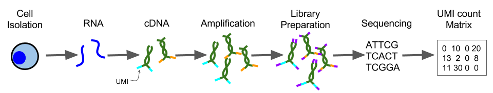
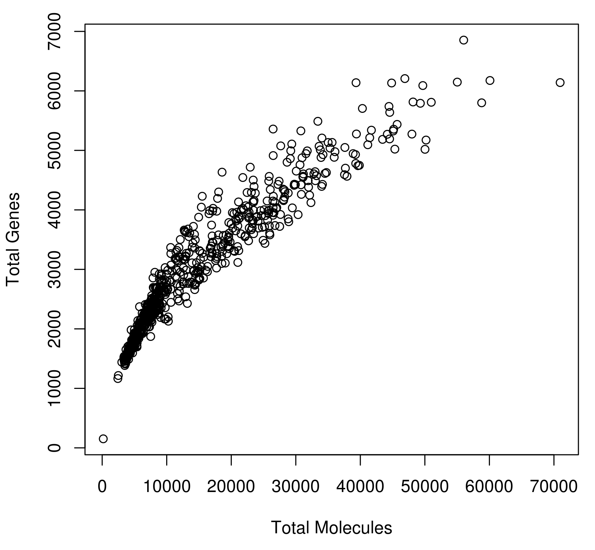

# 构建表达矩阵 {#construction_of_expression_matrix}

```{r, echo=FALSE,warning=FALSE}
library(knitr)
opts_chunk$set(fig.align = "center", echo=FALSE)
```

很多scRNA-seq数据分析从**表达矩**为开始。 一般来说，表达矩阵的每一行代表一个基因，每列代表一个细胞（但是一些作者会使用转置）。 每个条目代表特定基因在特定细胞的表达水平。表达量的单位取决于protocol和标准化方法。

## 质量控制

scRNA-seq实验测序结果是大量的cDNA reads。第一步是确保测序的高质量，可以使用以下标准工具执行质量控制，例如 [FastQC](http://www.bioinformatics.babraham.ac.uk/projects/fastqc/) 或 [Kraken](http://www.ebi.ac.uk/research/enright/software/kraken). 

假设有experiment.bam文件,运行以下FASTQC命令
```
$<path_to_fastQC>/fastQC experiment.bam
```

下面是125 bp reads数据集的FastQC输出结果示例。下图显示了由于技术错误导致在read中心无法正确测序几个碱基。 但是，由于read的其余部分质量很高，因此该错误很可能对比对效率的影响可以忽略不计。

```{r exprs-constr-fastqc, out.width = '90%', fig.cap="Example of FastQC output"}
knitr::include_graphics("figures/per_base_quality.png")
```

另外，使用[Integrative Genomics Browser (IGV)](https://www.broadinstitute.org/igv/)或者[SeqMonk](http://www.bioinformatics.babraham.ac.uk/projects/seqmonk/)对数据进行可视化非常有帮助。

## Reads alignment

After trimming low quality bases from the reads, the remaining sequences can
be mapped to a reference genome. Again, there is no need for a special purpose
method for this, so we can use the
[STAR](https://github.com/alexdobin/STAR) or the [TopHat](https://ccb.jhu.edu/software/tophat/index.shtml) aligner. For large full-transcript datasets from well annotated organisms (e.g. mouse, human) pseudo-alignment methods (e.g. [Kallisto](https://pachterlab.github.io/kallisto/), [Salmon](http://salmon.readthedocs.io/en/latest/salmon.html)) may out-perform conventional alignment. For drop-seq based datasets with tens- or hundreds of thousands of reads pseudoaligners become more appealing since their run-time can be several orders of magnitude less than traditional aligners.

An example of how to map reads.bam to using STAR is

```
$<path_to_STAR>/STAR --runThreadN 1 --runMode alignReads
--readFilesIn reads1.fq.gz reads2.fq.gz --readFilesCommand zcat --genomeDir <path>
--parametersFiles FileOfMoreParameters.txt --outFileNamePrefix <outpath>/output
```

__Note__, if the _spike-ins_ are used, the reference sequence should be augmented with the DNA sequence of the _spike-in_ molecules prior to mapping.

__Note__, when UMIs are used, their barcodes should be removed from the read sequence. A common practice is to add the barcode to the read name.

Once the reads for each cell have been mapped to the reference genome,
we need to make sure that a sufficient number of reads from each cell
could be mapped to the reference genome. In our experience, the
fraction of mappable reads for mouse or human cells is 60-70%. However, 
this result may vary depending on protocol, read length and settings for 
the read alignment. As a general rule, we expect all cells to have a similar
fraction of mapped reads, so any outliers should be inspected and
possibly removed. A low proportion of mappable reads usually indicates contamination.

An example of how to quantify expression using Salmon is
```
$<path_to_Salmon>/salmon quant -i salmon_transcript_index -1 reads1.fq.gz -2 reads2.fq.gz -p #threads -l A -g genome.gtf --seqBias --gcBias --posBias
```
__Note__ Salmon produces estimated read counts and estimated transcripts per million (tpm) in our experience the latter over corrects the expression of long genes for scRNASeq, thus we recommend using read counts. 

## Alignment example

The histogram below shows the total number of reads mapped to each
cell for an scRNA-seq experiment. Each bar represents one cell, and
they have been sorted in ascending order by the total number of reads
per cell. The three red arrows indicate cells that are outliers in
terms of their coverage and they should be removed from further
analysis. The two yellow arrows point to cells with a surprisingly
large number of unmapped reads. In this example we kept the cells during the alignment QC step, but they were later removed during 
cell QC due to a high proportion of ribosomal RNA reads. 

```{r exprs-constr-total-num-cells, out.width = '90%', fig.cap="Example of the total number of reads mapped to each cell."}

```

## Mapping QC

After mapping the raw sequencing to the genome we need to evaluate the quality of the mapping. There are many ways to measure the mapping quality, including: amount of reads mapping to rRNA/tRNAs, proportion of uniquely mapping reads, reads mapping across splice junctions, read depth along the transcripts. Methods developed for bulk RNA-seq, such as [RSeQC](http://rseqc.sourceforge.net/), are applicable to single-cell data:

```
python <RSeQCpath>/geneBody_coverage.py -i input.bam -r genome.bed -o output.txt
python <RSeQCpath>/bam_stat.py -i input.bam -r genome.bed -o output.txt
python <RSeQCpath>/split_bam.py -i input.bam -r rRNAmask.bed -o output.txt
```

However the expected results will depend on the experimental protocol, e.g. many scRNA-seq methods use poly-A selection to avoid sequencing rRNAs which results in a 3' bias in the read coverage across the genes (aka gene body coverage). The figure below shows this 3' bias as well as three cells which were outliers and removed from the dataset:

```{r exprs-constr-3-bias, out.width = '90%', fig.cap="Example of the 3' bias in the read coverage."}
knitr::include_graphics("figures/Exp1_RSEQC_geneBodyCoverage_plot_Combined.png")
```

## Reads quantification

The next step is to quantify the expression level of each gene for
each cell. For mRNA data, we can use one of the tools which has been
developed for bulk RNA-seq data, e.g. [HT-seq](http://www-huber.embl.de/users/anders/HTSeq/) or [FeatureCounts](http://subread.sourceforge.net/)

```
# include multimapping
<featureCounts_path>/featureCounts -O -M -Q 30 -p -a genome.gtf -o outputfile input.bam
# exclude multimapping
<featureCounts_path>/featureCounts -Q 30 -p -a genome.gtf -o outputfile input.bam
```

[Unique molecular identifiers (UMIs)](http://www.nature.com/nmeth/journal/v9/n1/full/nmeth.1778.html) make it possible to count the absolute number of molecules and they have proven popular for [scRNA-seq](http://www.nature.com/nmeth/journal/v11/n2/full/nmeth.2772.html). We will discuss how UMIs can be processed in the next chapter.

```{r, echo=FALSE}
library(knitr)
opts_chunk$set(fig.align = "center", echo=FALSE)
```

## Unique Molecular Identifiers (UMIs) {#umichapter}

Thanks to Andreas Buness from [EMBL Monterotondo](https://www.embl.it/services/bioinformatics/) for collaboration on this section.

### Introduction

Unique Molecular Identifiers are short (4-10bp) random barcodes added to transcripts during reverse-transcription. They enable sequencing reads to be assigned to individual transcript molecules and thus the removal of amplification noise and biases from scRNASeq data. 

```{r intro-umi-protocol, out.width = '90%', fig.cap="UMI sequencing protocol"}

```

When sequencing UMI containing data, techniques are used to specifically sequence only the end of the transcript containing the UMI (usually the 3' end).

### Mapping Barcodes

Since the number of unique barcodes ($4^N$, where $N$ is the length of UMI) is much smaller than the total number of molecules per cell (~$10^6$), each barcode will typically be assigned to multiple transcripts. Hence, to identify unique molecules both barcode and mapping location (transcript) must be used. The first step is to map UMI reads, for which we recommend using STAR since it is fast and outputs good quality BAM-alignments. Moreover, mapping locations can be useful for eg. identifying poorly-annotated 3' UTRs of transcripts.

UMI-sequencing typically consists of paired-end reads where one read from each pair captures the cell and UMI barcodes while the other read consists of exonic sequence from the transcript (Figure \@ref(fig:intro-umi-reads)). Note that trimming and/or filtering to remove reads containing poly-A sequence is recommended to avoid erors due to these read mapping to genes/transcripts with internal poly-A/poly-T sequences.

After processing the reads from a UMI experiment, the following conventions are often used:

1. The UMI is added to the read name of the other paired read. 

2. Reads are sorted into separate files by cell barcode
	+ For extremely large, shallow datasets, the cell barcode may be added to the read name as well to reduce the number of files.

```{r intro-umi-reads, out.width = '90%', fig.cap="UMI sequencing reads, red lightning bolts represent different fragmentation locations"}
knitr::include_graphics("figures/UMI-Seq-reads.png")
```

### Counting Barcodes

In theory, every unique UMI-transcript pair should represent all reads originating from a single RNA molecule. However, in practice this is frequently not the case and the most common reasons are:

1. __Different UMI does not necessarily mean different molecule__
	+ Due to PCR or sequencing errors, base-pair substitution events can result in new UMI sequences. Longer UMIs give more opportunity for errors to arise and based on estimates from cell barcodes we expect 7-10% of 10bp UMIs to contain at least one error. If not corrected for, this type of error will result in an overestimate of the number of transcripts.

2. __Different transcript does not necessarily mean different molecule__
	+ Mapping errors and/or multimapping reads may result in some UMIs being assigned to the wrong gene/transcript. This type of error will also result in an overestimate of the number of transcripts.

3. __Same UMI does not necessarily mean same molecule__
	+ Biases in UMI frequency and short UMIs can result in the same UMI being attached to different mRNA molecules from the same gene. Thus, the number of transcripts may be underestimated.

```{r intro-umi-errors, out.width = '90%', fig.cap="Potential Errors in UMIs"}
knitr::include_graphics("figures/UMI-Seq-errors.png")
```

### Correcting for Errors

How to best account for errors in UMIs remains an active area of research. The best approaches that we are aware of for resolving the issues mentioned above are:

1. [UMI-tools'](https://github.com/CGATOxford/UMI-tools) directional-adjacency method implements a procedure which considers both the number of mismatches and the relative frequency of similar UMIs to identify likely PCR/sequencing errors.

2. Currently an open question. The problem may be mitigated by removing UMIs with few reads to support their association with a particular transcript, or by removing all multi-mapping reads.

3. Simple saturation (aka "collision probability") correction proposed by [Grun, Kester and van Oudenaarden (2014)](http://www.nature.com/nmeth/journal/v11/n6/full/nmeth.2930.html#methods) to estimate the true number of molecules $M$:

$$M \approx -N*log(1 - \frac{n}{N})$$ 
where N = total number of unique UMI barcodes and n = number of observed barcodes.
 
An important caveat of this method is that it assumes that all UMIs are equally frequent. In most cases this is incorrect, since there is often a bias related to the GC content. 

```{r intro-umi-amp, out.width = '60%', fig.cap="Per gene amplification rate"}

```

Determining how to best process and use UMIs is currently an active area of research in the bioinformatics community. We are aware of several methods that have recently been developed, including:

* [UMI-tools](https://github.com/CGATOxford/UMI-tools)
* [PoissonUMIs](https://github.com/tallulandrews/PoissonUMIs)
* [zUMIs](https://github.com/sdparekh/zUMIs)
* [dropEst](https://github.com/hms-dbmi/dropEst)

### Downstream Analysis

Current UMI platforms (DropSeq, InDrop, ICell8) exhibit low and highly variable capture efficiency as shown in the figure below. 

```{r intro-umi-capture, out.width = '70%', fig.cap="Variability in Capture Efficiency"}

```

This variability can introduce strong biases and it needs to be considered in downstream analysis. Recent analyses often pool cells/genes together based on cell-type or biological pathway to increase the power. Robust statistical analyses of this data is still an open research question and it remains to be determined how to best adjust for biases.

__Exercise 1__ We have provided you with UMI counts and read counts from induced pluripotent stem cells generated from three different individuals [@Tung2017-ba] (see: Chapter \@ref(exprs-qc) for details of this dataset).

```{r, echo=TRUE, include=TRUE}
umi_counts <- read.table("data/tung/molecules.txt", sep = "\t")
read_counts <- read.table("data/tung/reads.txt", sep = "\t")
```
Using this data:

1. Plot the variability in capture efficiency

2. Determine the amplification rate: average number of reads per UMI.

```{r, include=FALSE}
# Exercise 1
# Part 1
plot(colSums(umi_counts), colSums(umi_counts > 0), xlab="Total Molecules Detected", ylab="Total Genes Detected")

# Part 2
amp_rate <- sum(read_counts)/sum(umi_counts)
amp_rate
```

