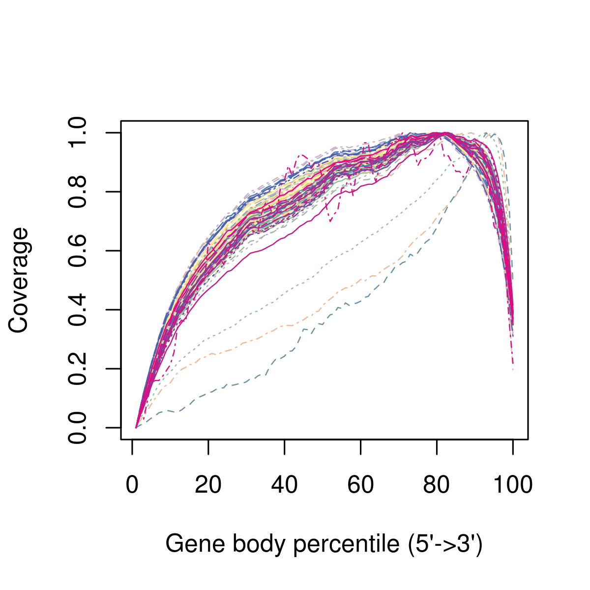
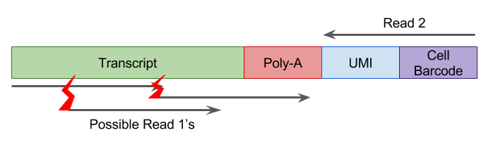

# 构建表达矩阵 {#construction_of_expression_matrix}

```{r, echo=FALSE,warning=FALSE}
library(knitr)
opts_chunk$set(fig.align = "center", echo=FALSE)
```

很多scRNA-seq数据分析从**表达矩阵**为开始。 一般来说，表达矩阵的每一行代表一个基因，每列代表一个细胞（但是一些作者会使用转置）。 每个条目代表特定基因在特定细胞的表达水平。表达量的单位取决于protocol和标准化方法。

## 质量控制

scRNA-seq实验测序结果是大量的cDNA reads。第一步是确保测序的高质量，可以使用以下标准工具执行质量控制，例如 [FastQC](http://www.bioinformatics.babraham.ac.uk/projects/fastqc/) 或 [Kraken](http://www.ebi.ac.uk/research/enright/software/kraken). 

假设有experiment.bam文件,运行以下FASTQC命令
```
$<path_to_fastQC>/fastQC experiment.bam
```

下面是125 bp reads数据集的FastQC输出结果示例。下图显示了由于技术错误导致在read中心无法正确测序几个碱基。 但是，由于read的其余部分质量很高，因此该错误很可能对比对效率的影响可以忽略不计。

```{r exprs-constr-fastqc, out.width = '90%', fig.cap="Example of FastQC output"}
knitr::include_graphics("figures/per_base_quality.png")
```

另外，使用[Integrative Genomics Browser (IGV)](https://www.broadinstitute.org/igv/)或者[SeqMonk](http://www.bioinformatics.babraham.ac.uk/projects/seqmonk/)对数据进行可视化非常有帮助。

## Reads 比对

将reads低质量碱基取出后，把剩下的序列比对到参考基因组上。同样，没有专门为scRNA-seq设计的比对方法。我们可以使用[STAR](https://github.com/alexdobin/STAR)或者[TopHat](https://ccb.jhu.edu/software/tophat/index.shtml)进行比对。对来自有丰富注释信息模式生物(比如小鼠和人)的大型全长转录本数据集，pseudo-alignment方法(比如[Kallisto](https://pachterlab.github.io/kallisto/)，[Salmon](http://salmon.readthedocs.io/en/latest/salmon.html))可能比传统比对方法表现更好。基于drop-seq数据集包含数十万reads，pseudoaligners运行时间比传统比对工具快不止一个量级。

使用STAR比对示例

```
$<path_to_STAR>/STAR --runThreadN 1 --runMode alignReads
--readFilesIn reads1.fq.gz reads2.fq.gz --readFilesCommand zcat --genomeDir <path>
--parametersFiles FileOfMoreParameters.txt --outFileNamePrefix <outpath>/output
```

**注意**, 如果使用了**spike-ins**, 在比对前应将**spike-ins**的DNA序列添加到参考基因组序列中.

**注意**, 当使用UMIs，应该从read序列中取出条形码序列。通常做法是将barcode加到read名称上。

一旦将每个细胞的reads比对到参考基因组，我们需要确保每个细胞有足够数量的read比对到参考基因组。 根据我们的经验，小鼠或人类细胞的reads的map率为60-70％。但是此结果可能会因protocols，read长度和read比对工具参数而异。一般来说，我们希望所有细胞都具有相似的map率，因此应检查并可能删除任何异常值，map率低通常表示污染。

使用Salmon定量基因表达：
```
$<path_to_Salmon>/salmon quant -i salmon_transcript_index -1 reads1.fq.gz -2 reads2.fq.gz -p #threads -l A -g genome.gtf --seqBias --gcBias --posBias
```
**注意**：Salmon或得到估计read counts和估计transcripts per million(tpm), TMP对scRNA-seq长基因的表达进行了过度校正，因此我们建议使用read counts。

## 比对示例

下列直方图显示scRNA-seq实验每个细胞比对reads总数。每个条形代表一个细胞，按照每个细胞的总reads数升序排列。三个红色箭头表示比对覆盖率降低的异常细胞，应该在后续分析中将其去除。黄色箭头表示unmapped reads较多的细胞。在比对质控步骤我们保留这两个细胞，但是在细胞质控时由于高的核糖体RNA reads比例将其移除。

```{r exprs-constr-total-num-cells, out.width = '90%', fig.cap="Example of the total number of reads mapped to each cell."}
knitr::include_graphics("figures/Bergiers_exp1_mapping_by_cell.png")
```

## Mapping QC

将原始测序数据比对到基因组后，需要评估比对的质量。目前有很多方法对比对质量进行评估，包括：rRNA/tRNAs reads数目，uniquely mapping reads比例，跨剪切位点的reads数，转录本read深度。为bulk RNA-seq开发的方法，比如[RSeQC](http://rseqc.sourceforge.net/)也适合单细胞数据：

```
python <RSeQCpath>/geneBody_coverage.py -i input.bam -r genome.bed -o output.txt
python <RSeQCpath>/bam_stat.py -i input.bam -r genome.bed -o output.txt
python <RSeQCpath>/split_bam.py -i input.bam -r rRNAmask.bed -o output.txt
```

然而预期结果依赖于实验protocol，比如很多scRNA-seq方法是用poly-A富集来排除rRNA，但导致read覆盖率具有3'偏好性，即基因的3'区域更容易被检测到。下图展示了测序reads的3'偏好性，以及3个从数据集中移除的异常细胞。

```{r exprs-constr-3-bias, out.width = '90%', fig.cap="Example of the 3' bias in the read coverage."}

```

## Reads定量

下一步是定量每个细胞的基因表达水平。对于mRNA数据，可以使用针对bulk RNA-seq开发的工具，比如[HT-seq](http://www-huber.embl.de/users/anders/HTSeq/) 或者[FeatureCounts](http://subread.sourceforge.net/)

```
# include multimapping
<featureCounts_path>/featureCounts -O -M -Q 30 -p -a genome.gtf -o outputfile input.bam
# exclude multimapping
<featureCounts_path>/featureCounts -Q 30 -p -a genome.gtf -o outputfile input.bam
```

[Unique molecular identifiers (UMIs)](http://www.nature.com/nmeth/journal/v9/n1/full/nmeth.1778.html) 使得计算分子的绝对数目成为可能，并且在[scRNA-seq](http://www.nature.com/nmeth/journal/v11/n2/full/nmeth.2772.html)非常受欢迎。下一章将讨论如何处理UMIs。

```{r, echo=FALSE}
library(knitr)
opts_chunk$set(fig.align = "center", echo=FALSE)
```

## 唯一分子标识符 {#umichapter}

感谢来 [EMBL Monterotondo](https://www.embl.it/services/bioinformatics/)的Andreas Buness在本节的合作。

### UMI介绍

UMI是在反转录过程中添加到转录本中的短（4-10bp）随机条形码序列。它们使测序read能够对应到单个转录物，从而去除scRNA-Seq数据扩增噪声和偏差。

```{r intro-umi-protocol, out.width = '90%', fig.cap="UMI sequencing protocol"}
knitr::include_graphics("figures/UMI-Seq-protocol.png")
```

当对包含UMI数据测序时，仅对包含UMI的转录本末端进行测序（通常是3'末端）

### 比对条形码序列

由于条形码数量($4^N$,$N$为UMI的长度)比细胞中RNA分子(~$10^6$)数目多，每个barcode通常会连接多个转录本。因此需要barcode和转录本比对位置来鉴定转录本分子。第一步比对UMI reads，推荐使用STAR，因为其运行速度快并且输出高质量BAM比对。此外，比对位置对鉴定转录本新的3'UTR很有帮助。

UMI测序通常由双端reads组成，其中一端read捕获细胞和UMI条形码，然后另一端read包含转录本的外显子序列(Figure \@ref(fig:intro-umi-reads))。注意：推荐移除reads中poly-A序列避免比对到基因/转录本内部的poly-A/poly-T序列而产生错误。

处理完UMI实验的reads后，通常有以下惯例：

1. UMI加到另外一个配对read的序列名称中

2. reads按照cell barcode归类到不同的文件，对特别大，测序深度浅的数据集，cell barcode加到read名称中以减少文件数量。

```{r intro-umi-reads, out.width = '90%', fig.cap="UMI测序reads, 红色闪电代表不同片段的文职"}

```

### Barcodes计数

理论上，每个唯一的UMI-转录本对应该对应来自一个RNA分子的所有reads，然而实际情况并非如此，常见原因如下：

1. **不同UMI不一定表示为不同的分子**，由于PCR或测序错误，碱基对替换事件可产生新的UMI序列。 较长的UMI碱基替换的可能性更高。根据cell barcode测序误差估计，7-10％的10bp UMI至少会包含一个错误。如果没有纠正错误，将导致高估转录本的数量。

2. **不同转录本不一定是不同分子**，比对错误，或者multimapping reads可能导致某些UMI对应到错误的基因/转录本，这种类型的错误也会导致高估转录本的数量。

3. **相同的UMI不一定是相同分子**，UMI频率和短UMI可导致相同UMI连接到相同基因的不同mRNA分子。因此，将导致低估转录本数量。

```{r intro-umi-errors, out.width = '90%', fig.cap="UMIs中可能错误"}

```

### 错误校正

如何最好地解释UMI中的错误仍然是一个活跃的研究领域。我们认为解决上述问题的最佳方法是：

1. [UMI-tools](https://github.com/CGATOxford/UMI-tools) 使用directional-adjacency方法，同时考虑错配数目和相似UMIs相对频率来识别可能的PCR/测序错误。

2. 目前问题还没完全解决，通过删除很少reads支持的UMI-转录本对，或者移除multi-mapping reads可以减轻该问题。

3. 简单饱和校正 (又称 "collision probability") [Grun, Kester and van Oudenaarden (2014)](http://www.nature.com/nmeth/journal/v11/n6/full/nmeth.2930.html#methods) 估计真实的分子数目 $M$:

$$M \approx -N*log(1 - \frac{n}{N})$$ 
其中N=唯一UMI barcode的总数，n=观测barcode数目

该方法的一个重要缺陷是其假设所有UMI出现频率相同。大多数情况下并不是，因为GC含量不同引入偏差。

```{r intro-umi-amp, out.width = '60%', fig.cap="基因扩增效率"}
knitr::include_graphics("figures/UMI-Seq-amp.png")
```

如何最好地处理和使用UMI目前是生物信息学界的一个活跃的研究领域。最近开发的几种方法，包括：

* [UMI-tools](https://github.com/CGATOxford/UMI-tools)
* [PoissonUMIs](https://github.com/tallulandrews/PoissonUMIs)
* [zUMIs](https://github.com/sdparekh/zUMIs)
* [dropEst](https://github.com/hms-dbmi/dropEst)

### 下游分析

目前UMI平台(DropSeq, InDrop, ICell8)捕获效率从低到高差异很大，如下图所示。

```{r intro-umi-capture, out.width = '70%', fig.cap="捕获效率差异"}
knitr::include_graphics("figures/UMI-Seq-capture.png")
```

这种差异引入强烈的偏差，需要在下游分析中考虑。最近的分析通常基于细胞类型或生物通路吧细胞/基因混合在一起增强检测能力。对这些数据的稳健统计分析仍然是一个开放的研究问题，还有待确定如何最好地调整偏差。

**练习1** 现提供三个不同来源的诱导多功能干细胞UMI counts和read counts数据 [@Tung2017-ba] (查看章节 \@ref(exprs-qc) 获得更多关于此数据集的信息)

```{r, echo=TRUE, eval=TRUE}
umi_counts <- read.table("data/tung/molecules.txt", sep = "\t")
read_counts <- read.table("data/tung/reads.txt", sep = "\t")
```
使用该数据:

1. 绘制捕获效率可变性

2. 确定扩增率：每个UMI的平均reads数目
Determine the amplification rate: average number of reads per UMI.

**答案1** 
```{r,echo=TRUE, eval=FALSE}
# Exercise 1
# Part 1
plot(colSums(umi_counts), colSums(umi_counts > 0), xlab="Total Molecules Detected", ylab="Total Genes Detected")

# Part 2
amp_rate <- sum(read_counts)/sum(umi_counts)
amp_rate
```

```{r}
# Exercise 1
# Part 1
plot(colSums(umi_counts), colSums(umi_counts > 0), xlab="Total Molecules Detected", ylab="Total Genes Detected")

# Part 2
amp_rate <- sum(read_counts)/sum(umi_counts)
amp_rate
```

