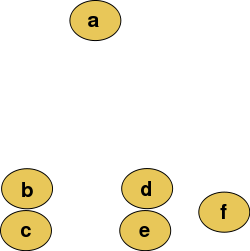
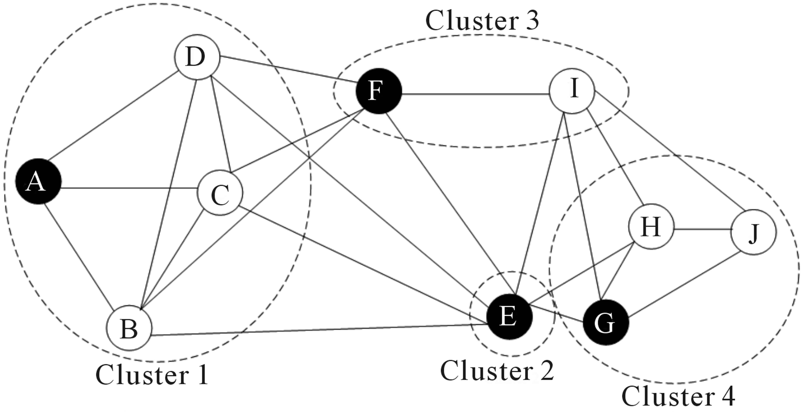
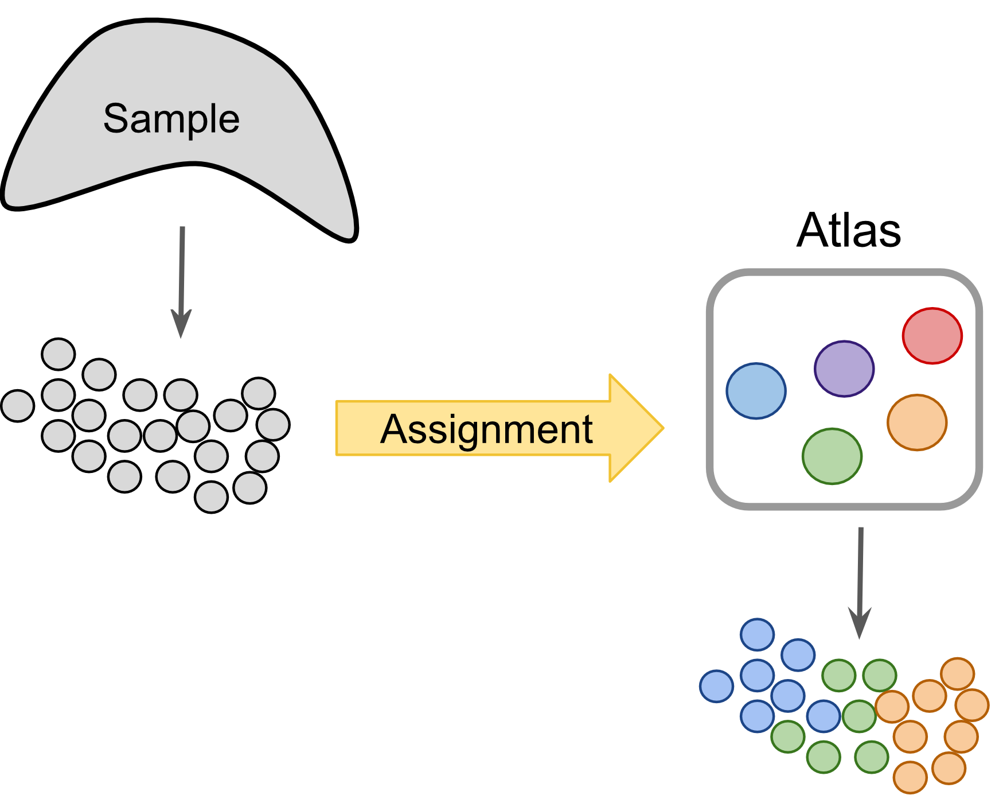
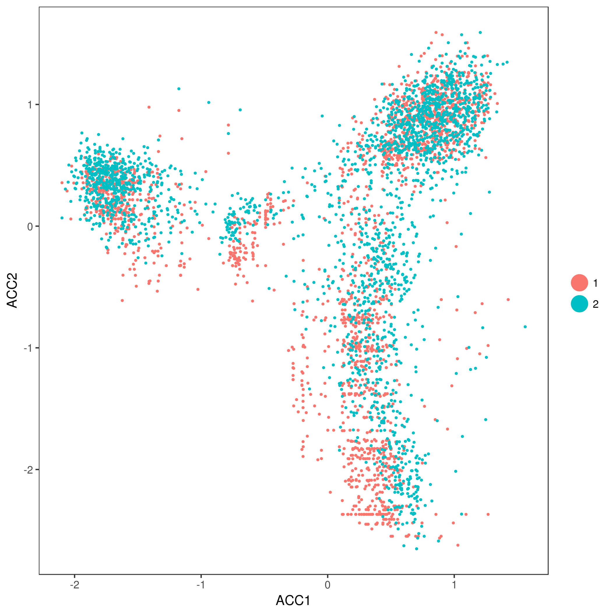
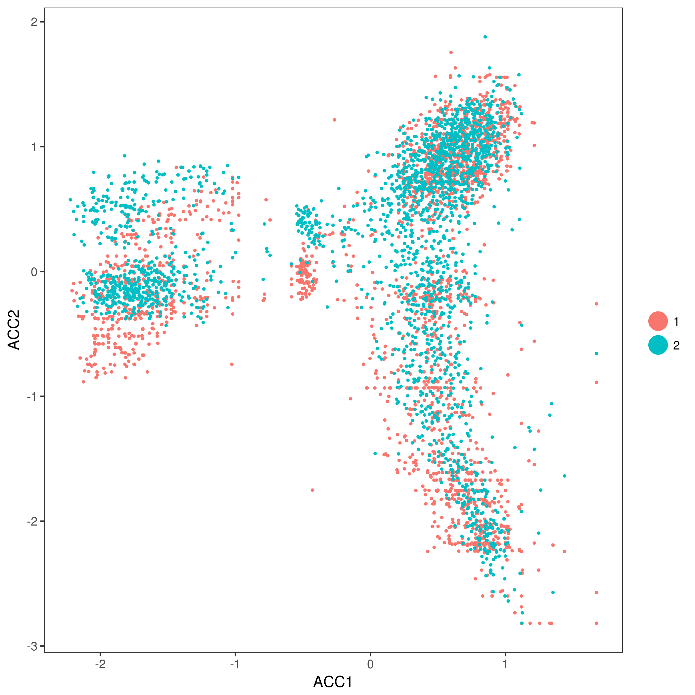

# 生物学分析 {#biological-analysis}

## 聚类介绍

```{r, echo=FALSE}
library(knitr)
opts_chunk$set(fig.align = "center", echo=FALSE)
```

对数据进行了标准化并移除了混淆因子后，就可以进行与手头的生物学问题相关的分析。分析的性质取决于数据集。 然而，一些方面在广泛的背景下有用，我们将在接下来的几章中讨论其中的一些方面。从scRNA-seq数据的聚类开始。

### 介绍

scRNA-seq最有希望的应用之一是基于转录谱的*de novo*发现和注释细胞类型。在计算上，这是一个难题，因为它相当于**非监督聚类**。 也就是说，我们需要根据转录组的相似性识别细胞群，不需要对细胞类型的任何先验知识。 此外，在大多数情况下，我们甚至不知道*先验*集群的数量。由于噪音（技术和生物）和高维度（比如基因），问题变得更具挑战性。

### 降维

在处理大型数据集时，应用某种降维方法是有帮助的。将数据投影到较低维度的子空间上，能够显著减少噪声。另一个好处是，在2维或3维子空间中可视化数据要容易得多。我们已经讨论了PCA(章节 \@ref(visual-pca))和t-SNE(章节 \@ref(visual-pca))。

### 聚类方法

**非监督聚类** 在机器学习中广泛研究并应用于不同领域。常用的流行方法是：**层次聚类**，**k-means聚类**，**基于的图聚类**。

#### 层次聚类

[层次聚类](https://en.wikipedia.org/wiki/Hierarchical_clustering)可以使用自下而上或自上而下的方法。自下而上策略中，每个细胞最初单独为一类，随后将类进行合并形成hieararchy：

```{r clust-hierarch-raw, out.width = '30%', fig.cap="原始数据"}

```

```{r clust-hierarch-dendr, out.width = '50%', fig.cap="层次聚类树状图"}
knitr::include_graphics("figures/hierarchical_clustering2.png")
```

使用自上而下策略，最初所有观测点为一类，递归对类进行拆分拆分形成hierarchy。该策略的一个优点是该方法是确定性的。

#### k-means

[_k_-means聚类](https://en.wikipedia.org/wiki/K-means_clustering),将 _N_个细胞划分成 _k_个不同的类。以迭代的方式，分配类中心并将每个细胞分配个最近的类。

```{r clust-k-means, out.width = '100%', fig.cap="Schematic representation of the k-means clustering"}
knitr::include_graphics("figures/k-means.png")
```

scRNA-seq分析的大多数方法在某些步骤都包括 _k_-means环节。

#### 基于图的方法

在过去的二十年中，人们对分析各个领域的网络产生了很大的兴趣。 一个目标是识别网络中节点的群体或模块。

```{r clust-graph, out.width = '100%', fig.cap="Schematic representation of the graph network"}

```

通过构建图，其中每个节点代表一个细胞,一些方法可以应用于scRNA-seq数据。 然而，构建图并为边指定权重并非易事。 基于图的方法的一个优点是其中一些方法非常有效，可以应用于包含数百万节点的网络。

### 聚类的挑战

* 类个数 _k_的确定？
* 什么是细胞类型？
* **可拓展性**：在过去的几年中，scRNA-seq实验的细胞数量增长了几个数量级，从~$10^2$ 到 ~$10^6$
* 工具不太友好

### scRNA-seq数据的工具

#### [SINCERA](https://research.cchmc.org/pbge/sincera.html)

* SINCERA [@Guo2015-ok] 基于层次聚类
* 数据在聚类前转为 _z_-scores
* 通过寻找hierarchy中第一个单例群识别 _k_

#### [SC3](http://bioconductor.org/packages/SC3/)

```{r clust-sc3, out.width = '100%', fig.cap="SC3 pipeline"}

```

* SC3 [@Kiselev2016-bq] 基于PCA和谱降维
* 使用 _k_-means
* 使用一致性聚类(consensus clustering)

#### tSNE + k-means

* 基于 __tSNE__映射
* 使用 _k_-means

#### Seurat clustering

[`Seurat`](https://github.com/satijalab/seurat)聚类基于类似于`SNN-Cliq`的 _community detection_方法，以及之前提出的用于分析CyTOF数据[@Levine2015-fk]的方法。由于`Seurat`已经成为scRNA-seq数据分析的一体化工具，我们专门用一章来更详细地讨论它(章节@@ref(seurat-chapter))。

### 比较聚类结果

可以使用[adjusted Rand index](https://en.wikipedia.org/wiki/Rand_index)比较聚类效果。 该指数衡量两个数据cluster之间的相似性。ARI指数的值位$[0;1]$区间，其中$1$表示两个聚类相同，$0$表示随机相似程度。

## 聚类示例 {#clust-methods}

```{r, eval=FALSE,echo=TRUE}
library(pcaMethods)
library(SC3)
library(scater)
library(SingleCellExperiment)
library(pheatmap)
library(mclust)
set.seed(1234567)
```

为说明scRNA-seq数据聚类，使用来自小鼠发育胚胎细胞[@Deng2014-mx]的`Deng`数据集。 我们已经对数据集进行预处理并创建`SingleCellExperiment`对象。 而且利用文章中识别的细胞类型对细胞进行注释(`colData`中`cell_type2`列)。

### Deng 数据集

加载数据:
```{r eval=FALSE,echo=TRUE}
deng <- readRDS("data/deng/deng-reads.rds")
deng
## class: SingleCellExperiment 
## dim: 22431 268 
## metadata(0):
## assays(2): counts logcounts
## rownames(22431): Hvcn1 Gbp7 ... Sox5 Alg11
## rowData names(10): feature_symbol is_feature_control ...
##   total_counts log10_total_counts
## colnames(268): 16cell 16cell.1 ... zy.2 zy.3
## colData names(30): cell_type2 cell_type1 ... pct_counts_ERCC
##   is_cell_control
## reducedDimNames(0):
## spikeNames(1): ERCC
```

查看细胞类型注释:
```{r eval=FALSE,echo=TRUE}
table(colData(deng)$cell_type2)
## 
##     16cell      4cell      8cell early2cell earlyblast  late2cell 
##         50         14         37          8         43         10 
##  lateblast   mid2cell   midblast         zy 
##         30         12         60          4
```

简单的PCA分析已经分离出一些细胞类型，并初步了解了数据结构：

```{r,eval=FALSE,echo=TRUE}
plotPCA(deng, colour_by = "cell_type2")
```
```{r,echo=FALSE}
knitr::include_graphics("https://scrnaseq-course.cog.sanger.ac.uk/website/clustering_files/figure-html/unnamed-chunk-5-1.png")
```

如上图所示，早期细胞类型分得很靠，但三个囊胚时间点难以区分。

### SC3

在Deng数据上运行`SC3`聚类，`SC3`的优点是其可以直接使用`SingleCellExperiment`对象。

假设我们不知道类 _k_(细胞类型)的数目，`SC3`可以对cluster数目进行估计。
```{r eval=FALSE,echo=TRUE}
deng <- sc3_estimate_k(deng)
metadata(deng)$sc3$k_estimation
## 6
```

有趣的是，`SC3`预测的细胞类型数量小于原始数据注释。 然而，不同细胞类型的早期，中期和晚期，刚好有6种细胞类型。 将合并的细胞类型存储在`colData`的`cell_type1`列中：
```{r,eval=FALSE,echo=TRUE}
plotPCA(deng, colour_by = "cell_type1")
```
```{r,echo=FALSE}
knitr::include_graphics("https://scrnaseq-course.cog.sanger.ac.uk/website/clustering_files/figure-html/unnamed-chunk-7-1.png")
```

下面运行`SC3`(同时计算类的生物学特性)：
```{r eval=FALSE,echo=TRUE}
deng <- sc3(deng, ks = 10, biology = TRUE, n_cores = 1)
```

`SC3`结果由几部分组成(详见[@Kiselev2016-bq]和[SC3 vignette](http://bioconductor.org/packages/release/bioc/vignettes/SC3/inst/doc/my-vignette.html))，这里展示一些：

一致性矩阵:
```{r,eval=FALSE,echo=TRUE}
sc3_plot_consensus(deng, k = 10, show_pdata = "cell_type2")
```
```{r,echo=FALSE}
knitr::include_graphics("https://scrnaseq-course.cog.sanger.ac.uk/website/clustering_files/figure-html/unnamed-chunk-9-1.png")
```
Silhouette图:
```{r eval=FALSE,echo=TRUE}
sc3_plot_silhouette(deng, k = 10)
```
```{r,echo=FALSE}
knitr::include_graphics("https://scrnaseq-course.cog.sanger.ac.uk/website/clustering_files/figure-html/unnamed-chunk-10-1.png")
```
表达矩阵热图:
```{r eval=FALSE,echo=TRUE}
sc3_plot_expression(deng, k = 10, show_pdata = "cell_type2")
```
```{r,echo=FALSE}
knitr::include_graphics("https://scrnaseq-course.cog.sanger.ac.uk/website/clustering_files/figure-html/unnamed-chunk-11-1.png")
```
识别的marker基因:
```{r eval=FALSE,echo=TRUE}
sc3_plot_markers(deng, k = 10, show_pdata = "cell_type2")
```
```{r,echo=FALSE}
knitr::include_graphics("https://scrnaseq-course.cog.sanger.ac.uk/website/clustering_files/figure-html/unnamed-chunk-12-1.png")
```
`SC3`类PCA图:
```{r,eval=FALSE,echo=TRUE}
plotPCA(deng, colour_by = "sc3_10_clusters")
```
```{r,echo=FALSE}
knitr::include_graphics("https://scrnaseq-course.cog.sanger.ac.uk/website/clustering_files/figure-html/unnamed-chunk-13-1.png")
```
`SC3`聚类结果和文献中细胞类型比较：
```{r eval=FALSE,echo=TRUE}
adjustedRandIndex(colData(deng)$cell_type2, colData(deng)$sc3_10_clusters)
## [1] 0.7721292
```

**注意** `SC3`可以在`Shiny`会话中以交互形式运行:
```{r, eval=FALSE}
sc3_interactive(deng)
```

上述命令会在浏览器中打开`SC3`。

**注意** 当细胞数量$>5000$，直接计算`SC3`距离非常慢。对于包含超过$10^5$细胞的大型数据集，推荐使用`Seurat`(见章节 \@ref(seurat-chapter))。

* **练习1**: 在浏览器中运行`SC3`,设置$k$从8-12，查看不同的聚类结果；

* **练习2**: 哪种聚类结果最稳定(查看"Stability"标签)；

* **练习3**: 使用$k=10$，查看cluster中差异表达基因和marker基因；

* **练习4**: 更改marker基因阈值(默认为0.85)。**SC3** 找到更多的marker基因了吗？

### tSNE + kmeans

之前(\@ref(visual-tsne))用 __scater__包画[tSNE](https://lvdmaaten.github.io/tsne/)图是用[Rtsne](https://cran.r-project.org/web/packages/Rtsne/index.html) 和 [ggplot2](https://cran.r-project.org/web/packages/ggplot2/index.html)做的。这里也同样：
```{r, eval=FALSE,echo=TRUE}
deng <- runTSNE(deng, rand_seed = 1)
plotTSNE(deng)
```
```{r, clust-tsne, fig.cap = "tSNE map of the patient data",echo=FALSE}
knitr::include_graphics("https://scrnaseq-course.cog.sanger.ac.uk/website/clustering_files/figure-html/clust-tsne-1.png")
```

注意，上图中的所有点都是黑色的。这与之前看到的不同，当时基于注释对细胞进行着色。 这里没有任何注释，所有细胞都来自同一批次，因此所有点都是黑色的。

现在将 _k_-means聚类算法应用到tSNE映射上的点云上。你在点云看到了多少组？

从$k=8$开始:
```{r eval=FALSE,echo=TRUE}
colData(deng)$tSNE_kmeans <- as.character(kmeans(deng@reducedDims$TSNE, centers = 8)$clust)
plotTSNE(deng, colour_by = "tSNE_kmeans")
```
```{r, clust-tsne-kmeans2, fig.cap = "tSNE map of the patient data with 8 colored clusters, identified by the k-means clustering algorithm",echo=FALSE}
knitr::include_graphics("https://scrnaseq-course.cog.sanger.ac.uk/website/clustering_files/figure-html/clust-tsne-kmeans2-1.png")
```
__练习7__: 设置$k=10$.

__练习8__: 比较`tSNE+kmeans`结果和文献中细胞类型，当改变`perplexity`参数时，结果会提高吗？

__答案__:
```{r, eval=FALSE, echo=TRUE}
colData(deng)$tSNE_kmeans <- as.character(kmeans(deng@reducedDims$TSNE, centers = 10)$clust)
adjustedRandIndex(colData(deng)$cell_type2, colData(deng)$tSNE_kmeans)
```

您可能已经注意到，`tSNE+kmeans`j结果是随机的，每次运行时都会给出不同的结果。 为了获得更好的结果，我们需要多次运行该方法。 SC3也是随机的，但由于`consensus`步骤，更稳健，不太可能产生不同的结果。

### SINCERA

[SINCERA](https://research.cchmc.org/pbge/sincera.html)基于层次聚类。注意，SINCERA在聚类之前进行基因尺度z-score转换：

```{r eval=FALSE,echo=TRUE}
# use the same gene filter as in SC3
input <- logcounts(deng[rowData(deng)$sc3_gene_filter, ])
```

```{r, eval=FALSE,echo=TRUE}
# perform gene-by-gene per-sample z-score transformation
dat <- apply(input, 1, function(y) scRNA.seq.funcs::z.transform.helper(y))
# hierarchical clustering
dd <- as.dist((1 - cor(t(dat), method = "pearson"))/2)
hc <- hclust(dd, method = "average")
```

如果cluster数量未知, [SINCERA](https://research.cchmc.org/pbge/sincera.html) 将k识别为生成不超过指定数量的单个cluster（仅包含1个细胞的clusters）的层次树的最小高度。
```{r, eval=FALSE,echo=TRUE}
num.singleton <- 0
kk <- 1
for (i in 2:dim(dat)[2]) {
    clusters <- cutree(hc, k = i)
    clustersizes <- as.data.frame(table(clusters))
    singleton.clusters <- which(clustersizes$Freq < 2)
    if (length(singleton.clusters) <= num.singleton) {
        kk <- i
    } else {
        break;
    }
}
cat(kk)
## 6
```

用热图对SINCERA结果进行可视化：
```{r eval=FALSE,echo=TRUE}
pheatmap(
    t(dat),
    cluster_cols = hc,
    cutree_cols = kk,
    kmeans_k = 100,
    show_rownames = FALSE
)
```
```{r, clust-sincera, fig.cap = "Clustering solutions of SINCERA method using found $k$",echo=FALSE}
knitr::include_graphics("https://scrnaseq-course.cog.sanger.ac.uk/website/clustering_files/figure-html/clust-sincera-1.png")
```
__练习10__: 比较`SINCERA`结果和文献细胞类型。

__答案__:
```{r, eval=FALSE,echo=TRUE}
colData(deng)$SINCERA <- as.character(cutree(hc, k = kk))
adjustedRandIndex(colData(deng)$cell_type2, colData(deng)$SINCERA)
## [1] 0.3823537
```

__练习11__: 使用单例cluster标准确定**k**效果好吗？

## 特征选择

```{r, echo=TRUE, message=FALSE, warning=FALSE}
library(scRNA.seq.funcs)
library(matrixStats)
library(M3Drop)
library(RColorBrewer)
library(SingleCellExperiment)
set.seed(1)
```
单细胞RNASeq能够检测每个细胞中数千个基因的表达。 然而，在大多数情况下，只有一部分基因对感兴趣的生物学条件的做出响应，例如， 细胞类型的差异，分化的驱动因素，对环境刺激的响应。 由于技术噪音，在scRNA-Seq实验中检测到的大多数基因仅在不同水平检测到。 这导致技术噪声和批量效应会混淆感兴趣的生物信号。

因此，进行特征选择以去除那些仅表现出来技术噪音的基因。这不仅会增加数据中的信噪比; 还通过减少数据量来降低分析的计算复杂性。

对于scRNASeq数据，我们将关注于非监督的特征选择方法，这些方法不需要任何先验信息，例如细胞类型或生物组，因为对大多数实验得不到这些信息，或者不可靠的。与之相反，差异表达(章节 \@ref(dechapter))可以被认为是监督特征选择的一种形式，因为它使用每个样本的已知生物标记来识别在不同组间差异表达的特征（如基因）。

在本节中，我们将继续使用Deng数据。

```{r echo=TRUE, eval=FALSE}
deng <- readRDS("data/deng/deng-reads.rds")
celltype_labs <- colData(deng)$cell_type2
cell_colors <- brewer.pal(max(3,length(unique(celltype_labs))), "Set3")
```

特征选择在质控后执行，但是此数据已经质控过，因此可以跳过该步骤。 M3Drop包含两种不同的特征选择方法，一个是"M3DropFeatureSelection"，基于Michaelis-Menten曲线，为全长转录本scRNA-seq（如Smartseq2）设计；另一个是"NBumiFeatureSelectionCombinedDrop"，基于负二项模型，专为UMI count数据而设计。我们在Deng Smartseq2数据上进行演示。

M3Drop特征选择使用标准化（但不是对数变换）表达矩阵。 使用以下命令从SingleCellExperiment对象中提取。

```{r echo=TRUE, eval=FALSE}
expr_matrix <- M3Drop::M3DropConvertData(deng)
```

此功能与大多数scRNA-seq分析包兼容，包括：scater，SingleCellExperiment，monocle和Seurat。 如果指定矩阵是原始count或者对数转换，它可以将其转换为正确的形式（删除未检测到的基因和标准化/delogging）。查看帮助手册以获取详细信息：

```{r echo=TRUE,eval=FALSE}
?M3Drop::M3DropConvertData
```

__练习1__: 确认转换函数已经删除未检测到的基因：
```{r, echo=TRUE, eval=FALSE}
nrow(counts(deng)) - nrow(expr_matrix)
summary( rowSums(counts(deng))[! rownames(counts(deng)) %in% rownames(expr_matrix) ] )
```

### 识别基因与null模型

无监督特征选择主要有两种方法。 第一个是识别与描述数据集中预期的技术噪声的null模型不同的基因。

如果数据集包含spike-in RNAs，其可以用于直接模拟技术噪音。然而，spike-ins可能不像内源转录本经历相同的技术噪音 [(Svensson et al., 2017)](https://www.nature.com/nmeth/journal/v14/n4/full/nmeth.4220.html)。而且，scRNA-seq实验只包含一小部分spike-ins，对拟合模型参数可能不足。

#### Highly Variable Genes

提出用于鉴定scRNA-Seq数据集特征的第一种方法是鉴定高度可变的基因（HVG）。 HVG假设如果基因在细胞间的表达差异很大，那么这些差异中的一部分是由于细胞之间的生物学差异而不是技术噪声。然而，由于count data的性质，基因的表达均值与细胞read count的方差之间存在正相关关系。必须纠正这种关系才能正确识别HVG。

__练习2__
使用rowMeans和rowVars函数绘制此数据集中所有基因的表达的均值和方差之间的关系。 （提示：使用log ="xy"在对数刻度上绘图）。

```{r, echo=TRUE, eval=FALSE}
plot(
    rowMeans(expr_matrix), 
    rowVars(expr_matrix), 
    log="xy", 
    pch=16,
    xlab="Mean Expression", 
    ylab="Variance", 
    main=""
)
```
```{r, fig.width = 8.5, fig.height = 6, echo=FALSE}
knitr::include_graphics("https://scrnaseq-course.cog.sanger.ac.uk/website/dropouts_files/figure-html/unnamed-chunk-7-1.png")
```
[Brennecke et al.](http://www.nature.com/nmeth/journal/v10/n11/full/nmeth.2645.html)提出了一种纠正方差和平均表达之间关系的方法。为使用Brennecke方法，首先对文库大小进行标准化，然后计算均值和变异系数（方差除以表达均值）。对于ERCC spike-in，用二次曲线拟合这两个变量之间的关系，然后使用卡方检验来找到显著高于曲线的基因。此方法作为Brennecke_getVariableGenes(counts, spikes)函数包含在M3Drop包中。 但是，此数据集不包含spike-ins，因此使用整个数据集来估计技术噪声。

在下图中，红色曲线是拟合的技术噪声模型，虚线是95%置信区间。 粉红点是多次测试校正后具有显著生物变异性的基因。

```{r, echo=TRUE, eval=FALSE}
Brennecke_HVG <- BrenneckeGetVariableGenes(
    expr_matrix,
    fdr = 0.01,
    minBiolDisp = 0.5
)
```
```{r, fig.width = 7, fig.height = 6, echo=FALSE}
knitr::include_graphics("https://scrnaseq-course.cog.sanger.ac.uk/website/dropouts_files/figure-html/unnamed-chunk-8-1.png")
```

该函数返回显著基因的矩阵以及估计效应大小（观察和预期的变异系数之间的差异），以及原始p值和FDR校正q值的显著性。保留显著HVG基因的名称。

```{r echo=TRUE, eval=FALSE}
HVG_genes <- Brennecke_HVG$Gene
```

_练习3__
使用BrenneckeGetVariableGenes有多少基因是显著的？

```{r, echo=TRUE, eval=FALSE}
length(HVG_genes)
## 1303
```
#### High Dropout Genes

另外一种寻找HVGs是识别具有非常多0值表达的基因。0的频率称之为`dropout rate`,和scRNA-seq数据中表达水平密切相关。scRNA-seq数据中表达矩阵超过一半的基因表达值为0，因为单细胞中mRNA无法被逆转录[(Andrews and Hemberg, 2016)](http://www.biorxiv.org/content/early/2017/05/25/065094)。逆转录是酶促反应，可以使用Michaelis-Menten方程模拟:

$$P_{dropout} = 1 - S/(K + S)$$

其中$S$为细胞中mRNA浓度(使用平均表达值来估计)，$K$是Michaelis-Menten常数。

由于Michaelis-Menten方差是非线性凸函数，数据集中细胞间差异表达的基因位于Michaelis-Menten模型的上/右方(见下图)。

```{r, eval=FALSE,echo=TRUE}
K <- 49
S_sim <- 10^seq(from = -3, to = 4, by = 0.05) # range of expression values
MM <- 1 - S_sim / (K + S_sim)
plot(
    S_sim, 
    MM, 
    type = "l", 
    lwd = 3, 
    xlab = "Expression", 
    ylab = "Dropout Rate", 
    xlim = c(1,1000)
)
S1 <- 10 # Mean expression in population 1
P1 <- 1 - S1 / (K + S1) # Dropouts for cells in condition 1
S2 <- 750 # Mean expression in population 2
P2 <- 1 - S2 / (K + S2) # Dropouts for cells in condition 2
points(
    c(S1, S2),
    c(P1, P2), 
    pch = 16, 
    col = "grey85", 
    cex = 3
)
mix <- 0.5 # proportion of cells in condition 1
points(
    S1 * mix + S2 * (1 - mix), 
    P1 * mix + P2 * (1 - mix), 
    pch = 16, 
    col = "grey35", 
    cex = 3
)
```
```{r, fig.width = 8.5, fig.height = 6, echo=FALSE}
knitr::include_graphics("https://scrnaseq-course.cog.sanger.ac.uk/website/dropouts_files/figure-html/unnamed-chunk-11-1.png")
```
__注意__: 将`log="x"`加入`plot`函数，查看log尺度下的图像。

__练习4__: 使用不同表达水平(S1 & S2)或混合进行作图。

```{r, echo=TRUE, eval=FALSE}
plot(
    S_sim, 
    MM, 
    type = "l", 
    lwd = 3, 
    xlab = "Expression", 
    ylab = "Dropout Rate", 
    xlim = c(1, 1000), 
    log = "x"
)
S1 <- 100
P1 <- 1 - S1 / (K + S1) # Expression & dropouts for cells in condition 1
S2 <- 1000
P2 <- 1 - S2 / (K + S2) # Expression & dropouts for cells in condition 2
points(
    c(S1, S2),
    c(P1, P2), 
    pch = 16, 
    col = "grey85", 
    cex = 3
)
mix <- 0.75 # proportion of cells in condition 1
points(
    S1 * mix + S2 * (1 - mix), 
    P1 * mix + P2 * (1 - mix), 
    pch = 16, 
    col = "grey35", 
    cex = 3
)
```
使用M3Drop识别MM曲线右侧的显著异常值。应用1％FDR多重假设校正：

```{r, eval=FALSE,echo=TRUE}
M3Drop_genes <- M3DropFeatureSelection(
    expr_matrix,
    mt_method = "fdr",
    mt_threshold = 0.01
)
M3Drop_genes <- M3Drop_genes$Gene
```
```{r, fig.width = 7, fig.height = 6, echo=FALSE}
knitr::include_graphics("https://scrnaseq-course.cog.sanger.ac.uk/website/dropouts_files/figure-html/unnamed-chunk-13-1.png")
```

M3Drop包中包含另一种方法，法专门针对UMI-tagged数据，该数据通常包含由低序列覆盖率以及逆转录不足，产生的许多0值。该模型是Depth-Adjusted Negative Binomial (DANB)。 该方法将每个表达观测描述为负二项模型，其均值和相应基因的平均表达和相应细胞的测序深度相关,其方差和基因的平均表达相关。

此方法直接对数据集中的raw counts进行建模，可以使用类似于M3Drop的"NBumiConvertData"函数提取相应的矩阵。 然而，我们有一个额外的步骤来拟合模型，因为这是该方法的最慢步骤，我们目前正在研究其他方法，可以将此模型信息用于其他方面（如标准化，共表达测试，检测HVG）。

该方法包括对每个特征的重要性进行二项式检验，但由于Deng数据不是UMI counts，因此模型不能充分地拟合噪声，并且太多基因检测为显著的。 因此，我们将按x效应大小去Top1500。

```{r, eval=FALSE,echo=TRUE}
deng_int <- NBumiConvertData(deng)
DANB_fit <- NBumiFitModel(deng_int) # DANB is fit to the raw count matrix
# Perform DANB feature selection
DropFS <- NBumiFeatureSelectionCombinedDrop(DANB_fit, method="fdr", qval.thresh=0.01, suppress.plot=FALSE)
DANB_genes <- DropFS[1:1500,]$Gene
```
```{r, fig.width=8, fig.height=5, echo=FALSE}
knitr::include_graphics("https://scrnaseq-course.cog.sanger.ac.uk/website/dropouts_files/figure-html/unnamed-chunk-14-1.png")
```
__练习5__
使用NBumiFeatureSelectionCombinedDrop有多少基因是显著的？

```{r, eval=FALSE, echo=TRUE}
nrow(DropFS)
## 10694
```

### Correlated Expression

和之前方法不同时使用基因-基因相关性。该方法基于多个基因将在不同细胞类型或细胞状态之间差异表达。在相同细胞群中表达的基因彼此正相关，其中在不同细胞群中表达的基因将彼此负相关。因此，通过基因间相关程度来鉴定重要基因。

这种方法的局限性在于它假设技术噪声对于每个细胞是随机且独立的，因此不产生基因-基因相关性，但是这种假设被批次效应所违背，批次效应通常在不同的实验批次之间并且产生基因-基因相关性。因此，通过基因-基因相关性排序选择前几千个基因比考虑相关性的显著性更合适。

```{r, eval=FALSE,echo=TRUE}
cor_feat <- M3Drop::corFS(expr_matrix)
Cor_genes <- names(cor_feat)[1:1500]
```

最后，scRNA-Seq数据分析中另一种常用的特征选择方法是使用PCA loadings。具有高PCA loadings的基因可能是高度可变的并且与许多其他可变基因相关，因此可能与潜在的生物学性质相关。然而，与基因-基因相关性一样，PCA loading对批次效应敏感; 因此，建议绘制PCA结果以确定对应生物变异而不是批次效应的组成分。

```{r, eval=FALSE,echo=TRUE}
# PCA is typically performed on log-transformed expression data
pca <- prcomp(log(expr_matrix + 1) / log(2))

# plot projection
plot(
    pca$rotation[,1], 
    pca$rotation[,2], 
    pch = 16, 
    col = cell_colors[as.factor(celltype_labs)]
) 
```
```{r, fig.width=7, fig.height=6, echo=FALSE}
knitr::include_graphics("https://scrnaseq-course.cog.sanger.ac.uk/website/dropouts_files/figure-html/unnamed-chunk-17-1.png")
```
```{r eval=FALSE,echo=TRUE}
# calculate loadings for components 1 and 2
score <- rowSums(abs(pca$x[,c(1,2)])) 
names(score) <- rownames(expr_matrix)
score <- score[order(-score)]
PCA_genes <- names(score[1:1500])
```
__练习6__
查看前5个组成分，哪个与生物学现象最相关？如果考虑这些组成分的loadings，Top1500个特征如何变化？
```{r, echo=TRUE, eval=FALSE}
plot(
    pca$rotation[,2], 
    pca$rotation[,3], 
    pch = 16, 
    col = cell_colors[as.factor(celltype_labs)]
)
plot(
    pca$rotation[,3], 
    pca$rotation[,4], 
    pch = 16, 
    col = cell_colors[as.factor(celltype_labs)]
)
# calculate loadings for components 1 and 2
score <- rowSums(abs(pca$x[,c(2, 3, 4)]))
names(score) <- rownames(expr_matrix)
score <- score[order(-score)]
PCA_genes2 = names(score[1:1500])
```
### 比较不同的方法

检查所识别的特征是否代表了该数据集中细胞类型之间差异表达的基因。

```{r, eval=FALSE,echo=TRUE}
M3DropExpressionHeatmap(
    M3Drop_genes,
    expr_matrix,
    cell_labels = celltype_labs
)
```

```{r, fig.width = 7, fig.height = 10, echo=FALSE}
knitr::include_graphics("https://scrnaseq-course.cog.sanger.ac.uk/website/dropouts_files/figure-html/unnamed-chunk-19-1.png")
```
使用Jaccard指数比较特征选择方法的一致性：
```{r eval=FALSE,echo=TRUE}
J <- sum(M3Drop_genes %in% HVG_genes)/length(unique(c(M3Drop_genes, HVG_genes)))
```

__练习7__

绘制每种方法的基因的表达值，其中哪个是差异表达？该数据集中不同方法的一致性体现在哪里？

```{r, eval=FALSE, echo=TRUE, fig.width = 7, fig.height = 10}
M3DropExpressionHeatmap(
    HVG_genes,
    expr_matrix,
    cell_labels = celltype_labs
)
```

```{r, eval=FALSE, echo=TRUE, fig.width = 7, fig.height = 10}
M3DropExpressionHeatmap(
    Cor_genes,
    expr_matrix,
    cell_labels = celltype_labs
)
```

```{r, eval=FALSE, echo=TRUE, fig.width = 7, fig.height = 10}
M3DropExpressionHeatmap(
    PCA_genes,
    expr_matrix,
    cell_labels = celltype_labs
)
```

```{r, eval=FALSE, echo=TRUE, fig.width = 7, fig.height = 10}
M3DropExpressionHeatmap(
    PCA_genes2,
    expr_matrix,
    cell_labels = celltype_labs
)
```

```{r, eval=FALSE, echo=TRUE}
list_of_features <- list(
    M3Drop_genes, 
    HVG_genes, 
    Cor_genes, 
    PCA_genes, 
    PCA_genes2
)
Out <- matrix(
    0, 
    ncol = length(list_of_features), 
    nrow = length(list_of_features)
)
for(i in 1:length(list_of_features) ) {
    for(j in 1:length(list_of_features) ) {
        Out[i,j] <- sum(list_of_features[[i]] %in% list_of_features[[j]])/
            length(unique(c(list_of_features[[i]], list_of_features[[j]])))
     }
}
colnames(Out) <- rownames(Out) <- c("M3Drop", "HVG", "Cor", "PCA", "PCA2")
```


## 伪时间分析

```{r, echo=TRUE, message=FALSE, warning=FALSE}
library(SingleCellExperiment)
library(TSCAN)
library(M3Drop)
library(monocle)
library(destiny)
library(SLICER)
library(ouija)
library(scater)
library(ggplot2)
library(ggthemes)
library(ggbeeswarm)
library(corrplot)
set.seed(1)
```
在许多情况下，科学家正在研究细胞不断变化的过程。 这包括，例如，在发育阶段的分化过程：在刺激之后，细胞将从一种细胞类型变为另一种细胞类型。 理想情况下，我们希望监测单个细胞随时间的表达水平。然而，用scRNA-seq并不能做到，因为当提取RNA时细胞被裂解（破坏）。

相反，在多个时间点采样并获得基因表达谱的snapshot。 由于一些细胞将在分化过程中比其他细胞更快，因此每个snapshot包括处于不同发育状态的细胞。 使用统计方法沿着一个或多个轨迹对细胞进行排序，这些轨迹代表潜在的发育轨迹，这种排序被称为"伪时间"。

在本章中，我们考虑五种不同的工具：Monocle，TSCAN，destiny，SLICER和ouija，用于根据伪时间发育过程对细胞进行排序。 为了演示这些方法，我们使用小鼠胚胎发育的数据集[@Deng2014-mx]。该数据集由早期小鼠发育的10个不同时间点的268个细胞组成。 在这种情况下，不需要伪时间对齐，因为细胞标签提供关于发育轨迹的信息。 因此，细胞标签可以建立一个基准，以便评估和比较不同的方法。

Cannoodt等人最近的综述提供了来自单细胞转录组学的轨迹推断的各种计算方法的详细综述[@Cannoodt2016-uj]。 他们讨论了几种工具，但不幸的是，许多这些工具维护不善，或没有在R中实现。

Cannoodt等人包括:

* SCUBA - Matlab实现
* Wanderlust - Matlab (需要注册和下载)
* Wishbone - Python
* SLICER - R, 但是只能从GitHub安装
* SCOUP - C++ 命令行工具
* Waterfall - R, 附件中的R脚本
* Mpath - R包, GitHub安装，文档没有vignette/workflow
* Monocle - Bioconductor包
* TSCAN - Bioconductor包

然而只有两个讨论的工具（Monocle和TSCAN）满足开源软件黄金标准。

下图总结了不同工具的特征。

```{r pseudotime-methods-description, out.width = '90%', fig.cap="Descriptions of trajectory inference methods for single-cell transcriptomics data (Fig. 2 from Cannoodt et al, 2016).", echo=FALSE}
knitr::include_graphics("figures/cannoodt_pseudotime_properties.png")
```

```{r pseudotime-methods, out.width = '90%', fig.cap="Characterization of trajectory inference methods for single-cell transcriptomics data (Fig. 3 from Cannoodt et al, 2016).", echo=FALSE}
knitr::include_graphics("figures/cannoodt_pseudotime_methods.png")
```


### Deng数据初探

首先看看Deng data，但还没有应用复杂的伪时间方法。如下图所示，简单的PCA可以很好地显示这些数据中的结构。PCA分离的效果不错，除了囊胚细胞类型("早期囊胚", "中期囊胚", "晚期囊胚")混杂在一起。

```{r eval=FALSE,echo=TRUE}
deng_SCE <- readRDS("data/deng/deng-reads.rds")
deng_SCE$cell_type2 <- factor(
    deng_SCE$cell_type2,
    levels = c("zy", "early2cell", "mid2cell", "late2cell",
                        "4cell", "8cell", "16cell", "earlyblast",
                        "midblast", "lateblast")
)
cellLabels <- deng_SCE$cell_type2
deng <- counts(deng_SCE)
colnames(deng) <- cellLabels
deng_SCE <- runPCA(deng_SCE)
plotPCA(deng_SCE, colour_by = "cell_type2")
```

```{r data-overview, echo=FALSE}
knitr::include_graphics("https://scrnaseq-course.cog.sanger.ac.uk/website/pseudotime_files/figure-html/data-overview-1.png")
```
PCA为评估不同的伪时间方法提供了基准。对于一个非常粗糙的伪时间分析，我们可以只取第一个主成分的坐标。

```{r eval=FALSE,echo=TRUE}
deng_SCE$PC1 <- reducedDim(deng_SCE, "PCA")[,1]
ggplot(as.data.frame(colData(deng_SCE)), aes(x = PC1, y = cell_type2, 
                              colour = cell_type2)) +
    geom_quasirandom(groupOnX = FALSE) +
    scale_color_tableau() + theme_classic() +
    xlab("First principal component") + ylab("Timepoint") +
    ggtitle("Cells ordered by first principal component")
```
```{r pca-pseudotime, echo=FALSE}
knitr::include_graphics("https://scrnaseq-course.cog.sanger.ac.uk/website/pseudotime_files/figure-html/pca-pseudotime-1.png")
```

如上图所示，PC1在发育时间段的早期和晚期都难以对细胞进行正确排序，但总的来说，按照发育时间对细胞排序效果不错。

定制的伪时间分析方法比粗糙引用PCA效果好吗？

### TSCAN

TSCAN将聚类与伪时间分析相结合。首先，基于混合正态分布使用`mclust`聚类细胞。构建一个最小生成树来连接cluster。 连接最大数量cluster的分支是用于确定伪时间的主分支。

首先使用所有基因对细胞排序。

```{r eval=FALSE,echo=TRUE}
procdeng <- TSCAN::preprocess(deng)
colnames(procdeng) <- 1:ncol(deng)
dengclust <- TSCAN::exprmclust(procdeng, clusternum = 10)
TSCAN::plotmclust(dengclust)
```
```{r tscan-all-genes, echo=FALSE}
knitr::include_graphics("https://scrnaseq-course.cog.sanger.ac.uk/website/pseudotime_files/figure-html/tscan-all-genes-1.png")
```
```{r eval=FALSE,echo=TRUE}
dengorderTSCAN <- TSCAN::TSCANorder(dengclust, orderonly = FALSE)
pseudotime_order_tscan <- as.character(dengorderTSCAN$sample_name)
deng_SCE$pseudotime_order_tscan <- NA
deng_SCE$pseudotime_order_tscan[as.numeric(dengorderTSCAN$sample_name)] <- 
    dengorderTSCAN$Pseudotime
```

令人沮丧的是，TSCAN仅为268细胞中221个细胞提供伪时间值，静默返回未指定细胞的缺失值。

检查哪些时间点分配给什么状态：

```{r eval=FALSE,echo=TRUE}
cellLabels[dengclust$clusterid == 10]
ggplot(as.data.frame(colData(deng_SCE)), 
       aes(x = pseudotime_order_tscan, 
           y = cell_type2, colour = cell_type2)) +
    geom_quasirandom(groupOnX = FALSE) +
    scale_color_tableau() + theme_classic() +
    xlab("TSCAN pseudotime") + ylab("Timepoint") +
    ggtitle("Cells ordered by TSCAN pseudotime")

```
```{r tscan-vs-truth, echo=FALSE}
knitr::include_graphics("https://scrnaseq-course.cog.sanger.ac.uk/website/pseudotime_files/figure-html/tscan-vs-truth-1.png")
```

TSCAN的发展轨迹是"错误的方式"，因为后来的伪时间值对应于早期时间点，反之亦然。 这本身并不是一个问题（通过翻转排序以获得伪时间的直观解释），但总的来说，TSCAN在此数据集上的性能优于PCA（并不奇怪，因为这是一种基于PCA的方法）

__练习1__ 比较不同聚类数目的结果(`clusternum`).

### monocle

Monocle跳过TSCAN的聚类阶段，并直接在细胞的降维尺度构建最小生成树以连接所有细胞。然后Monocle识别该树中最长的路径以确定伪时间。 Monocle可以识别发散轨迹（即一种细胞类型分化为两种不同的细胞类型）。每个分叉路径定义为单独的细胞状态。

不幸的是，Monocle在使用所有基因时不起作用，因此必须进行特征选择。首先，使用M3Drop：
```{r eval=FALSE,echo=TRUE}
m3dGenes <- as.character(
    M3DropFeatureSelection(deng)$Gene
)
```
```{r m3d-select-genes, echo=FALSE}
knitr::include_graphics("https://scrnaseq-course.cog.sanger.ac.uk/website/pseudotime_files/figure-html/m3d-select-genes-1.png")
```
```{r eval=FALSE,echo=TRUE}
d <- deng[which(rownames(deng) %in% m3dGenes), ]
d <- d[!duplicated(rownames(d)), ]
```

运行monocle:
```{r eval=FALSE,echo=TRUE}
colnames(d) <- 1:ncol(d)
geneNames <- rownames(d)
rownames(d) <- 1:nrow(d)
pd <- data.frame(timepoint = cellLabels)
pd <- new("AnnotatedDataFrame", data=pd)
fd <- data.frame(gene_short_name = geneNames)
fd <- new("AnnotatedDataFrame", data=fd)

dCellData <- newCellDataSet(d, phenoData = pd, featureData = fd, expressionFamily = tobit())
dCellData <- setOrderingFilter(dCellData, which(geneNames %in% m3dGenes))
dCellData <- estimateSizeFactors(dCellData)
dCellDataSet <- reduceDimension(dCellData, pseudo_expr = 1)
dCellDataSet <- orderCells(dCellDataSet, reverse = FALSE)
plot_cell_trajectory(dCellDataSet)
# Store the ordering
pseudotime_monocle <-
    data.frame(
        Timepoint = phenoData(dCellDataSet)$timepoint,
        pseudotime = phenoData(dCellDataSet)$Pseudotime,
        State = phenoData(dCellDataSet)$State
    )
rownames(pseudotime_monocle) <- 1:ncol(d)
pseudotime_order_monocle <-
    rownames(pseudotime_monocle[order(pseudotime_monocle$pseudotime), ])
```
```{r monocle-all-genes, echo=FALSE}
knitr::include_graphics("https://scrnaseq-course.cog.sanger.ac.uk/website/pseudotime_files/figure-html/monocle-all-genes-1.png")
```
将推断的伪时间与已知的采样时间点进行比较。
```{r eval=FALSE,echo=TRUE}
deng_SCE$pseudotime_monocle <- pseudotime_monocle$pseudotime
ggplot(as.data.frame(colData(deng_SCE)), 
       aes(x = pseudotime_monocle, 
           y = cell_type2, colour = cell_type2)) +
    geom_quasirandom(groupOnX = FALSE) +
    scale_color_tableau() + theme_classic() +
    xlab("monocle pseudotime") + ylab("Timepoint") +
    ggtitle("Cells ordered by monocle pseudotime")

```
```{r monocle-vs-truth, echo=FALSE}
knitr::include_graphics("https://scrnaseq-course.cog.sanger.ac.uk/website/pseudotime_files/figure-html/monocle-vs-truth-1.png")
```

Monocle  - 至少是默认设置 - 在这些数据上表现不佳。 "late2cell"与"zy"，"early2cell"和"mid2cell"细胞完全分离（尽管这些是正确排序的），并且"4cell"，"8cell"，"16cell”及其它囊胚期细胞完全没有分离。


### Diffusion maps

[Diffusion maps](https://en.wikipedia.org/wiki/Diffusion_map)由 [Ronald Coifman和Stephane Lafon](http://www.sciencedirect.com/science/article/pii/S1063520306000546)引入，其基本思想是假设数据是来自扩散过程的样本。 该方法通过估计与数据相关的扩散算子的特征值和特征向量来推断低维流形。

[Angerer et al](https://academic.oup.com/bioinformatics/article/32/8/1241/1744143)将diffusion map概念应用于scRNA-seq数据的分析，创建 [destiny](http://bioconductor.org/packages/destiny)的R包。

我们将在这里将第一扩散映射分量中的细胞的顺序作为"diffusion map pseudotime"。

```{r eval=FALSE,echo=TRUE}
deng <- logcounts(deng_SCE)
colnames(deng) <- cellLabels
dm <- DiffusionMap(t(deng))

tmp <- data.frame(DC1 = eigenvectors(dm)[,1],
                  DC2 = eigenvectors(dm)[,2],
                  Timepoint = deng_SCE$cell_type2)
ggplot(tmp, aes(x = DC1, y = DC2, colour = Timepoint)) +
    geom_point() + scale_color_tableau() + 
    xlab("Diffusion component 1") + 
    ylab("Diffusion component 2") +
    theme_classic()
```
```{r destiny-deng-1, echo=FALSE}
knitr::include_graphics("https://scrnaseq-course.cog.sanger.ac.uk/website/pseudotime_files/figure-html/destiny-deng-1.png")
```
```{r eval=FALSE,echo=TRUE}
deng_SCE$pseudotime_diffusionmap <- rank(eigenvectors(dm)[,1])
ggplot(as.data.frame(colData(deng_SCE)), 
       aes(x = pseudotime_diffusionmap, 
           y = cell_type2, colour = cell_type2)) +
    geom_quasirandom(groupOnX = FALSE) +
    scale_color_tableau() + theme_classic() +
    xlab("Diffusion map pseudotime (first diffusion map component)") +
    ylab("Timepoint") +
    ggtitle("Cells ordered by diffusion map pseudotime")

```
```{r destiny-deng-2, echo=FALSE}
knitr::include_graphics("https://scrnaseq-course.cog.sanger.ac.uk/website/pseudotime_files/figure-html/destiny-deng-2.png")
```

与其他方法一样，使用destiny中的第一个扩散映射成分作为伪时间可以很好地排序早期时间点，但它无法很好区分后者。

__练习2__ 通过考虑额外的特征向量，是否在较晚的时间点获得更好的分辨率？
__练习3__ 如果只是用M3Drop识别的基因，顺序如何改变？


### SLICER

SLICER方法是用于构建轨迹的算法，其描述在连续生物过程期间的基因表达变化，就像Monocle和TSCAN。 SLICER旨在捕获高度非线性基因表达变化，自动选择与过程相关的基因，并检测轨迹中的多个分支和环路特征[@Welch2016-jr]。SLICER R软件包可从GitHub获得，可以使用`devtools`安装。

使用SLICER中的`select_genes`函数自动选择用于构建细胞轨迹的基因。 该函数使用"neighbourhood variance"来识别在一组细胞中平滑变化而不是随机波动的基因。然后确定哪个“k”值（最近邻居的数量）产生最类似于轨迹的embedding。然后估计细胞的 [locally linear embedding](https://en.wikipedia.org/wiki/Nonlinear_dimensionality_reduction)。

```{r eval=FALSE,echo=TRUE}
library("lle")
slicer_genes <- select_genes(t(deng))
k <- select_k(t(deng[slicer_genes,]), kmin = 30, kmax=60)
slicer_traj_lle <- lle(t(deng[slicer_genes,]), m = 2, k)$Y
reducedDim(deng_SCE, "LLE") <- slicer_traj_lle
plotReducedDim(deng_SCE, use_dimred = "LLE", colour_by = "cell_type2") +
    xlab("LLE component 1") + ylab("LLE component 2") +
    ggtitle("Locally linear embedding of cells from SLICER")
```
```{r slicer-analyis, echo=FALSE}
knitr::include_graphics("https://scrnaseq-course.cog.sanger.ac.uk/website/pseudotime_files/figure-html/slicer-analyis-1.png")
```

通过计算locally linear embedding，构建全连接的k-最近邻图。每个细胞用黄色圆圈表示，细胞ID蓝字位于中间。这里显示使用10个最近邻居计算的图表。这里SLICER似乎通过一个分支检测到一个主要轨迹。

```{r eval=FALSE,echo=TRUE}
slicer_traj_graph <- conn_knn_graph(slicer_traj_lle, 10)
plot(slicer_traj_graph, main = "Fully connected kNN graph from SLICER")
```
```{r slicer-build-graph, echo=FALSE}
knitr::include_graphics("https://scrnaseq-course.cog.sanger.ac.uk/website/pseudotime_files/figure-html/slicer-build-graph-1.png")
```

从该图可以congoing轨迹中起始/结束细胞的识别“极端”细胞。

```{r eval=FALSE,echo=TRUE}
ends <- find_extreme_cells(slicer_traj_graph, slicer_traj_lle)
start <- ends[1]
```
```{r slicer, echo=FALSE}
knitr::include_graphics("https://scrnaseq-course.cog.sanger.ac.uk/website/pseudotime_files/figure-html/slicer-1.png")
```

定义起始细胞后，使用估计伪时间对细胞进行排序。

```{r eval=FALSE,echo=TRUE}
pseudotime_order_slicer <- cell_order(slicer_traj_graph, start)
branches <- assign_branches(slicer_traj_graph, start)

pseudotime_slicer <-
    data.frame(
        Timepoint = cellLabels,
        pseudotime = NA,
        State = branches
    )
pseudotime_slicer$pseudotime[pseudotime_order_slicer] <-
    1:length(pseudotime_order_slicer)
deng_SCE$pseudotime_slicer <- pseudotime_slicer$pseudotime
```

将推断的伪时间与已知的采样时间点进行比较，SLICER本身不提供伪时间值，只是细胞的排序。

```{r eval=FALSE,echo=TRUE}
ggplot(as.data.frame(colData(deng_SCE)), 
       aes(x = pseudotime_slicer, 
           y = cell_type2, colour = cell_type2)) +
    geom_quasirandom(groupOnX = FALSE) +
    scale_color_tableau() + theme_classic() +
    xlab("SLICER pseudotime (cell ordering)") +
    ylab("Timepoint") +
    theme_classic()
```
```{r slicer-vs-truth, echo=FALSE}
knitr::include_graphics("https://scrnaseq-course.cog.sanger.ac.uk/website/pseudotime_files/figure-html/slicer-vs-truth-1.png")
```
与之前的方法一样，SLICER对早期时间点进行正确的排序，但是其将"16cell"期置于"8cell"期之前，但是对于囊胚细胞提供了比许多早期方法更好的排序。

__练习4__ 当k不同时，结果如何变化(比如k=5)，如何在调用`conn_knn_graph`时改变最近邻数目？

__练习5__ 当使用SLICER选择的另一组基因(比如M3Drop鉴定的基因)，轨迹如何变化？

### Ouija

[Ouija](http://kieranrcampbell.github.io/ouija/)采用了与迄今为所研究的伪时间估计方法不同的策略。 早期的方法都是“无监督的”，也就是说，除了可能选择informative genes之外，我们不提供任何关于期望某些基因或整个轨迹表现的先验信息。

相比之下，Ouija是一种概率框架，仅使用一小组marker基因来解释学习single-cell pseudotimes。 这个方法：

* 从少数标记基因中推断出pseudotimes，让您了解为什么pseudotimes从这些基因中学习出来;
* 为解释基因调控行为（如峰值时间或上调时间）提供参数估计（具有不确定性）;
* 贝叶斯假设检验发现调控基因
* 识别亚稳态，即沿连续轨迹的离散细胞类型。

将向Ouija提供以下标记基因（以及高度表达的预计时间点）：

* 早期时间点: Dazl, Rnf17, Sycp3, Nanog, Pou5f1, Fgf8, Egfr, Bmp5, Bmp15
* 中期时间点: Zscan4b, Foxa1, Prdm14, Sox21
* 晚期时间点: Creb3, Gpx4, Krt8, Elf5, Eomes, Cdx2, Tdgf1, Gdf3

使用Ouija，我们可以将基因建模为表现为单调上调或下调（称为开关行为），或基因短暂达到峰值的瞬态行为。 默认情况下，Ouija假设所有基因都表现出类似开关的行为（作者保证我们不要担心，如果我们弄错了，噪声模型意味着错误地指定瞬态基因，因为类似开关的影响很小）。

在这里，我们可以"作弊"，并检查我们选择的标记基因确实确定了分化过程的不同时间点。

```{r eval=FALSE,echo=TRUE}
ouija_markers_down <- c("Dazl", "Rnf17", "Sycp3", "Fgf8", 
                        "Egfr", "Bmp5", "Bmp15", "Pou5f1")
ouija_markers_up <- c("Creb3", "Gpx4", "Krt8", "Elf5", "Cdx2", 
                      "Tdgf1", "Gdf3", "Eomes")
ouija_markers_transient <- c("Zscan4b", "Foxa1", "Prdm14", "Sox21")
ouija_markers <- c(ouija_markers_down, ouija_markers_up, 
                   ouija_markers_transient)
plotExpression(deng_SCE, ouija_markers, x = "cell_type2", colour_by = "cell_type2") +
    theme(axis.text.x = element_text(angle = 60, hjust = 1))
```
```{r ouija-response-type, fig.height=11, echo=FALSE}
knitr::include_graphics("https://scrnaseq-course.cog.sanger.ac.uk/website/pseudotime_files/figure-html/ouija-response-type-1.png")
```
为了拟合pseudotimes，只需调用`ouija`，传递预期的响应类型。 注意，如果没有提供响应类型，则默认情况下它们都被假定为类似开关。 Ouija的输入可以是非负表达值的cell-by-gene矩阵，也可以是ExpressionSet对象，或者SingleCellExperiment对象中选择`logcounts`值。

我们可以应用关于基因在分化过程中是上调还是下调的先验信息，并且还提供关于何时可能发生表达转换或表达峰值的先验信息。

使用下列拟合Ouija模型：

* Hamiltonian Monte Carlo (HMC) - MCMC推断，其中log-posterior梯度信息用于"引导"随机遍历参数空间，或
* Automatic Differentiation Variational Bayes (ADVI or simply VI) - 近似推断，其中最小化KL近似分布偏差。 

一般而言，HMC将为所有参数提供更准确的推理和近似正确的后验方差。 然而，VB比HMC快几个数量级，虽然它可能低估了后验方差，但是Ouija的作者认为，通常情况下，其在发现后验pseudotimes和HMC效果相同。

为了帮助Ouija模型，我们为它提供了关于上调和下调基因的开关强度的先验信息。 通过将下调基因的开关强度设置为-10，将上调基因的开关强度设置为10，先验强度标准差为0.5，告诉模型我们对这些基因在分化过程中的预期行为充满信心。
```{r ouija-fit, eval=FALSE,echo=TRUE}
options(mc.cores = parallel::detectCores())
response_type <- c(rep("switch", length(ouija_markers_down) + 
                           length(ouija_markers_up)), 
                   rep("transient", length(ouija_markers_transient)))
switch_strengths <- c(rep(-10, length(ouija_markers_down)),
                      rep(10, length(ouija_markers_up)))
switch_strength_sd <- c(rep(0.5, length(ouija_markers_down)),
                      rep(0.5, length(ouija_markers_up)))
garbage <- capture.output(
    oui_vb <- ouija(deng_SCE[ouija_markers,],
                    single_cell_experiment_assay = "logcounts", 
                    response_type = response_type,
                    switch_strengths = switch_strengths,
                    switch_strength_sd = switch_strength_sd,
                    inference_type = "vb")
)

print(oui_vb)
```

使用plot_expression函数绘制伪时间基因表达以及平均函数（sigmoid或高斯瞬态函数）的最大后验（MAP）估计。

```{r eval=FALSE,echo=TRUE}
plot_expression(oui_vb)
```
```{r ouija-plot-exprs, echo=FALSE}
knitr::include_graphics("https://scrnaseq-course.cog.sanger.ac.uk/website/pseudotime_files/figure-html/ouija-plot-exprs-1.png")
```

使用plot_switch_times和plot_transient_times函数，在轨迹基因调控行为发生时，以switch时间或峰值时间（对于类似开关或瞬态基因）的形式进行可视化：

```{r eval=FALSE,echo=TRUE}
plot_switch_times(oui_vb)
```
```{r ouija-plot-switch-times, echo=FALSE}
knitr::include_graphics("https://scrnaseq-course.cog.sanger.ac.uk/website/pseudotime_files/figure-html/ouija-plot-switch-times-1.png")
```
```{r eval=FALSE,echo=TRUE}
plot_peak_times(oui_vb)
```
```{r echo=FALSE}
knitr::include_graphics("https://scrnaseq-course.cog.sanger.ac.uk/website/pseudotime_files/figure-html/ouija-plot-switch-times-2.png")
```
使用一致性矩阵识别亚稳态。

```{r eval=FALSE,echo=TRUE}
cmo <- consistency_matrix(oui_vb)
plot_consistency(oui_vb)
```
```{r ouija-consistency, echo=FALSE}
knitr::include_graphics("https://scrnaseq-course.cog.sanger.ac.uk/website/pseudotime_files/figure-html/ouija-consistency-1.png")
```
```{r eval=FALSE,echo=TRUE}
cell_classifications <- cluster_consistency(cmo)
```

```{r eval=FALSE,echo=TRUE}
map_pst <- map_pseudotime(oui_vb)
ouija_pseudotime <- data.frame(map_pst, cell_classifications)

ggplot(ouija_pseudotime, aes(x = map_pst, y = cell_classifications)) +
  geom_point() +
  xlab("MAP pseudotime") +
  ylab("Cell classification")
```
```{r ouija-pseudotime, echo=FALSE}
knitr::include_graphics("https://scrnaseq-course.cog.sanger.ac.uk/website/pseudotime_files/figure-html/ouija-pseudotime-1.png")
```
```{r eval=FALSE,echo=TRUE}
deng_SCE$pseudotime_ouija <- ouija_pseudotime$map_pst
deng_SCE$ouija_cell_class <- ouija_pseudotime$cell_classifications

ggplot(as.data.frame(colData(deng_SCE)), 
       aes(x = pseudotime_ouija, 
           y = cell_type2, colour = cell_type2)) +
    geom_quasirandom(groupOnX = FALSE) +
    scale_color_tableau() + theme_classic() +
    xlab("Ouija pseudotime") +
    ylab("Timepoint") +
    theme_classic()

```
```{r echo=FALSE}
knitr::include_graphics("https://scrnaseq-course.cog.sanger.ac.uk/website/pseudotime_files/figure-html/ouija-pseudotime-2.png")
```

虽然Ouija对标记基因的选择和提供的先验信息敏感，但Ouija在细胞的排序方面表现相当不错。 如果选择不同的标记基因或更改先验信息，结果会如何变化？

Ouija识别四种亚稳态，将其注释为"zygote/2cell", "4/8/16 cell", "blast1" and "blast2"。

```{r eval=FALSE,echo=TRUE}
ggplot(as.data.frame(colData(deng_SCE)), 
       aes(x = as.factor(ouija_cell_class), 
           y = pseudotime_ouija, colour = cell_type2)) +
    geom_boxplot() + 
    coord_flip() +
    scale_color_tableau() + theme_classic() +
    xlab("Ouija cell classification") +
    ylab("Ouija pseudotime") +
    theme_classic()
```
```{r ouija-states, echo=FALSE}
knitr::include_graphics("https://scrnaseq-course.cog.sanger.ac.uk/website/pseudotime_files/figure-html/ouija-states-1.png")
```
一个常见的分析是基因的调节顺序。 例如，基因A在基因B之前是否上调？ 基因C在基因D下调前是否达到峰值？ Ouija根据贝叶斯假设检验来回答这些问题，该检验调控时间的差异（switch时间或峰值时间）是否和0有显著差异。


```{r ouija-regulation, eval=FALSE,echo=TRUE}
gene_regs <- gene_regulation(oui_vb)
head(gene_regs)
## # A tibble: 6 x 7
## # Groups:   label, gene_A [6]
##   label         gene_A gene_B mean_difference lower_95 upper_95 significant
##   <chr>         <chr>  <chr>            <dbl>    <dbl>    <dbl> <lgl>      
## 1 Bmp15 - Cdx2  Bmp15  Cdx2           -0.0658 -1.17e-1  -0.0136 TRUE       
## 2 Bmp15 - Creb3 Bmp15  Creb3           0.266   1.96e-1   0.321  TRUE       
## 3 Bmp15 - Elf5  Bmp15  Elf5           -0.665  -7.03e-1  -0.622  TRUE       
## 4 Bmp15 - Eomes Bmp15  Eomes           0.0765 -1.30e-2   0.150  FALSE      
## 5 Bmp15 - Foxa1 Bmp15  Foxa1          -0.0157 -4.95e-2   0.0128 FALSE      
## 6 Bmp15 - Gdf3  Bmp15  Gdf3            0.0592  2.06e-4   0.114  TRUE
```

可以从Ouija的基因调控输出中得出什么结论？

尝试HMC推断，查看Ouija结果是否变化？

### 方法比较 {#comparison-of-the-methods}

如何比较TSCAN，Monocle，Diffusion Map，SLICER和Ouija推断出的轨迹？

TSCAN和Diffusion Map方法轨迹"方向错误"，比对之前先对其进行调整。

```{r eval=FALSE,echo=TRUE}
df_pseudotime <- as.data.frame(
    colData(deng_SCE)[, grep("pseudotime", colnames(colData(deng_SCE)))]
)
colnames(df_pseudotime) <- gsub("pseudotime_", "", 
                                colnames(df_pseudotime))
df_pseudotime$PC1 <- deng_SCE$PC1
df_pseudotime$order_tscan <- -df_pseudotime$order_tscan
df_pseudotime$diffusionmap <- -df_pseudotime$diffusionmap

corrplot.mixed(cor(df_pseudotime, use = "na.or.complete"), 
               order = "hclust", tl.col = "black",
               main = "Correlation matrix for pseudotime results",
               mar = c(0, 0, 3.1, 0))

```
```{r compare-results, fig.width=10, echo=FALSE}
knitr::include_graphics("https://scrnaseq-course.cog.sanger.ac.uk/website/pseudotime_files/figure-html/compare-results-1.png")
```

上图所示，Ouija，TSCAN和SLICER都提供了与PC1类似且强相关的轨迹。Diffusion Map与这些方法的相关性较低，而Monocle给出了非常不同的结果。

__练习6__: 将destiny和SLICER与TSCAN，Monocle和Ouija进行更深入的比较。区别在哪里？

### Expression of genes through time

每个包可以通过伪时间显示基因表达。检查单个基因非常有助于鉴定在分化过程中起重要作用的基因。使用`Rhoa`基因进行演示。

我们已经将使用所有方法计算的伪时间值添加到`SCE`对象的`colData`中。`scater`软件包的绘图功能可用于研究基因表达，细胞群和pseudotime的关系。 这对于不提供绘图功能的SLICER等软件包非常有用。

__主成分__
```{r eval=FALSE,echo=TRUE}
plotExpression(deng_SCE, "Rhoa", x = "PC1", 
               colour_by = "cell_type2", show_violin = FALSE,
               show_smooth = TRUE)
```

```{r Rhoa-pc1, echo=FALSE}
knitr::include_graphics("https://scrnaseq-course.cog.sanger.ac.uk/website/pseudotime_files/figure-html/Rhoa-pc1-1.png")
```
__TSCAN__
```{r eval=FALSE,echo=TRUE}
plotExpression(deng_SCE, "Rhoa", x = "pseudotime_order_tscan", 
               colour_by = "cell_type2", show_violin = FALSE,
               show_smooth = TRUE)
```
```{r Rhoa-tscan, echo=FALSE}
knitr::include_graphics("https://scrnaseq-course.cog.sanger.ac.uk/website/pseudotime_files/figure-html/Rhoa-tscan-1.png")
```
__Monocle__
```{r eval=FALSE,echo=TRUE}
plotExpression(deng_SCE, "Rhoa", x = "pseudotime_monocle", 
               colour_by = "cell_type2", show_violin = FALSE,
               show_smooth = TRUE)
```
```{r Rhoa-monocle, echo=FALSE}
knitr::include_graphics("https://scrnaseq-course.cog.sanger.ac.uk/website/pseudotime_files/figure-html/Rhoa-monocle-1.png")
```
__Diffusion Map__
```{r eval=FALSE,echo=TRUE}
plotExpression(deng_SCE, "Rhoa", x = "pseudotime_diffusionmap", 
               colour_by = "cell_type2", show_violin = FALSE,
               show_smooth = TRUE)
```
```{r Rhoa-diff-map, echo=FALSE}
knitr::include_graphics("https://scrnaseq-course.cog.sanger.ac.uk/website/pseudotime_files/figure-html/Rhoa-diff-map-1.png")
```

__SLICER__
```{r eval=FALSE,echo=TRUE}
plotExpression(deng_SCE, "Rhoa", x = "pseudotime_slicer", 
               colour_by = "cell_type2", show_violin = FALSE,
               show_smooth = TRUE)
```
```{r Rhoa-slicer, echo=FALSE}
knitr::include_graphics("https://scrnaseq-course.cog.sanger.ac.uk/website/pseudotime_files/figure-html/Rhoa-slicer-1.png")
```
__Ouija__
```{r eval=FALSE,echo=TRUE}
plotExpression(deng_SCE, "Rhoa", x = "pseudotime_ouija", 
               colour_by = "cell_type2", show_violin = FALSE,
               show_smooth = TRUE)
```
```{r Rhoa-ouija, echo=FALSE}
knitr::include_graphics("https://scrnaseq-course.cog.sanger.ac.uk/website/pseudotime_files/figure-html/Rhoa-ouija-1.png")
```

这些方法中有多少优于使用第一主成分表示伪时间？

__练习7__: 使用一部基因比如`Brennecke_getVariableGenes()`得到的HVG重复上面练习。

## Imputation

```{r, echo=FALSE}
library(knitr)
opts_chunk$set(fig.align="center")
```
```{r, eval=FALSE,echo=TRUE}
library(scImpute)
library(SC3)
library(scater)
library(SingleCellExperiment)
library(mclust)
library(DrImpute)
library(Rmagic)
set.seed(1234567)
```

如前所述，分析scRNA-seq数据时的主要挑战之一是存在零或dropout。Dropouts可能由于以下原因：

* 基因不在细胞中表达，因此没有转录物
* 基因表达，但由于某些原因，转录本在测序前丢失
* 基因表达并捕获转录物并转化为cDNA，但测序深度低。

因此，dropout可能是实验缺陷，如果是这种情况，希望提供计算校正。一种策略是将从表达矩阵插补缺失值，为了能够插补基因表达值，必须有一个基础模型。由于不知道哪些dropout是技术原因，哪些对应于真实缺失，因此插补是一项艰巨的挑战，并且倾向于在下游分析中产生 [假阳性结果](https://f1000research.com/articles/7-1740/v2)。 

目前有很多插值的方法，再次我们考虑三种运行速度快而且发表的方法：
[MAGIC](https://github.com/pkathail/magic) [@Van_Dijk2017-bh], 
[DrImpute](https://github.com/gongx030/DrImpute) and 
[scImpute](https://github.com/Vivianstats/scImpute) [@Li2017-tz]. 

DrImpute和scImpute都使用模型来确定哪些零值是技术原因造成的，并且对这些值进行插补。二者都使用聚类来识别具有同源表达的一组细胞。 DrImpute插补cluster中细胞表达不一致为0的值。然而，scImpute使用零膨胀的正态分布拟合对数归一化的表达值并估算inflated零值。

### scImpute

为测试scImpute，使用默认参数应用于Deng数据集。scImpute将.csv或.txt文件作为输入：

```{r eval=FALSE,echo=TRUE}
deng <- readRDS("data/deng/deng-reads.rds")
write.csv(counts(deng), "deng.csv")
scimpute(
    count_path = "deng.csv",
    infile = "csv",
    outfile = "txt", 
    out_dir = "./",
    Kcluster = 10,
    ncores = 2
)
```
通过PCA图来比较结果和原始数据

```{r eval=FALSE,echo=TRUE}
res <- read.table("scimpute_count.txt")
colnames(res) <- NULL
res <- SingleCellExperiment(
    assays = list(logcounts = log2(as.matrix(res) + 1)), 
    colData = colData(deng)
)
rowData(res)$feature_symbol <- rowData(deng)$feature_symbol
plotPCA(
    res, 
    colour_by = "cell_type2"
)
```
```{r, fig.width = 8.5, fig.height = 6, echo=FALSE}
knitr::include_graphics("https://scrnaseq-course.cog.sanger.ac.uk/website/imputation_files/figure-html/unnamed-chunk-4-1.png")
```

比较结果与章节\@ref(clust-methods)的原始数剧。最显著的差异是什么？

检查特定基因的表达，观察插补对表达分布的影响。
```{r eval=FALSE,echo=TRUE}
plotExpression(res, c("Sox2", "Eomes", "Zscan4d", "Fgf4"))
```
```{r echo=FALSE}
knitr::include_graphics("https://scrnaseq-course.cog.sanger.ac.uk/website/imputation_files/figure-html/unnamed-chunk-5-1.png")
```
```{r eval=FALSE,echo=TRUE}
plotExpression(deng, c("Sox2", "Eomes", "Zscan4d", "Fgf4"))
```
```{r echo=FALSE}
knitr::include_graphics("https://scrnaseq-course.cog.sanger.ac.uk/website/imputation_files/figure-html/unnamed-chunk-5-2.png")
```

为评价插补的效果，使用`SC3`对插补后的矩阵进行聚类。
```{r eval=FALSE,echo=TRUE}
res <- sc3_estimate_k(res)
metadata(res)$sc3$k_estimation
## [1] 6
res <- sc3(res, ks = 10, n_cores = 1, gene_filter = FALSE)
adjustedRandIndex(colData(deng)$cell_type2, colData(res)$sc3_10_clusters)
## [1] 0.5062983
plotPCA(
    res, 
    colour_by = "sc3_10_clusters"
)
```
```{r echo=FALSE}
knitr::include_graphics("https://scrnaseq-course.cog.sanger.ac.uk/website/imputation_files/figure-html/unnamed-chunk-6-1.png")
```

__练习:__ 基于PCA和聚类结果，使用`scImpute`对Deng数据集进行插补效果好吗？

### DrImpute

使用DrImpute进行同样的操作。DrImpute在R中直接运行对数标准化表达矩阵，使用scater生成此矩阵，然后运行DrImpute。 与scImpute不同，DrImpute使用两个不同的相关距离来考虑跨越一系列ks的一致性插补：

```{r eval=FALSE,echo=TRUE}
deng <- normalize(deng)
res <- DrImpute(deng@assays[["logcounts"]], ks=8:12)
colnames(res) <- colnames(deng)
rownames(res) <- rownames(deng)
res <- SingleCellExperiment(
    assays = list(logcounts = as.matrix(res)), 
    colData = colData(deng)
)
rowData(res)$feature_symbol <- rowData(deng)$feature_symbol
plotPCA(
    res, 
    colour_by = "cell_type2"
)
```
```{r echo=FALSE}
knitr::include_graphics("https://scrnaseq-course.cog.sanger.ac.uk/website/imputation_files/figure-html/unnamed-chunk-7-1.png")
```
```{r eval=FALSE,echo=TRUE}
plotExpression(res, c("Sox2", "Eomes", "Zscan4d", "Fgf4"))
```
```{r echo=FALSE}
knitr::include_graphics("https://scrnaseq-course.cog.sanger.ac.uk/website/imputation_files/figure-html/unnamed-chunk-7-2.png")
```
__练习:__ 检查DrImpute矩阵的sc3聚类，`DrImpute`适合对Deng数据集进行插补吗？


### MAGIC

__(由于技术原因，本章作为练习)__

MAGIC是一个python包，但是作者提供了一个R包封装，所以它可以从R无缝地运行。

与scImpute和DrImpute不同，MAGIC可以smooth整个数据集。它会对零值进行插补，但也会smooth非零值，以进一步扩大数据集中的结构。 由于它基于扩散过程，因此特别增强了数据集中类似轨迹的结构，与scImpute和DrImpute相反，后者假设数据具有类似cluster的结构。

```{r, eval=FALSE}
res <- magic(t(deng@assays[["logcounts"]]), genes="all_genes", k=10, t="auto")
```

```{r, eval=FALSE}
res <- t(as.matrix(res))
rownames(res) <- rownames(deng)
colnames(res) <- colnames(deng)
res <- SingleCellExperiment(
    assays = list(logcounts = res), 
    colData = colData(deng)
)
rowData(res)$feature_symbol <- rownames(res)
plotPCA(
    res, 
    colour_by = "cell_type2"
)
```

比对结果与章节\@ref(clust-methods)的原始数据。显著差异是什么？

为评价插补的效果，使用`SC3`对插补后的矩阵进行聚类。
```{r message=FALSE, warning=FALSE, paged.print=FALSE, eval=FALSE}
res <- sc3_estimate_k(res)
metadata(res)$sc3$k_estimation
res <- sc3(res, ks = 10, n_cores = 1, gene_filter = FALSE)
adjustedRandIndex(colData(deng)$cell_type2, colData(res)$sc3_10_clusters)
plotPCA(
    res, 
    colour_by = "sc3_10_clusters"
)
```

__练习:__ MAGIC包含2个影响插补水平的参数：`t` 和 `k`，增大或减小这些参数，结果如何？(提示：尝试t=1, t=10, k=2, k=50)


__练习:__ 基于PCA和聚类分析的`scImpute`和`MAGIC`有什么区别？哪一个更好用？

## 差异表达分析 {#dechapter}

### Bulk RNA-seq

bulk RNA-seq数据最常见的分析类型之一是鉴定差异表达的基因。通过比较在两种条件下变化的基因，例如 突变体和野生型或刺激和未刺激的，寻找背后的分子机制。

用于bulk RNA-seq差异表达分析有几种不同的方法，比如 [DESeq2](https://bioconductor.org/packages/DESeq2)和
[edgeR](https://bioconductor.org/packages/release/bioc/html/edgeR.html),而且有大量的 [数据集](http://genomebiology.biomedcentral.com/articles/10.1186/gb-2013-14-9-r95)，其中RNA-seq数据被RT-qPCR验证。这些数据可以对差异表达分析的算法进行基准测试。现有的证据表明算法表现不错。

### Single cell RNA-seq

与bulk RNA-seq相反，在scRNA-seq中，通常没有一组确定的实验条件。如前一章(\@ref(clust-methods))所示，通过无监督的聚类方法来识别细胞群体，然后通过比较各群体之间的差异（如SC3的Kruskal-Wallis检验），或成对比较cluster中基因表达，找到差异表达的基因。 在下一章中，我们将主要考虑为成对比较开发的工具。

### 分布的差异{#Differences-in-Distribution}

与bulk RNA-seq不同，在单细胞实验中，每个group有大量的样品（即细胞）。 因此，利用每组中表达值的完整分布来识别组间的差异，而不是向bulk RNA-seq中仅仅比较平均表达。

主要有两种方法比较分布。首先，可以使用现有的统计模型/分布拟合到每个组中的表达，然后检验每个模型的参数差异，或者允许特定参数不同，模型是否拟合地更好。例如在章节\@ref(dealing-with-confounders)，使用edgeR检验在不同批次中允许平均表达不同是否显著提高数据的负二项模型的拟合。

或者，使用非参数检验，该检验不假设表达值服从任何特定分布，例如， [Kolmogorov-Smirnov test (KS-test)](https://en.wikipedia.org/wiki/Kolmogorov%E2%80%93Smirnov_test)。 非参数测试通常将观察到的表达值转换为rank并检验一组的rank分布是否与另一组的rank分布显著不同。然而，一些非参数方法不适用存在大量tied values，例如单细胞RNA-seq表达数据中的dropout的情况。 此外，如果参数检验的条件成立，那么它通常比非参数测试更强大。

### scRNA-seq数据模型 {#Models-of-single-cell-RNASeq-data}

最常用的RNA-seq数据模型是负二项分布模型：

```{r eval=FALSE,echo=TRUE}
set.seed(1)
hist(
    rnbinom(
        1000, 
        mu = 10, 
        size = 100), 
    col = "grey50", 
    xlab = "Read Counts", 
    main = "Negative Binomial"
)
```
```{r nb-plot, fig.cap="Negative Binomial distribution of read counts for a single gene across 1000 cells", echo=FALSE}
knitr::include_graphics("https://scrnaseq-course.cog.sanger.ac.uk/website/de-intro_files/figure-html/nb-plot-1.png")
```
均值:
$\mu = mu$

方差:
$\sigma^2 = mu + mu^2/size$

其有两个参数，平均表达值($\mu$)和离散程度(dispersion)，离散程度与方差负相关。负二项分布模型很好地拟合了bulk RNA-seq数据，并且应用于大多数统计方法。此外，它也很好地你好了UMI数据的molecule coutns分布([Grun et al. 2014](http://www.nature.com/nmeth/journal/v11/n6/full/nmeth.2930.html), [Islam et al. 2011](http://genome.cshlp.org/content/21/7/1160))。

然而由于相对于非零read counts的高dropout率，原始负二项分布模型不适合全长转录本数据。对于这种类型的数据，已经提出了各种零膨胀负二项模型，比如 [MAST](https://bioconductor.org/packages/release/bioc/html/MAST.html), [SCDE](https://bioconductor.org/packages/release/bioc/html/scde.html)。

```{r eval=FALSE,echo=TRUE}
d <- 0.5;
counts <- rnbinom(
    1000, 
    mu = 10, 
    size = 100
)
counts[runif(1000) < d] <- 0
hist(
    counts, 
    col = "grey50", 
    xlab = "Read Counts", 
    main = "Zero-inflated NB"
)
```
```{r zero-inflation-plot, fig.cap="Zero-inflated Negative Binomial distribution", echo=FALSE}
knitr::include_graphics("https://scrnaseq-course.cog.sanger.ac.uk/website/de-intro_files/figure-html/zero-inflation-plot-1.png")
```
均值:
$\mu = mu \cdot (1 - d)$

方差:
$\sigma^2 = \mu \cdot (1-d) \cdot (1 + d \cdot \mu + \mu / size)$

这个模型为dropout引入新的参数$d$到负二项分布模型，如第19章中所看到的，基因的dropout率与基因的平均表达密切相关。 不同的零膨胀负二项模型使用mu和d之间的不同关系，并且一些可以使$\mu$和$d$拟合每个基因的表达。

最后，一些方法使用Poisson-Beta分布，该分布基于转录爆发的机制模型。 这个模型有很强的实验支持( [Kim and Marioni, 2013](https://genomebiology.biomedcentral.com/articles/10.1186/gb-2013-14-1-r7))，它较好地拟合scRNA-seq数据，但它比负二项模型不容易使用，而且现有的方法交少。

```{r eval=FALSE,echo=TRUE}
a <- 0.1
b <- 0.1
g <- 100
lambdas <- rbeta(1000, a, b)
counts <- sapply(g*lambdas, function(l) {rpois(1, lambda = l)})
hist(
    counts, 
    col = "grey50", 
    xlab = "Read Counts", 
    main = "Poisson-Beta"
)
```

```{r pois-beta-plot, fit.cap="Poisson-Beta distribution", echo=FALSE}
knitr::include_graphics("https://scrnaseq-course.cog.sanger.ac.uk/website/de-intro_files/figure-html/pois-beta-plot-1.png")
```
均值:
$\mu = g \cdot a / (a + b)$

方差:
$\sigma^2 = g^2 \cdot a \cdot b/((a + b + 1) \cdot (a + b)^2)$

该模型使用三个参数：$a$转录激活率; $b$转录抑制率; 和$g$转录激活状态时转录本产生的速率。 差异表达方法可以检验每个参数的组间差异或仅一个（通常是$g$）。

所有这些模型可以进一步扩展来明确地解释基因表达差异的其他来源，例如批次效应或文库深度，这取决于特定的DE算法。

__练习__: 改变每个分布的参数，探索它们如何影响基因表达的分布。Poisson-Beta和Negative Binomial模型相似处在哪里？

## 差异表达分析实战 {#DE-in-a-real-dataset}

```{r, eval=FALSE,echo=TRUE}
library(scRNA.seq.funcs)
library(edgeR)
library(monocle)
library(MAST)
library(ROCR)
set.seed(1)
```

### 介绍

为了测试不同的单细胞差异表达方法，我们使用第7-17章的Blischak数据集。对于该实验，除了单细胞数据之外，还产生每个细胞系的bulk RNA-seq数据。 使用标准方法分别在bulk RNA-seq和scRNA-seq鉴定差异表达基因，并用bulk RNA-seq结果评估单细胞方法准确性。为了节省时间，我们预先计算了这些。 可以运行以下命令来加载这些数据。

```{r eval=FALSE,echo=TRUE}
DE <- read.table("data/tung/TPs.txt")
notDE <- read.table("data/tung/TNs.txt")
GroundTruth <- list(
    DE = as.character(unlist(DE)), 
    notDE = as.character(unlist(notDE))
)
```

比较NA19101到NA19239的基准已经产生，下面加载相应的单细胞数据：

```{r eval=FALSE,echo=TRUE}
molecules <- read.table("data/tung/molecules.txt", sep = "\t")
anno <- read.table("data/tung/annotation.txt", sep = "\t", header = TRUE)
keep <- anno[,1] == "NA19101" | anno[,1] == "NA19239"
data <- molecules[,keep]
group <- anno[keep,1]
batch <- anno[keep,4]
# remove genes that aren't expressed in at least 6 cells
gkeep <- rowSums(data > 0) > 5;
counts <- data[gkeep,]
# Library size normalization
lib_size = colSums(counts)
norm <- t(t(counts)/lib_size * median(lib_size)) 
# Variant of CPM for datasets with library sizes of fewer than 1 mil molecules
```

现在比较各种单细胞差异表达分析方法。请注意，这里只运行R语言环境并且运行速度相对较快的方法。

### Kolmogorov-Smirnov test

最容易使用的检验类型是非参数测试。最常用的非参数检验是 [Kolmogorov-Smirnov test](https://en.wikipedia.org/wiki/Kolmogorov%E2%80%93Smirnov_test) (KS-test)，可以用它来比较两个个体中每个基因的分布。

KS检验量化了两个群体中每个基因表达的经验累积分布之间的距离。它对平均表达值的变化和方差的变化很敏感。 然而，它假设数据是连续的，并且当数据包含大量相同的值（例如，0）时可能表现不佳。 KS检验的另一个问题是它对于大样本量可能非常敏感，因此即使差异的幅度非常小，它也可能结果为显著。

```{r ks-statistic, echo=FALSE, out.width = '60%', fig.cap="Illustration of the two-sample Kolmogorov–Smirnov statistic. Red and blue lines each correspond to an empirical distribution function, and the black arrow is the two-sample KS statistic. (taken from [here](https://en.wikipedia.org/wiki/Kolmogorov%E2%80%93Smirnov_test))"}
knitr::include_graphics("figures/KS2_Example.png")
```

运行KS检验:

```{r, eval=FALSE,echo=TRUE}
pVals <- apply(
    norm, 1, function(x) {
        ks.test(
            x[group == "NA19101"], 
            x[group == "NA19239"]
        )$p.value
    }
)
# multiple testing correction
pVals <- p.adjust(pVals, method = "fdr")
```

此代码将函数"appy"到表达矩阵的每一行（由1指定）。函数只返回ks.test输出的p.value。 我们现在可以考虑通过KS检验检测到多少true positive和true negative DE基因.

#### 评价准确率

```{r eval=FALSE,echo=TRUE}
sigDE <- names(pVals)[pVals < 0.05]
length(sigDE) 
## [1] 5095
# Number of KS-DE genes
sum(GroundTruth$DE %in% sigDE) 
## [1] 792
# Number of KS-DE genes that are true DE genes
sum(GroundTruth$notDE %in% sigDE)
## [1] 3190
# Number of KS-DE genes that are truly not-DE
```

通过KS检验将基准中true negative基因识别为DE(假阳性)，但这可能是由于大量的f非DE基因。通常将这些计数归一化为真阳性率(TPR), TP/(TP + FN)和假阳性率 (FPR), FP/(FP+TP)。

```{r eval=FALSE,echo=TRUE}
tp <- sum(GroundTruth$DE %in% sigDE)
fp <- sum(GroundTruth$notDE %in% sigDE)
tn <- sum(GroundTruth$notDE %in% names(pVals)[pVals >= 0.05])
fn <- sum(GroundTruth$DE %in% names(pVals)[pVals >= 0.05])
tpr <- tp/(tp + fn)
fpr <- fp/(fp + tn)
cat(c(tpr, fpr))
## 0.7346939 0.2944706
```
TPR大于FPR，表明KS检验识别出差异表达基因。

目前为止，我们只评估了单个显著性阈值的性能。通常，可以改变阈值并评估一系列值的性能。 然后将其绘制为ROC(receiver-operating-characteristic curve)曲线，并且计算ROC曲线下的面积AUC。我们将使用ROCR包来绘图。
```{r eval=FALSE,echo=TRUE}
# Only consider genes for which we know the ground truth
pVals <- pVals[names(pVals) %in% GroundTruth$DE | 
               names(pVals) %in% GroundTruth$notDE] 
truth <- rep(1, times = length(pVals));
truth[names(pVals) %in% GroundTruth$DE] = 0;
pred <- ROCR::prediction(pVals, truth)
perf <- ROCR::performance(pred, "tpr", "fpr")
ROCR::plot(perf)
```
```{r ks-roc-plot, fig.cap="ROC curve for KS-test.", echo=FALSE}
knitr::include_graphics("https://scrnaseq-course.cog.sanger.ac.uk/website/de-real_files/figure-html/ks-roc-plot-1.png")
```
```{r eval=FALSE,echo=TRUE}
aucObj <- ROCR::performance(pred, "auc")
aucObj@y.values[[1]] # AUC
## [1] 0.7954796
```

最后，为了便于比较其他DE方法，将这段代码放入一个函数中，这样就不需要重复它:

```{r eval=FALSE,echo=TRUE}
DE_Quality_AUC <- function(pVals) {
    pVals <- pVals[names(pVals) %in% GroundTruth$DE | 
                   names(pVals) %in% GroundTruth$notDE]
    truth <- rep(1, times = length(pVals));
    truth[names(pVals) %in% GroundTruth$DE] = 0;
    pred <- ROCR::prediction(pVals, truth)
    perf <- ROCR::performance(pred, "tpr", "fpr")
    ROCR::plot(perf)
    aucObj <- ROCR::performance(pred, "auc")
    return(aucObj@y.values[[1]])
}
```
### Wilcox/Mann-Whitney-U Test

The Wilcox-rank-sum检验是另一种非参数检验，检验一组中的值是否大于/小于另一组中的值。因此，它通常被认为是检验两组间表达值中位数差异; 而KS检验对表达值分布的任何变化都很敏感。

```{r eval=FALSE,echo=TRUE}
pVals <- apply(
    norm, 1, function(x) {
        wilcox.test(
            x[group == "NA19101"], 
            x[group == "NA19239"]
        )$p.value
    }
)
# multiple testing correction
pVals <- p.adjust(pVals, method = "fdr")
DE_Quality_AUC(pVals)
## [1] 0.8320326
```
```{r wilcox-plot, fig.cap="ROC curve for Wilcox test.", echo=FALSE}
knitr::include_graphics("https://scrnaseq-course.cog.sanger.ac.uk/website/de-real_files/figure-html/wilcox-plot-1.png")
```

### edgeR

我们已经在章节\@ref(dealing-with-confounders)中使用了edgeR来计算差异表达。 edgeR基于基因表达的负二项式模型，并使用广义线性模型（GLM），使我们能够将其他因素（例如批次）包含到模型中。

```{r eval=FALSE,echo=TRUE}
dge <- DGEList(
    counts = counts, 
    norm.factors = rep(1, length(counts[1,])), 
    group = group
)
group_edgeR <- factor(group)
design <- model.matrix(~ group_edgeR)
dge <- estimateDisp(dge, design = design, trend.method = "none")
fit <- glmFit(dge, design)
res <- glmLRT(fit)
pVals <- res$table[,4]
names(pVals) <- rownames(res$table)

pVals <- p.adjust(pVals, method = "fdr")
DE_Quality_AUC(pVals)
## [1] 0.8466764
```
```{r edger-plot, fig.cap="ROC curve for edgeR.", echo=FALSE}
knitr::include_graphics("https://scrnaseq-course.cog.sanger.ac.uk/website/de-real_files/figure-html/edger-plot-1.png")
```

### Monocle

[Monocle](https://bioconductor.org/packages/release/bioc/html/monocle.html)可以使用几种不同的DE模型。 对于count数据，它建议使用负二项模型（negbinomial.size）。对于标准化数据，对其进行对数变换使用正态分布（gaussianff）。 与edgeR类似，此方法使用GLM框架，因此理论上可以考虑批次效应，但实际上，如果包含批次，模型将不适用此数据集。

```{r eval=FALSE,echo=TRUE}
pd <- data.frame(group = group, batch = batch)
rownames(pd) <- colnames(counts)
pd <- new("AnnotatedDataFrame", data = pd)

Obj <- newCellDataSet(
    as.matrix(counts), 
    phenoData = pd, 
    expressionFamily = negbinomial.size()
)
Obj <- estimateSizeFactors(Obj)
Obj <- estimateDispersions(Obj)
res <- differentialGeneTest(Obj, fullModelFormulaStr = "~group")

pVals <- res[,3]
names(pVals) <- rownames(res)
pVals <- p.adjust(pVals, method = "fdr")
DE_Quality_AUC(pVals)
## [1] 0.8252662
```
```{r Monocle-plot, fig.cap="ROC curve for Monocle.", echo=FALSE}
knitr::include_graphics("https://scrnaseq-course.cog.sanger.ac.uk/website/de-real_files/figure-html/Monocle-plot-1.png")
```
__练习__: 比较使用负二项式模型结果和对数变换使用正态/高斯模型(`gaussianff()`)模型结果。

__Answer__:
```{r eval=FALSE,echo=TRUE}
pd <- data.frame(group = group, batch = batch)
rownames(pd) <- colnames(norm)
pd <- new("AnnotatedDataFrame", data = pd)

Obj_log <- newCellDataSet(
    as.matrix(log(norm + 1) / log(2)), 
    phenoData = pd, 
    expressionFamily = gaussianff()
)
Obj_log <- estimateSizeFactors(Obj_log)
# Obj_log <- estimateDispersions(Obj_log)
res <- differentialGeneTest(Obj_log, fullModelFormulaStr = "~group")

pVals <- res[,3]
names(pVals) <- rownames(res)
pVals <- p.adjust(pVals, method = "fdr")
DE_Quality_AUC(pVals)
## [1] 0.8294642
```
```{r Monocle-plot2, fig.cap="ROC curve for Monocle-gaussian.", echo=FALSE}
knitr::include_graphics("https://scrnaseq-course.cog.sanger.ac.uk/website/de-real_files/figure-html/Monocle-plot2-1.png")
```

### MAST

[MAST](https://bioconductor.org/packages/release/bioc/html/MAST.html)基于零膨胀负二项模型。 它使用hurdle模型检验差异表达，组合基因表达的离散（0对非0）检验和连续（非零值）检验。同样，其使用线性建模框架来考虑复杂模型。

```{r eval=FALSE,echo=TRUE}
log_counts <- log(counts + 1) / log(2)
fData <- data.frame(names = rownames(log_counts))
rownames(fData) <- rownames(log_counts);
cData <- data.frame(cond = group)
rownames(cData) <- colnames(log_counts)

obj <- FromMatrix(as.matrix(log_counts), cData, fData)
colData(obj)$cngeneson <- scale(colSums(assay(obj) > 0))
cond <- factor(colData(obj)$cond)

# Model expression as function of condition & number of detected genes
zlmCond <- zlm.SingleCellAssay(~ cond + cngeneson, obj) 

summaryCond <- summary(zlmCond, doLRT = "condNA19101")
summaryDt <- summaryCond$datatable

summaryDt <- as.data.frame(summaryDt)
pVals <- unlist(summaryDt[summaryDt$component == "H",4]) # H = hurdle model
names(pVals) <- unlist(summaryDt[summaryDt$component == "H",1])
pVals <- p.adjust(pVals, method = "fdr")
DE_Quality_AUC(pVals)
## [1] 0.8284046
```
```{r MAST-plot, fig.cap="ROC curve for MAST.", echo=FALSE}
knitr::include_graphics("https://scrnaseq-course.cog.sanger.ac.uk/website/de-real_files/figure-html/MAST-plot-1.png")
```

### Slow method(>1h) 

这些方法今天运行速度太慢，但鼓励您自己尝试。

#### BPSC

[BPSC](https://academic.oup.com/bioinformatics/article/32/14/2128/2288270/Beta-Poisson-model-for-single-cell-RNA-seq-data)使用单细胞基因表达的Poisson-Beta模型，并将与广义线性模型相结合。 BPSC将一个或多个组与参考组（"Control"）进行比较，并且可以包括其他因素，例如模型中的批次效应。

```{r,eval=FALSE,echo=TRUE}
library(BPSC)
bpsc_data <- norm[,batch=="NA19101.r1" | batch=="NA19239.r1"]
bpsc_group = group[batch=="NA19101.r1" | batch=="NA19239.r1"]

control_cells <- which(bpsc_group == "NA19101")
design <- model.matrix(~bpsc_group)
coef=2 # group label
res=BPglm(data=bpsc_data, controlIds=control_cells, design=design, coef=coef, 
                estIntPar=FALSE, useParallel = FALSE)
pVals = res$PVAL
pVals <- p.adjust(pVals, method = "fdr")
DE_Quality_AUC(pVals)
```

#### SCDE

[SCDE](http://hms-dbmi.github.io/scde/)是单细胞特异性差异表达分析方法。它使用贝叶斯统计量将零膨胀负二项式模型拟合表达数据。 以下用法检验各组间基因的平均表达差异，但最近的版本包括检验平均表达差异或一组基因的离散程度，通常代表一条通路。

```{r, eval=FALSE,echo=TRUE}
library(scde)
cnts <- apply(
    counts,
    2,
    function(x) {
        storage.mode(x) <- 'integer'
        return(x)
    }
)
names(group) <- 1:length(group)
colnames(cnts) <- 1:length(group)
o.ifm <- scde::scde.error.models(
    counts = cnts,
    groups = group,
    n.cores = 1,
    threshold.segmentation = TRUE,
    save.crossfit.plots = FALSE,
    save.model.plots = FALSE,
    verbose = 0,
    min.size.entries = 2
)
priors <- scde::scde.expression.prior(
    models = o.ifm,
    counts = cnts,
    length.out = 400,
    show.plot = FALSE
)
resSCDE <- scde::scde.expression.difference(
    o.ifm,
    cnts,
    priors,
    groups = group,
    n.randomizations = 100,
    n.cores = 1,
    verbose = 0
)
# Convert Z-scores into 2-tailed p-values
pVals <- pnorm(abs(resSCDE$cZ), lower.tail = FALSE) * 2
DE_Quality_AUC(pVals)
```

## 比较/组合scRNA-seq数据集

```{r echo=FALSE, message=FALSE, warning=FALSE, paged.print=FALSE}
library(knitr)
library(googleVis)
opts_chunk$set(fig.align="center", dev = 'png')
op <- options(gvis.plot.tag='chart')
```
```{r, eval=FALSE,echo=TRUE}
library(scater)
library(SingleCellExperiment)
```

### 介绍

随着scRNA-seq数据集越来越多，进行merged_seurat比较是关键。比较scRNA-Seq数据集有两种主要方法。 第一种方法是"label-centric"，其通过比较单个细胞或一组细胞识别数据集间相同的细胞类型/状态。另一种方法是"cross-dataset normalization"，试图去除特定实验的技术/生物效应，使得组合联合分析来自多个实验的数据。

label-centric方法可以与高置信度细胞注释的数据集一起使用，例如，人类细胞图谱（HCA）[@Regev2017-mw]或Tabula Muris [@tabula2018single]。一旦这些项目完成，将新样本的细胞或cluster投影到该参考图谱上以识别组织成分或识别细胞类型。 从概念上讲，这种预测类似于流行的BLAST方法[@Altschul1990-ts]，这使得可以在数据库中快速找到最接近的匹配，用于新鉴定的核苷酸或氨基酸序列。 label-centric方法还可用于比较由不同实验室收集的相似生物来源的数据集，以确保注释和分析是一致的。

```{r, echo=FALSE, merged_seurat.width = '80%', fig.cap="Label-centric dataset comparison can be used to compare the annotations of two different samples."}

```

```{r, echo=FALSE, merged_seurat.width = '80%', fig.cap="Label-centric dataset comparison can project cells from a new experiment onto an annotated reference."}

```

cross-dataset normalization方法也可用于比较相似生物来源的数据集，不像label-centric方法，它可以实现多个数据集的联合分析，以便于更可靠地识别稀有细胞类型，其可能在每个个体中过于稀疏地采样。然而，cross-dataset normalization不适用于非常大且不同的reference，因为它假设每个数据集中的生物变异性的重要部分与其他数据集重叠。

```{r, echo=FALSE, merged_seurat.width = '80%', fig.cap="Cross-dataset normalization enables joint-analysis of 2+ scRNASeq datasets."}
knitr::include_graphics("figures/CourseCrossNorm.png")
```
### Datasets

在两个人胰腺数据集上运行这些方法：[@Muraro2016-yk]和[@Segerstolpe2016-wc]。 由于胰腺已被广泛研究，这些数据集得到了很好的注释。
```{r}
muraro <- readRDS("data/pancreas/muraro.rds")
segerstolpe <- readRDS("data/pancreas/segerstolpe.rds")
```

此数据已针对scmap格式化。细胞类型label必须存储在`colData`的`cell_type1`列中，并且两个数据集之间一致的基因ID必须存储在`rowData`的`feature_symbol`列中。

首先，检查两个数据集中的gene-id匹配情况:
```{r eval=FALSE,echo=TRUE}
sum(rowData(muraro)$feature_symbol %in% rowData(segerstolpe)$feature_symbol)/nrow(muraro)
## [1] 0.9599519
sum(rowData(segerstolpe)$feature_symbol %in% rowData(muraro)$feature_symbol)/nrow(segerstolpe)
## [1] 0.719334
```
muraro中6％基因与segerstople中的基因匹配，而segerstolpe中72％的基因与muraro匹配。因为segerstolpe数据集比muraro数据集测序深度更深。 然而，它突出了比较scRNA-Seq数据集的一些困难。

通过检查这两个数据集的总体大小来确认这一点。
```{r eval=FALSE,echo=TRUE}
dim(muraro)
## [1] 19127  2126
dim(segerstolpe)
## [1] 25525  3514
```

此外，使用以下命令检查每个数据集的细胞类型注释：

```{r eval=FALSE,echo=TRUE}
summary(factor(colData(muraro)$cell_type1))
##      acinar       alpha        beta       delta      ductal endothelial 
##         219         812         448         193         245          21 
##     epsilon       gamma mesenchymal     unclear 
##           3         101          80           4
summary(factor(colData(segerstolpe)$cell_type1))
##                 acinar                  alpha                   beta 
##                    185                    886                    270 
##          co-expression                  delta                 ductal 
##                     39                    114                    386 
##            endothelial                epsilon                  gamma 
##                     16                      7                    197 
##                   mast           MHC class II         not applicable 
##                      7                      5                   1305 
##                    PSC           unclassified unclassified endocrine 
##                     54                      2                     41
```

即使两个数据集来自相同的生物组织，注释细胞类型也略有差异。如果您熟悉胰腺生物学，您可能会认识到segerstolpe中的pancreatic stellate cells (PSCs)是一种间充质干细胞，在muraro中属于"mesenchymal“类型。但是，目前尚不清楚这两个注释是否应该被视为同义词。 可以使用label-centric的比较方法来确定这两个细胞类型的注释是否确实相同。

或者，我们可以通过利用数据集中的形成来理解那些“unclassified endocrine”或被认为对每个数据集中的原始聚类质量太差（"not applicable"）的细胞的功能。 我们可以尝试使用label-centric的方法来推断它们最可能属于哪个现有注释，或者使用cross-dataset normalization来揭示其中的新颖细胞类型（或现有注释中的子类型）。

为了简化演示分析，我们将删除少量未分配类型的细胞和质量较差的细胞。但保留"unclassified endocrine"，看看这些方法中是否阐明它们属于哪种细胞类型。

```{r}
segerstolpe <- segerstolpe[,colData(segerstolpe)$cell_type1 != "unclassified"]
segerstolpe <- segerstolpe[,colData(segerstolpe)$cell_type1 != "not applicable",]
muraro <- muraro[,colData(muraro)$cell_type1 != "unclear"]
```
### scmap

```{r}
library(scmap)
set.seed(1234567)
```
`scmap` [@Kiselev2017-nb]，一种将scRNA-seq实验细胞投影到其他实验中鉴定的细胞类型上的方法。 此外，云版本的scmap可以免费运行，但有merged_seurat限制， [http://www.hemberg-lab.cloud/scmap](http://www.hemberg-lab.cloud/scmap)。

#### 特征选择
创建`SingleCellExperiment`对象后可以直接运行`scmap`。首先构建参考cluster的"索引"。 由于我们想知道PSC和间充质细胞是否是同义词，需要将每个数据集投射到另一个，因此为每个数据集构建索引。 这需要首先为参考数据集选择信息量最大的特征。

```{r}
muraro <- selectFeatures(muraro, suppress_plot = FALSE)
```
```{r, eval=FALSE, echo=FALSE}
knitr::include_graphics("https://scrnaseq-course.cog.sanger.ac.uk/website/projection_files/figure-html/unnamed-chunk-12-1.png")
```

红色高亮的基因将用于进一步分析（投影）。

```{r}
segerstolpe <- selectFeatures(segerstolpe, suppress_plot = FALSE)
```
```{r, eval=FALSE,echo=FALSE}
knitr::include_graphics("https://scrnaseq-course.cog.sanger.ac.uk/website/projection_files/figure-html/unnamed-chunk-13-1.png")
```
从这些图的y轴可以看出scmap使用基于dropmerged_seurat的特征选择方法。

计算细胞类型索引:
```{r}
muraro <- indexCluster(muraro)
segerstolpe <- indexCluster(segerstolpe)
```

可视化索引:
```{r eval=FALSE,echo=TRUE}
heatmap(as.matrix(metadata(muraro)$scmap_cluster_index))
```
```{r, echo=FALSE}
knitr::include_graphics("https://scrnaseq-course.cog.sanger.ac.uk/website/projection_files/figure-html/unnamed-chunk-15-1.png")
```

如果特征过于集中在少数细胞类型中，可以使用`setFeatures`函数调整特征。

__练习__
使用每个数据集的rowData，两个数据集中有多少基因作为特征？

__答案__
```{r, include=FALSE, eval=FALSE,echo=TRUE}
ans = sum(rowData(muraro)[rowData(muraro)$scmap_features, "feature_symbol"] %in% rowData(segerstolpe)[rowData(segerstolpe)$scmap_features, "feature_symbol"])
print(ans)
```

#### 投影

scmap计算从每个细胞到参考索引中每个细胞类型的距离，然后应用经验阈值来确定将哪些细胞分配给最近的参考细胞类型以及哪些细胞未分配。 为了解释测序深度的差异，使用spearman相关系数和余弦距离计算距离，并且仅当两种距离返回一致结果时，将结果分配给该细胞。

将`segerstolpe`投影到`muraro`数据集:
```{r,warning=FALSE}
seger_to_muraro <- scmapCluster(
  projection = segerstolpe,
  index_list = list(
    muraro = metadata(muraro)$scmap_cluster_index
  )
)
```

将`muraro`投影到`segerstolpe`

```{r, warning=FALSE}
muraro_to_seger <- scmapCluster(
  projection = muraro,
  index_list = list(
    seger = metadata(segerstolpe)$scmap_cluster_index
  )
)
```
请注意，在每种情况下，我们都会投影到单个数据集，但这可以扩展到任意数量已计算索引的数据集。

比较原始细胞类型label与投影label：
```{r eval=FALSE,echo=TRUE}
table(colData(muraro)$cell_type1, muraro_to_seger$scmap_cluster_labs)
##              
##               acinar alpha beta co-expression delta ductal endothelial
##   acinar         211     0    0             0     0      0           0
##   alpha            1   763    0            18     0      2           0
##   beta             2     1  397             7     2      2           0
##   delta            0     0    2             1   173      0           0
##   ductal           7     0    0             0     0    208           0
##   endothelial      0     0    0             0     0      0          15
##   epsilon          0     0    0             0     0      0           0
##   gamma            2     0    0             0     0      0           0
##   mesenchymal      0     0    0             0     0      1           0
##              
##               epsilon gamma MHC class II PSC unassigned
##   acinar            0     0            0   0          8
##   alpha             0     2            0   0         26
##   beta              0     5            1   2         29
##   delta             0     0            0   0         17
##   ductal            0     0            5   3         22
##   endothelial       0     0            0   1          5
##   epsilon           3     0            0   0          0
##   gamma             0    95            0   0          4
##   mesenchymal       0     0            0  77          2
```

在这里，我们可以看到细胞类型映射到segerstolpe，重要的是除了一个"间充质“细胞之外的所有细胞都被分配到“PSC”类。

```{r eval=FALSE,echo=TRUE}
table(colData(segerstolpe)$cell_type1, seger_to_muraro$scmap_cluster_labs)
##                         
##                          acinar alpha beta delta ductal endothelial
##   acinar                    181     0    0     0      4           0
##   alpha                       0   869    1     0      0           0
##   beta                        0     0  260     0      0           0
##   co-expression               0     7   31     0      0           0
##   delta                       0     0    1   111      0           0
##   ductal                      0     0    0     0    383           0
##   endothelial                 0     0    0     0      0          14
##   epsilon                     0     0    0     0      0           0
##   gamma                       0     2    0     0      0           0
##   mast                        0     0    0     0      0           0
##   MHC class II                0     0    0     0      0           0
##   PSC                         0     0    1     0      0           0
##   unclassified endocrine      0     0    0     0      0           0
##                         
##                          epsilon gamma mesenchymal unassigned
##   acinar                       0     0           0          0
##   alpha                        0     0           0         16
##   beta                         0     0           0         10
##   co-expression                0     0           0          1
##   delta                        0     0           0          2
##   ductal                       0     0           0          3
##   endothelial                  0     0           0          2
##   epsilon                      6     0           0          1
##   gamma                        0   192           0          3
##   mast                         0     0           0          7
##   MHC class II                 0     0           0          5
##   PSC                          0     0          53          0
##   unclassified endocrine       0     0           0         41
```
再次看到细胞类型相互匹配，除了"PSC"所有细胞除一个外都与"间充质"细胞相匹配，这提供了强有力的证据证明这两个注释应该被认为是同义词。

可以通过 [桑葚图](https://developers.google.com/chart/interactive/docs/gallery/sankey)对上述表格进行可视化:

```{r results='asis', tidy=FALSE}
plot(getSankey(colData(muraro)$cell_type1,  muraro_to_seger$scmap_cluster_labs[,1], plot_height=400))
```

__练习__

之前未分类的细胞有多少可以使用scmap分配细胞类型？

__答案__
```{r, eval=FALSE,echo=TRUE}
t2 <- table(colData(segerstolpe)$cell_type1, seger_to_muraro$scmap_cluster_labs)
seger_assigned <- sum(t2[c("unclassified endocrine"), 1:9])
```
### 细胞间映射

scmap还可以将一个数据集中的每个细胞投影到参考数据集中的近似最近邻细胞。 这使用高度优化的搜索算法，允许它扩展到非常大的参考空间（理论上是100,000万个细胞）。 但是，这个过程是随机的，因此必须固定随机种子以确保可以重现结果。

我们已经为此数据集进行了特征选择，可以直接构建索引。

```{r eval=FALSE,echo=TRUE}
set.seed(193047)
segerstolpe <- indexCell(segerstolpe)
muraro <- indexCell(muraro)
```

在这种情况下，索引是使用不同特征集的每个细胞的一系列聚类，参数k和M是聚类的数量和在这些子聚类中使用的特征的数量。 将新细胞分配给每个subcluster中最近的cluster，以生成唯一的聚类分配模式。 然后，在参考数据集中寻找具有相同或最相似的聚类分配模式的细胞。

检查参考数据集的聚类分配模式
```{r eval=FALSE,echo=TRUE}
metadata(muraro)$scmap_cell_index$subclusters[1:5,1:5]
##      D28.1_1 D28.1_13 D28.1_15 D28.1_17 D28.1_2
## [1,]       4        6        4       24      34
## [2,]      16       27       14       11       3
## [3,]      18       12       17       26      24
## [4,]      44       33       41       44      12
## [5,]      39       44       23       34      32
```

投影并寻找`w`最近邻：
```{r eval=FALSE,echo=TRUE}
muraro_to_seger <- scmapCell(
  projection = muraro,
  index_list = list(
    seger = metadata(segerstolpe)$scmap_cell_index
  ),
  w = 5
)
```

查看结果:
```{r eval=FALSE,echo=TRUE}
muraro_to_seger$seger[[1]][,1:5]
##      D28.1_1 D28.1_13 D28.1_15 D28.1_17 D28.1_2
## [1,]    1448     1381     1125     1834    1553
## [2,]    1731      855     1081     1731    1437
## [3,]    1229     2113     2104     1790    1890
## [4,]    2015     1833     1153     1882    1593
## [5,]    1159     1854     1731     1202    1078
```

这显示了segerstolpe到muraro中的细胞5个最近邻居的列号。然后从segerstolpe数据的colData中选择适当的数据来计算伪时间估计，分支分配或其他细胞水平数据。作为演示，查找每个细胞的最近邻居的细胞类型。
```{r eval=FALSE,echo=TRUE}
cell_type_NN <- colData(segerstolpe)$cell_type1[muraro_to_seger$seger[[1]][1,]]
head(cell_type_NN)
cell_type_NN <- colData(segerstolpe)$cell_type1[muraro_to_seger$seger[[1]][1,]]
head(cell_type_NN)
```

### Metaneighbour

[Metaneighbour](https://www.biorxiv.org/content/early/2017/06/16/150524)专门用于检查细胞类型是否在数据集之间保持一致。它有两个版本。 首先是一种完全监督的方法，它假设所有数据集中细胞类型一致，并计算这些细胞类型标记的"good"的程度。（下面将描述"good"的确切含义）。 或者，metaneighbour可以估计数据集内和数据集之间所有细胞类型彼此之间的相似程度。 我们将只使用无监督版本，因为它具有更广泛的适用性，并且更容易解释结果。

Metaneighbour通过构建细胞-细胞spearman相关网络来比较数据集中的细胞类型。然后通过最近邻居的加权投票来预测细胞类型。 然后将两个cluster之间的整体相似性评分为AUROC，基于加权投票将类型A的细胞分配给类型B. AUROC为1表示在任何其他细胞出现之前，所有类型A的细胞都被分配到类型B，如果细胞随机分配，则AUROC为0.5。

Metanighbour只是一些R函数而不是一个完整的R包，所以必须使用`source`加载它们
```{r eval=FALSE,echo=TRUE}
source("utils/2017-08-28-runMN-US.R")
```
#### 数据准备

Metaneighbour要求在运行之前将所有数据集组合成单个表达矩阵：

```{r eval=FALSE,echo=TRUE}
is.common <- rowData(muraro)$feature_symbol %in% rowData(segerstolpe)$feature_symbol
muraro <- muraro[is.common,]
segerstolpe <- segerstolpe[match(rowData(muraro)$feature_symbol, rowData(segerstolpe)$feature_symbol),]
rownames(segerstolpe) <- rowData(segerstolpe)$feature_symbol
rownames(muraro) <- rowData(muraro)$feature_symbol
identical(rownames(segerstolpe), rownames(muraro))

combined_logcounts <- cbind(logcounts(muraro), logcounts(segerstolpe))
dataset_labels <- rep(c("m", "s"), times=c(ncol(muraro), ncol(segerstolpe)))
cell_type_labels <- c(colData(muraro)$cell_type1, colData(segerstolpe)$cell_type1)

pheno <- data.frame(Sample_ID = colnames(combined_logcounts),
                Study_ID=dataset_labels,
                Celltype=paste(cell_type_labels, dataset_labels, sep="-"))
rownames(pheno) <- colnames(combined_logcounts)
```

Metaneighbor包括识别HVG的特征选择方法。

```{r eval=FALSE,echo=TRUE}
var.genes = get_variable_genes(combined_logcounts, pheno)
```

由于Metaneighbor比`scmap`慢得多，对这些数据集进行下采样。

```{r eval=FALSE,echo=TRUE}
subset <- sample(1:nrow(pheno), 2000)
combined_logcounts <- combined_logcounts[,subset]
pheno <- pheno[subset,]
cell_type_labels <- cell_type_labels[subset]
dataset_labels <- dataset_labels[subset]
```

现在准备运行Metaneighbor。首先，运行无监督版本，查看两个数据集中哪些细胞类型最相似。

```{r eval=FALSE,echo=TRUE}
unsup <- run_MetaNeighbor_US(var.genes, combined_logcounts, unique(pheno$Celltype), pheno)
heatmap(unsup)
```
```{r, echo=FALSE}
knitr::include_graphics("https://scrnaseq-course.cog.sanger.ac.uk/website/projection_files/figure-html/unnamed-chunk-32-1.png")
```

### mnnCorrect
[mnnCorrect](https://www.biorxiv.org/content/early/2017/07/18/165118)校正数据集以促进联合分析。 为了解释两个重复或两个不同实验之间的组成差异，首先匹配实验中的单个细胞以找到重叠的生物结构。 使用该重叠结构学习表达的哪个维度对应于生物状态以及哪个维度对应于批次/实验效应; mnnCorrect假设这些维度在高维表达空间中是彼此正交的。 最后，从整个表达矩阵中删除批次/实验效应，返回校正后的矩阵。

为了跨数据集匹配细胞，mnnCorrect使用余弦距离来避免文库大小效应，跨数据集识别mututal nearest neighbours（k确定邻居大小）。 只有重叠的生物群应该有mutual nearest neighbours（见下图b）。 然而，这假设k被设置为数据集中最小生物群的大小，但是k越小将识别太少的mutual nearest-neighbour对来对批次效应进行良好估计。

学习生物/技术效应的方法是使用奇异值分解，类似于批次校正部分中的RUV，或者使用优化的irlba包进行主成分分析，这比SVD快。 参数`svd.dim`指定应该保留多少维度来总结数据的生物结构，我们将它设置为三，因为使用上面的Metaneighbor发现有三个主要组。 可以通过平滑（sigma）和/或方差调整（var.adj）进一步调整这些估计。

mnnCorrect还假设您已经对表达式矩阵去子集，以便相同的基因具有相同的顺。当为Metaneighbor设置数据时，我们已经为数据集做了这些。

```{r, echo=FALSE, merged_seurat.width = '80%', fig.cap="mnnCorrect batch/dataset effect correction. From Haghverdi et al. 2017"}

```
```{r eval=FALSE,echo=TRUE}
require("scran")
# mnnCorrect will take several minutes to run
corrected <- mnnCorrect(logcounts(muraro), logcounts(segerstolpe), k=20, sigma=1, pc.approx=TRUE, subset.row=var.genes, svd.dim=3)
```
首先让我们检查一下是否找到了足够数量的mnn对，mnnCorrect返回一个数据框列表，其中包含每个数据集的mnn对。
```{r eval=FALSE,echo=TRUE}
dim(corrected$pairs[[1]]) # muraro -> others
## [1] 0 3
dim(corrected$pairs[[2]]) # seger -> others
## [1] 2533    3
```
第一列和第二列包含细胞列ID，第三列数字代表第二列细胞属于哪个数据集/批次。在我们的例子中只比较两个数据集，因此所有mnn对都已分配给第二个表，第三个列只包含一个。
```{r eval=FALSE,echo=TRUE}
head(corrected$pairs[[2]])
## DataFrame with 6 rows and 3 columns
##   current.cell other.cell other.batch
##      <integer>      <Rle>       <Rle>
## 1         1553          5           1
## 2         1078          5           1
## 3         1437          5           1
## 4         1890          5           1
## 5         1569          5           1
## 6          373          5           1
total_pairs <- nrow(corrected$pairs[[2]])
n_unique_seger <- length(unique((corrected$pairs[[2]][,1])))
n_unique_muraro <- length(unique((corrected$pairs[[2]][,2])))
```

mnnCorrect在`n_unique_seger` segerstolpe cell和`n_unique_muraro` muraro cells之间找到了2533组mutual nearest-neighbours。 这应该是足够数量的对，但每个数据集中的独特细胞数量较少表明可能没有捕获每个数据集中的完整生物信号。

__练习__
哪些细胞类型在这些数据集中有mnns？应该增加/减少k吗？

__答案__
```{r, echo=TRUE, eval=FALSE}
seger_matched_cells <- unique((corrected$pairs[[2]][,1]))
summary(factor(colData(segerstolpe)$cell_type1[seger_matched_cells]))

muraro_matched_cells <- unique((corrected$pairs[[2]][,2]))
summary(factor(colData(muraro)$cell_type1[muraro_matched_cells]))
```

现在创建一个组合数据集来联合分析这些数据。但是，校正的数据不再是counts，通常包含负值，因此某些分析工具可能不再适用。 简单起见，绘制一个联合TSNE。

```{r eval=FALSE,echo=TRUE}
require("Rtsne")
joint_expression_matrix <- cbind(corrected$corrected[[1]], corrected$corrected[[2]])

# Tsne will take some time to run on the full dataset
joint_tsne <- Rtsne(t(joint_expression_matrix[rownames(joint_expression_matrix) %in% var.genes,]), initial_dims=10, theta=0.75,
                        check_duplicates=FALSE, max_iter=200, stop_lying_iter=50, mom_switch_iter=50)
dataset_labels <- factor(rep(c("m", "s"), times=c(ncol(muraro), ncol(segerstolpe))))
cell_type_labels <- factor(c(colData(muraro)$cell_type1, colData(segerstolpe)$cell_type1))
plot(joint_tsne$Y[,1], joint_tsne$Y[,2], pch=c(16,1)[dataset_labels], col=rainbow(length(levels(cell_type_labels)))[cell_type_labels])
```
```{r, echo=FALSE}
knitr::include_graphics("https://scrnaseq-course.cog.sanger.ac.uk/website/projection_files/figure-html/unnamed-chunk-38-1.png")
```

### 典型相关分析 (Seurat)

Seurat包中包含另一种用于组合多个数据集的校正方法，称为 [CCA](https://www.biorxiv.org/content/early/2017/07/18/164889)。 但是，与mnnCorrect不同，它不直接校正表达矩阵本身。相反，Seurat为每个数据集找到一个较低维度的子空间，然后校正这些子空间。 与mnnCorrect不同，Seurat一次只组合一对数据集。

Seurat通过称为典型相关分析（CCA）的方法使用基因-基因相关性识别数据集中的生物结构。Seurat学习基因-基因相关性的共享结构，然后评估每个细胞与这种结构的拟合程度。必须通过数据特异的降维方法而不是共享相关结构描述的细胞代表数据集特异的细胞类型/状态，在比对两个数据集前舍去。 最后，使用'warping'算法比对两个数据集，该算法对每个数据集的低维表示进行归一化，其对群体密度差异稳健。

注意，因为Seurat占用了大量的库空间，必须重新启动R-session才能加载它，并且不会在此页面上自动生成plots / merged_seuratput。

重新加载数据:
```{r, eval=FALSE}
muraro <- readRDS("data/pancreas/muraro.rds")
segerstolpe <- readRDS("data/pancreas/segerstolpe.rds")
segerstolpe <- segerstolpe[,colData(segerstolpe)$cell_type1 != "unclassified"]
segerstolpe <- segerstolpe[,colData(segerstolpe)$cell_type1 != "not applicable",]
muraro <- muraro[,colData(muraro)$cell_type1 != "unclear"]
is.common <- rowData(muraro)$feature_symbol %in% rowData(segerstolpe)$feature_symbol
muraro <- muraro[is.common,]
segerstolpe <- segerstolpe[match(rowData(muraro)$feature_symbol, rowData(segerstolpe)$feature_symbol),]
rownames(segerstolpe) <- rowData(segerstolpe)$feature_symbol
rownames(muraro) <- rowData(muraro)$feature_symbol
identical(rownames(segerstolpe), rownames(muraro))
```

首先，将数据重新格式化为Seurat对象：

```{r, eval=FALSE}
require("Seurat")
set.seed(4719364)
muraro_seurat <- CreateSeuratObject(raw.data=assays(muraro)[["normcounts"]]) # raw counts aren't available for muraro
muraro_seurat@meta.data[, "dataset"] <- 1
muraro_seurat@meta.data[, "celltype"] <- paste("m",colData(muraro)$cell_type1, sep="-")

seger_seurat <- CreateSeuratObject(raw.data=assays(segerstolpe)[["counts"]])
seger_seurat@meta.data[, "dataset"] <- 2
seger_seurat@meta.data[, "celltype"] <- paste("s",colData(segerstolpe)$cell_type1, sep="-")
```
对每个数据集进行标准化，缩放和识别HGV：
```{r, eval=FALSE}
muraro_seurat <- NormalizeData(object=muraro_seurat)
muraro_seurat <- ScaleData(object=muraro_seurat)
muraro_seurat <- FindVariableGenes(object=muraro_seurat, do.plot=TRUE)

seger_seurat <- NormalizeData(object=seger_seurat)
seger_seurat <- ScaleData(object=seger_seurat)
seger_seurat <- FindVariableGenes(object=seger_seurat, do.plot=TRUE)
```

```{r, echo=FALSE, merged_seurat.width = '80%', fig.cap="muraro variable genes"}
knitr::include_graphics("figures/muraro_seurat_hvg.png")
```
```{r, echo=FALSE, merged_seurat.width = '80%', fig.cap="segerstolpe variable genes"}
knitr::include_graphics("figures/seger_seurat_hvg.png")
```
尽管Seurat校正了离散程度和表达均值之间的关系，对特征进行排名时也不使用校正值。将以下命令的结果与上图中的结果进行比较：
```{r, eval=FALSE}
head(muraro_seurat@hvg.info, 50)
head(seger_seurat@hvg.info, 50)
```

按照他们的例子使用前2000个最分散的基因并用merged_seurat来校正每个数据集的表达均值。

```{r, eval=FALSE,echo=TRUE}
gene.use <- union(rownames(x = head(x = muraro_seurat@hvg.info, n = 2000)),
                  rownames(x = head(x = seger_seurat@hvg.info, n = 2000)))

```

__练习__
如果选择按均值缩放后top2000的特征，这些特征是什么？
__答案__
```{r, echo=TRUE, eval=FALSE}
seger_hvg <- seger_seurat@hvg.info
seger_hvg <- seger_hvg[order(seger_hvg[,3], decreasing=TRUE),]
muraro_hvg <- seger_seurat@hvg.info
muraro_hvg <- muraro_hvg[order(muraro_hvg[,3], decreasing=TRUE),]

gene.use.scaled <- union(rownames(seger_hvg[1:2000,]), rownames(muraro_hvg[1:2000,]))
```

运行CCA来查找这两个数据集的共享相关结构：

请注意，为了加快计算速度，我们将仅使用前5个维度，但理想情况下，您会考虑更多，然后使用`DimHeatmap`选择信息最丰富的维度。

```{r, eval=FALSE,echo=TRUE}
merged_seurat <- RunCCA(object=muraro_seurat, object2=seger_seurat, genes.use=gene.use, add.cell.id1="m", add.cell.id2="s", num.cc = 5)
DimPlot(object = merged_seurat, reduction.use = "cca", group.by = "dataset", pt.size = 0.5) # Before correcting
```
```{r, echo=FALSE, merged_seurat.width = '80%', fig.cap="Before Aligning"}
knitr::include_graphics("figures/cca_before.png")
```

为了识别特定于数据集的细胞类型，我们比较了CCA与特定数据集主成分分析"解释"细胞的程度。

```{r, eval=FALSE,echo=TRUE}
merged_seurat <- CalcVarExpRatio(object = merged_seurat, reduction.type = "pca", grouping.var = "dataset", dims.use = 1:5)
merged.all <- merged_seurat
merged_seurat <- SubsetData(object=merged_seurat, subset.name="var.ratio.pca", accept.low = 0.5) # CCA > 1/2 as good as PCA
merged.discard <- SubsetData(object=merged.all, subset.name="var.ratio.pca", accept.high = 0.5)

summary(factor(merged.discard@meta.data$celltype)) # check the cell-type of the discarded cells.
```
在这里我们可以看到，尽管两个数据集都包含内皮细胞，但几乎都作为"dataset-specific"被丢弃。下面比对数据集：

```{r, eval=FALSE,echo=TRUE}
merged_seurat <- AlignSubspace(object = merged_seurat, reduction.type = "cca", grouping.var = "dataset", dims.align = 1:5)
DimPlot(object = merged_seurat, reduction.use = "cca.aligned", group.by = "dataset", pt.size = 0.5) # After aligning subspaces
```

```{r, echo=FALSE, merged_seurat.width = '80%', fig.cap="After Aligning"}

```

__练习__
比较使用离散程度缩放的特征结果

__答案__
```{r, eval=FALSE, echo=TRUE}
merged_seurat <- RunCCA(object=muraro_seurat, object2=seger_seurat, genes.use=gene.use.scaled, add.cell.id1="m", add.cell.id2="s", num.cc = 5)
merged_seurat <- AlignSubspace(object = merged_seurat, reduction.type = "cca", grouping.var = "dataset", dims.align = 1:5)
DimPlot(object = merged_seurat, reduction.use = "cca.aligned", group.by = "dataset", pt.size = 0.5) # After aligning subspaces
```
```{r, echo=FALSE, merged_seurat.width = '80%', fig.cap="After Aligning"}

```


__进阶练习__
使用我们之前在组合数据集上介绍的聚类方法。是否发现任何新型细胞类型？

## 检索scRNA-seq数据

```{r, echo=TRUE, message=FALSE, warning=FALSE}
library(scfind)
library(SingleCellExperiment)
library(plotly)
set.seed(1234567)
```

### About 

`scfind`是可以使用基因列表搜索单细胞RNA-Seq集合（Atlas）的工具，寻找表达特定基因集表达的细胞和细胞类型。`scfind`是一个[Github包]((https://github.com/hemberg-lab/scfind))。 [网站](https://scfind.sanger.ac.uk/)提供了包含大量数据集的`scfind`云版本。

```{r, echo = FALSE, out.width = '80%', fig.cap="scfind can be used to search large collection of scRNA-seq data by a list of gene IDs."}
knitr::include_graphics("figures/scfind.png")
```

### 数据集

在Tabula Muris 10X数据集上运行`scfind`。` scfind`还在`SingleCellExperiment`类上运行：
```{r, message=FALSE, warning=FALSE,echo=TRUE}
tm10x_heart <- readRDS("data/sce/Heart_10X.rds")
tm10x_heart
colData(tm10x_heart)
```

### 基因索引

使用数据集创建基因索引：
```{r,echo=TRUE}
heart_index <- buildCellTypeIndex(
  sce = tm10x_heart,
  assay.name = "counts",
  cell.type.label = "cell_type1",
  dataset.name = "Heart"
)
```

`scfind`采用两步压缩策略，有效压缩大型cell-by-gene矩阵，并允许通过基因查询快速检索数据。估计用这种方法可以达到2个数量级的压缩。

索引的输入矩阵是`SingleCellExperiment`类的原始count矩阵。 默认情况下，`SingleCellExperiment`对象的`colData`的`cell_type1`列用于定义细胞类型，但也可以使用`buildCellTypeIndex`的`cell.type.label`参数手动定义。对于具有多个组织的数据集，还可以使用函数`mergeDataset`将所有组织合并在一起以创建超级索引。

索引可以使用`saveObject`函数以.rds格式保存，并使用`loadObject`函数加载以备将来使用。

```{r,echo=TRUE}
tm10x_thymus <- readRDS("data/sce/Thymus_10X.rds")
thymus_index <- buildCellTypeIndex(
  sce = tm10x_thymus, 
  assay.name = "counts", 
  cell.type.label = "cell_type1", 
  dataset.name = "Thymus"
)
scfind_index <- mergeDataset(heart_index, thymus_index)

scfind_index@datasets
cellTypeNames(scfind_index)
sample(scfindGenes(scfind_index),20)
```

使用交互式Shiny快速找到细胞类型，使用如下命令：
To quickly and easily find the enriched cell type using an interactive Shiny application use the following method:
```{r eval=FALSE, message=FALSE, warning=FALSE, include=FALSE}
scfindShiny(scfind_index)
```


### Marker基因

在数据集中找到Thymus T细胞的标记基因
```{r,echo=TRUE}
# Showing the top 5 marker genes for each cell type and sort by F1 score.
t_cell_markers <- cellTypeMarkers(scfind_index, cell.types = "Thymus.T cell", top.k = 5, sort.field = "f1") 

t_cell_markers
```

评估Thymus stromal细胞中Thymus T cell的marker
```{r,echo=TRUE}
evaluateMarkers(
  scfind_index, 
  gene.list = as.character(t_cell_markers$genes), 
  cell.types = "Thymus.stromal cell", 
  sort.field = "f1"
)
```

```{r,echo=TRUE}
# By default, the marker evaluation takes all cell types in the dataset as background cell type, but you can use the argument `background.cell.types` to fine tune the evaluation

background <- cellTypeNames(scfind_index, datasets = "Thymus")
background

evaluateMarkers(
  scfind_index, 
  gene.list = as.character(t_cell_markers$genes), 
  cell.types = "Thymus.stromal cell", 
  sort.field = "f1", 
  background.cell.types = background
)
```


### 搜索基因列表

`scfind`可以快速从大型单细胞数据集中识别出最能代表感兴趣基因的细胞类型。我们使用文献 [Yanbin et al. 2015](https://www.nature.com/articles/cr201599)鉴定的标记基因。
用于免疫染色的心肌细胞特异性标志物如图1所示。
```{r,echo=TRUE}
cardiomyocytes <- c("Mef2c", "Gata4", "Nkx2.5", "Myh6", "tnnt2", "tnni3", "CDH2", "Cx43", "GJA1") 
result <- markerGenes(
  scfind_index, 
  gene.list = cardiomyocytes
)
result
```

为了允许从基因列表查询搜索富集的细胞类型，`scfind`使用查询优化程序。首先，函数`markerGenes`将统计在数据集中具有最高支持度的子查询。 每个基因集的TF-IDF得分允许用户识别最佳子查询以找到最相关的细胞类型。
```{r,echo=TRUE}
best_subquery <- result[which.max(result$tfidf),] # get the best subquery by ranking TF-IDF score
best_subquery <- strsplit(as.character(best_subquery$Query), ",")[[1]] # obtain gene list
hyperQueryCellTypes(
  scfind_index,
  gene.list = best_subquery
)
```

`hyperQueryCellTypes`函数返回与给定数据集中的所有细胞类型对应的p值列表。它还输出一组细胞，其基因与列表中基因共表达。

__练习1__

在Heart数据集中查找所有细胞类型的标记基因

```{r, echo=TRUE}
heart_cell_types <- cellTypeNames(scfind_index, "Heart")

for(cell_type_name in heart_cell_types)
{
  result <- cellTypeMarkers(
    scfind_index, 
    cell.types = cell_type_name, 
    sort.field = "f1", 
    background = heart_cell_types) 
  print(result)
}
```

```{r,echo=TRUE}
cardiac_contractility <- c("Ace2","Fkbp1b","Gh","Cacna1c","Cd59b","Ppp1r1a","Tnnt2","Nos1","Agtr1a","Camk2g","Grk2","Ins2","Dnah8","Igf1","Nos3","Nppa","Nppb","Il6","Myh6","Ren2","Tnni3","Apln","Kcnmb1","Pik3cg","Prkca","Aplnr","Slc8a1","Ace","Akt1","Edn1","Kcnmb2","Nos2","Tnf","Myh14","Adrb2","Agt","Adrb1","Atp2a2","Ryr2","Pln")
```

_练习2__

输入与“心肌收缩力”相关的基因列表，找到具有最高支持度的最佳基因组。识别此查询富集的细胞类型。

```{r, echo=TRUE}
result <- markerGenes(scfind_index, cardiac_contractility)
best_sub_query <- as.character(result[which.max(result$tfidf), c("Query")])
best_sub_query <- strsplit(best_sub_query, ",")[[1]]
hyperQueryCellTypes(scfind_index, best_sub_query)
```

### In-silico gating

使用`findCellTypes`函数，可以执行in-silico gating以识别细胞类型子集，类似细胞排序。 在基因名称前面分别加上逻辑运算符，包括"-","*","no"和"intermediate"表达式。 在这里，我们使用运算符将Thymus数据集的T细胞分为效应T调节细胞和效应记忆T细胞子集。


```{r,echo=TRUE}
effector_t_reg_cells <- c("*Ptprc", "-Il7r", "Ctla4", "-Il7r")
effector_memory_t_cells <- c("-Il2ra", "*Ptprc", "Il7r")

subset_treg <- findCellTypes(scfind_index, effector_t_reg_cells, "Thymus") 
subset_tmem <- findCellTypes(scfind_index, effector_memory_t_cells, "Thymus")

subset_treg
subset_tmem
```
使用来自Thymus的`SingleCellExperiment`的TSNE图信息来展示gating结果。
```{r,echo=TRUE}
map <- data.frame(
  tm10x_thymus@reducedDims[['TSNE']], 
  cell_type = as.character(colData(tm10x_thymus)$cell_type1), 
  stringsAsFactors = F
  )

map <- subset(map, cell_type == "T cell") 

plot_ly(map, x = ~X1 , y = ~X2, type="scatter")

map$cell_type[subset_treg$`Thymus.T cell`] <- "Effector T Regulatory Cell"
map$cell_type[subset_tmem$`Thymus.T cell`] <- "Effector Memory T Cell"

plot_ly(map, x = ~X1 , y = ~X2, type="scatter", color = ~cell_type)
```


### sessionInfo()

```{r,echo=TRUE}
sessionInfo()
```
