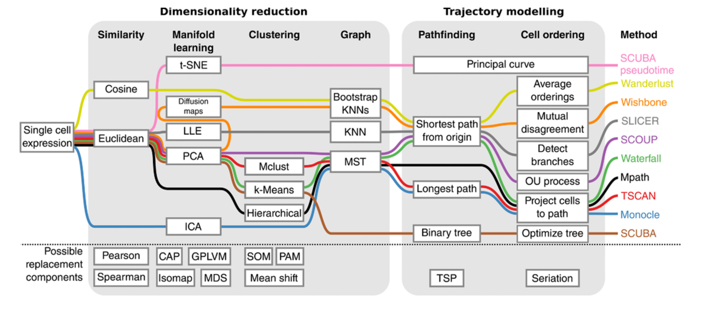
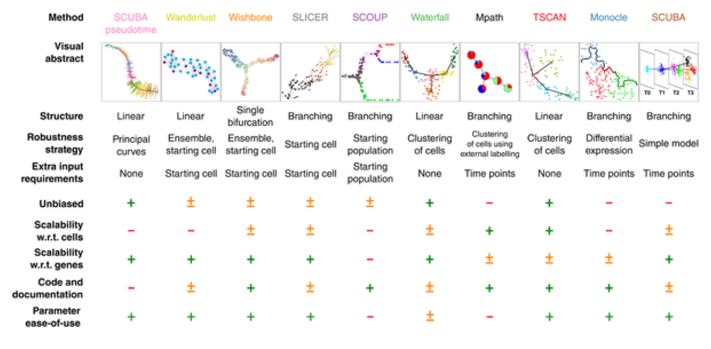

# 生物学分析

## 聚类介绍


对数据进行了标准化并移除了混淆因子后，就可以进行与手头的生物学问题相关的分析。分析的性质取决于数据集。 然而，一些方面在广泛的背景下有用，我们将在接下来的几章中讨论其中的一些方面。从scRNA-seq数据的聚类开始。

### 介绍

scRNA-seq最有希望的应用之一是基于转录谱的*de novo*发现和注释细胞类型。在计算上，这是一个难题，因为它相当于**非监督聚类**。 也就是说，我们需要根据转录组的相似性识别细胞群，不需要对细胞类型的任何先验知识。 此外，在大多数情况下，我们甚至不知道*先验*集群的数量。由于噪音（技术和生物）和高维度（比如基因），问题变得更具挑战性。

### 降维

When working with large datasets, it can often be beneficial to apply
some sort of dimensionality reduction method. By projecting
the data onto a lower-dimensional sub-space, one is often able to
significantly reduce the amount of noise. An additional benefit is
that it is typically much easier to visualize the data in a 2 or
3-dimensional subspace. We have already discussed PCA (chapter \@ref(visual-pca)) and t-SNE (chapter \@ref(visual-pca)).

### 聚类方法

__Unsupervised clustering__ is useful in many different applications and
it has been widely studied in machine learning. Some of the most
popular approaches are __hierarchical clustering__, __k-means clustering__ and __graph-based clustering__.

#### 层次聚类

In [hierarchical clustering](https://en.wikipedia.org/wiki/Hierarchical_clustering), one can use either a bottom-up or a
top-down approach. In the former case, each cell is initially assigned to
its own cluster and pairs of clusters are subsequently merged to
create a hieararchy:

<div class="figure" style="text-align: center">

<p class="caption">(\#fig:clust-hierarch-raw)Raw data</p>
</div>

<div class="figure" style="text-align: center">

<p class="caption">(\#fig:clust-hierarch-dendr)The hierarchical clustering dendrogram</p>
</div>

With a top-down strategy, one instead starts with
all observations in one cluster and then recursively split each
cluster to form a hierarchy. One of the
advantages of this strategy is that the method is deterministic.

#### k-means

In [_k_-means clustering](https://en.wikipedia.org/wiki/K-means_clustering), the goal is to partition _N_ cells into _k_
different clusters. In an iterative manner, cluster centers are
assigned and each cell is assigned to its nearest cluster:

<div class="figure" style="text-align: center">

<p class="caption">(\#fig:clust-k-means)Schematic representation of the k-means clustering</p>
</div>

Most methods for scRNA-seq analysis includes a _k_-means step at some point.

#### 基于图的方法

Over the last two decades there has been a lot of interest in
analyzing networks in various domains. One goal is to identify groups
or modules of nodes in a network.

<div class="figure" style="text-align: center">

<p class="caption">(\#fig:clust-graph)Schematic representation of the graph network</p>
</div>

Some of these methods can be applied
to scRNA-seq data by building a graph where each node represents a cell. Note that constructing the graph and assigning weights to the edges is not trivial. One advantage of graph-based methods is that some of them are very efficient and can be applied to networks containing millions of nodes.

### 聚类的挑战

* What is the number of clusters _k_?
* What is a cell type?
* __Scalability__: in the last few years the number of cells in scRNA-seq experiments has grown by several orders of magnitude from ~$10^2$ to ~$10^6$
* Tools are not user-friendly

### Tools for scRNA-seq data

#### [SINCERA](https://research.cchmc.org/pbge/sincera.html)

* SINCERA [@Guo2015-ok] is based on hierarchical clustering
* Data is converted to _z_-scores before clustering
* Identify _k_ by finding the first singleton cluster in the hierarchy

#### [SC3](http://bioconductor.org/packages/SC3/)

<div class="figure" style="text-align: center">

<p class="caption">(\#fig:clust-sc3)SC3 pipeline</p>
</div>

* SC3 [@Kiselev2016-bq] is based on PCA and spectral dimensionality reductions
* Utilises _k_-means
* Additionally performs the consensus clustering

#### tSNE + k-means

* Based on __tSNE__ maps
* Utilises _k_-means

#### Seurat clustering

[`Seurat`](https://github.com/satijalab/seurat) clustering is based on a _community detection_ approach similar to `SNN-Cliq` and to one previously proposed for analyzing CyTOF data [@Levine2015-fk]. Since `Seurat` has become more like an all-in-one tool for scRNA-seq data analysis we dedicate a separate chapter to discuss it in more details (chapter \@ref(seurat-chapter)).

### Comparing clustering

To compare two sets of clustering labels we can use [adjusted Rand index](https://en.wikipedia.org/wiki/Rand_index). The index is a measure of the similarity between two data clusterings. Values of the adjusted Rand index lie in $[0;1]$ interval, where $1$ means that two clusterings are identical and $0$ means the level of similarity expected by chance.

## Clustering example {#clust-methods}


```r
library(pcaMethods)
library(SC3)
library(scater)
library(SingleCellExperiment)
library(pheatmap)
library(mclust)
set.seed(1234567)
```

To illustrate clustering of scRNA-seq data, we consider the `Deng` dataset of cells from developing mouse embryo [@Deng2014-mx]. We have preprocessed the dataset and created a `SingleCellExperiment` object in advance. We have also annotated the cells with the cell types identified in the original publication (it is the `cell_type2` column in the `colData` slot).

### Deng dataset

Let's load the data and look at it:

```r
deng <- readRDS("data/deng/deng-reads.rds")
deng
## class: SingleCellExperiment 
## dim: 22431 268 
## metadata(0):
## assays(2): counts logcounts
## rownames(22431): Hvcn1 Gbp7 ... Sox5 Alg11
## rowData names(10): feature_symbol is_feature_control ...
##   total_counts log10_total_counts
## colnames(268): 16cell 16cell.1 ... zy.2 zy.3
## colData names(30): cell_type2 cell_type1 ... pct_counts_ERCC
##   is_cell_control
## reducedDimNames(0):
## spikeNames(1): ERCC
```

Let's look at the cell type annotation:

```r
table(colData(deng)$cell_type2)
## 
##     16cell      4cell      8cell early2cell earlyblast  late2cell 
##         50         14         37          8         43         10 
##  lateblast   mid2cell   midblast         zy 
##         30         12         60          4
```

A simple PCA analysis already separates some strong cell types and provides some insights in the data structure:

```r
plotPCA(deng, colour_by = "cell_type2")
```

As you can see, the early cell types separate quite well, but the three blastocyst timepoints are more difficult to distinguish.

### SC3

Let's run `SC3` clustering on the Deng data. The advantage of the `SC3` is that it can directly ingest a `SingleCellExperiment` object.

Now let's image we do not know the number of clusters _k_ (cell types). `SC3` can estimate a number of clusters for you:

```r
deng <- sc3_estimate_k(deng)
metadata(deng)$sc3$k_estimation
```

Interestingly, the number of cell types predicted by `SC3` is smaller than in the original data annotation. However, early, mid and late stages of different cell types together, we will have exactly 6 cell types. We store the merged cell types in `cell_type1` column of the `colData` slot:

```r
plotPCA(deng, colour_by = "cell_type1")
```


Now we are ready to run `SC3` (we also ask it to calculate biological properties of the clusters): 

```r
deng <- sc3(deng, ks = 10, biology = TRUE, n_cores = 1)
```

`SC3` result consists of several different outputs (please look in [@Kiselev2016-bq] and [SC3 vignette](http://bioconductor.org/packages/release/bioc/vignettes/SC3/inst/doc/my-vignette.html) for more details). Here we show some of them:

Consensus matrix:

```r
sc3_plot_consensus(deng, k = 10, show_pdata = "cell_type2")
```

Silhouette plot:

```r
sc3_plot_silhouette(deng, k = 10)
```

Heatmap of the expression matrix:

```r
sc3_plot_expression(deng, k = 10, show_pdata = "cell_type2")
```

Identified marker genes:

```r
sc3_plot_markers(deng, k = 10, show_pdata = "cell_type2")
```

PCA plot with highlighted `SC3` clusters:

```r
plotPCA(deng, colour_by = "sc3_10_clusters")
```

Compare the results of `SC3` clustering with the original publication cell type labels:

```r
adjustedRandIndex(colData(deng)$cell_type2, colData(deng)$sc3_10_clusters)
## [1] 0.7721292
```

__Note__ `SC3` can also be run in an interactive `Shiny` session:


This command will open `SC3` in a web browser.

__Note__ Due to direct calculation of distances `SC3` becomes very slow when the number of cells is $>5000$. For large datasets containing up to $10^5$ cells we recomment using `Seurat` (see chapter \@ref(seurat-chapter)).

* __Exercise 1__: Run `SC3` for $k$ from 8 to 12 and explore different clustering solutions in your web browser.

* __Exercise 2__: Which clusters are the most stable when $k$ is changed from 8 to 12? (Look at the "Stability" tab)

* __Exercise 3__: Check out differentially expressed genes and marker genes for the obtained clusterings. Please use $k=10$.

* __Exercise 4__: Change the marker genes threshold (the default is 0.85). Does __SC3__ find more marker genes?

### tSNE + kmeans

[tSNE](https://lvdmaaten.github.io/tsne/) plots that we saw before (\@ref(visual-tsne)) when used the __scater__ package are made by using the [Rtsne](https://cran.r-project.org/web/packages/Rtsne/index.html) and [ggplot2](https://cran.r-project.org/web/packages/ggplot2/index.html) packages. Here we will do the same:

```r
deng <- runTSNE(deng, rand_seed = 1)
plotTSNE(deng)
```
<div class="figure" style="text-align: center">

<p class="caption">(\#fig:clust-tsne)tSNE map of the patient data</p>
</div>

Note that all points on the plot above are black. This is different from what we saw before, when the cells were coloured based on the annotation. Here we do not have any annotation and all cells come from the same batch, therefore all dots are black.

Now we are going to apply _k_-means clustering algorithm to the cloud of points on the tSNE map. How many groups do you see in the cloud?

We will start with $k=8$:

```r
colData(deng)$tSNE_kmeans <- as.character(kmeans(deng@reducedDims$TSNE, centers = 8)$clust)
plotTSNE(deng, colour_by = "tSNE_kmeans")
```
<div class="figure" style="text-align: center">

<p class="caption">(\#fig:clust-tsne-kmeans2)tSNE map of the patient data with 8 colored clusters, identified by the k-means clustering algorithm</p>
</div>
__Exercise 7__: Make the same plot for $k=10$.

__Exercise 8__: Compare the results between `tSNE+kmeans` and the original publication cell types. Can the results be improved by changing the `perplexity` parameter?

__Our solution__:


As you may have noticed, `tSNE+kmeans` is stochastic
and gives different results every time they are run. To get a better
overview of the solutions, we need to run the methods multiple times. `SC3` is also stochastic, but thanks to the consensus step, it is more robust and less likely to produce different outcomes.

### SINCERA

As mentioned in the previous chapter [SINCERA](https://research.cchmc.org/pbge/sincera.html) is based on hierarchical clustering. One important thing to keep in mind is that it performs a gene-level z-score transformation before doing clustering:


```r
# use the same gene filter as in SC3
input <- logcounts(deng[rowData(deng)$sc3_gene_filter, ])
```


```r
# perform gene-by-gene per-sample z-score transformation
dat <- apply(input, 1, function(y) scRNA.seq.funcs::z.transform.helper(y))
# hierarchical clustering
dd <- as.dist((1 - cor(t(dat), method = "pearson"))/2)
hc <- hclust(dd, method = "average")
```

If the number of cluster is not known [SINCERA](https://research.cchmc.org/pbge/sincera.html) can identify __k__ as the minimum height of the hierarchical tree that generates no more than a specified number of singleton clusters (clusters containing only 1 cell)

```r
num.singleton <- 0
kk <- 1
for (i in 2:dim(dat)[2]) {
    clusters <- cutree(hc, k = i)
    clustersizes <- as.data.frame(table(clusters))
    singleton.clusters <- which(clustersizes$Freq < 2)
    if (length(singleton.clusters) <= num.singleton) {
        kk <- i
    } else {
        break;
    }
}
cat(kk)
## 6
```

Let's now visualize the SINCERA results as a heatmap:

```r
pheatmap(
    t(dat),
    cluster_cols = hc,
    cutree_cols = kk,
    kmeans_k = 100,
    show_rownames = FALSE
)
```
<div class="figure" style="text-align: center">

<p class="caption">(\#fig:clust-sincera)Clustering solutions of SINCERA method using found $k$</p>
</div>
__Exercise 10__: Compare the results between `SINCERA` and the original publication cell types.

__Our solution__:

```r
colData(deng)$SINCERA <- as.character(cutree(hc, k = kk))
adjustedRandIndex(colData(deng)$cell_type2, colData(deng)$SINCERA)
```

__Exercise 11__: Is using the singleton cluster criteria for finding __k__ a good idea?


## Feature Selection


```r
library(scRNA.seq.funcs)
library(matrixStats)
library(M3Drop)
library(RColorBrewer)
library(SingleCellExperiment)
set.seed(1)
```

Single-cell RNASeq is capable of measuring the expression of many
thousands of genes in every cell. However, in most situations only a
portion of those will show a response to the biological condition of
interest, e.g. differences in cell-type, drivers of differentiation,
respond to an environmental stimulus. Most genes detected in a scRNASeq
experiment will only be detected at different levels due to technical
noise. One consequence of this is that technical noise and batch
effects can obscure the biological signal of interest.

Thus, it is often advantageous to perform feature selection to remove
those genes which only exhibit technical noise from downstream analysis.
Not only does this generally increase the signal:noise ratio in the data;
it also reduces the computational complexity of analyses, by reducing
the total amount of data to be processed.

For scRNASeq data, we will be focusing on unsupervised methods of feature
selection which don't require any a priori information, such as cell-type
labels or biological group, since they are not available, or may be unreliable,
for many experiments. In contrast, differential expression (chapter \@ref(dechapter))
can be considered a form of supervised feature selection since it uses the
known biological label of each sample to identify features (i.e. genes) which
are expressed at different levels across groups.

For this section we will continue working with the Deng data. 


```r
deng <- readRDS("data/deng/deng-reads.rds")
celltype_labs <- colData(deng)$cell_type2
cell_colors <- brewer.pal(max(3,length(unique(celltype_labs))), "Set3")
```

Feature selection is performed after QC, however this data has already been QCed so
we can skip that step here. M3Drop contain two different feature selection methods
"M3DropFeatureSelection" which is based on a Michaelis-Menten curve and is designed
for full-transcript single-cell RNA-seq data (such as Smartseq2) and 
"NBumiFeatureSelectionCombinedDrop" which is based on a negative binomial model and
is designed for UMI count data. We will demonstrate both on the Deng Smartseq2 data.

M3Drop feature selection is runs direction on a normalized (but not log-transformed) 
expression matrix. This can be extracted from our SingleCellExperiment object using the 
command below. 


```r
expr_matrix <- M3Drop::M3DropConvertData(deng)
```

This function is compatible with most single-cell RNA-seq analysis packages including:
scater, SingleCellExperiment, monocle, and Seurat. It can also convert an existing 
expression matrix to the correct form (removing undetected genes & normalizing/delogging) 
if you specify whether the matrix is raw counts, or log transformed. Check the manual for details:


__Exercise 1__: Confirm that the conversion function has removed undetected genes:

```r
nrow(counts(deng)) - nrow(expr_matrix)
summary( rowSums(counts(deng))[! rownames(counts(deng)) %in% rownames(expr_matrix) ] )
```

### Identifying Genes vs a Null Model

There are two main approaches to unsupervised feature selection. The
first is to identify genes which behave differently from a null model
describing just the technical noise expected in the dataset.

If the dataset contains spike-in RNAs they can be used to directly model
technical noise. However, measurements of spike-ins may not experience
the same technical noise as endogenous transcripts [(Svensson et al., 2017)](https://www.nature.com/nmeth/journal/v14/n4/full/nmeth.4220.html).
In addition, scRNASeq experiments often contain only a small number of
spike-ins which reduces our confidence in fitted model parameters.

#### Highly Variable Genes

The first method proposed to identify features in scRNASeq datasets
was to identify highly variable genes (HVG). HVG assumes that if genes
have large differences in expression across cells some of those differences
are due to biological difference between the cells rather than technical noise.
However, because of the nature of count data, there is a positive relationship
between the mean expression of a gene and the variance in the read counts across
cells. This relationship must be corrected for to properly identify HVGs.

__Exercise 2__
Using the functions rowMeans and rowVars to plot the relationship between mean expression
and variance for all genes in this dataset. (Hint: use log="xy" to plot on a log-scale).


```r
plot(
    rowMeans(expr_matrix), 
    rowVars(expr_matrix), 
    log="xy", 
    pch=16,
    xlab="Mean Expression", 
    ylab="Variance", 
    main=""
)
```

A popular method to correct for the relationship between variance and mean expression
was proposed by [Brennecke et al.](http://www.nature.com/nmeth/journal/v10/n11/full/nmeth.2645.html).
To use the Brennecke method, we first normalize for library size then calculate
the mean and the square coefficient of variation (variation divided by
the squared mean expression). A quadratic curve is fit to the relationship
between these two variables for the ERCC spike-in, and then a chi-square test is used to find genes
significantly above the curve. This method is included in the M3Drop package as the
Brennecke_getVariableGenes(counts, spikes) function. However, this dataset does not contain spike-ins
so we will use the entire dataset to estimate the technical noise.

In the figure below the red curve
is the fitted technical noise model and the dashed line is the 95%
CI. Pink dots are the genes with significant biological variability
after multiple-testing correction.


```r
Brennecke_HVG <- BrenneckeGetVariableGenes(
    expr_matrix,
    fdr = 0.01,
    minBiolDisp = 0.5
)
```


This function returns a matrix of significant genes as well as their estimated effect size (difference 
between observed and expected coefficient of variation), and their significance as raw p.values and 
FDR corrected q.values. For now we will just keep the names of the significant HVG genes.


```r
HVG_genes <- Brennecke_HVG$Gene
```

__Exercise 3__
How many genes were signifcant using BrenneckeGetVariableGenes? 


```r
length(HVG_genes)
```
#### High Dropout Genes

An alternative to finding HVGs is to identify genes with unexpectedly high numbers of zeros.
The frequency of zeros, known as the "dropout rate", is very closely related to expression level
in scRNASeq data. Zeros are the dominant feature of single-cell RNASeq data, typically accounting
for over half of the entries in the final expression matrix. These zeros predominantly result
from the failure of mRNAs failing to be reversed transcribed [(Andrews and Hemberg, 2016)](http://www.biorxiv.org/content/early/2017/05/25/065094). Reverse transcription
is an enzyme reaction thus can be modelled using the Michaelis-Menten equation:

$$P_{dropout} = 1 - S/(K + S)$$

where $S$ is the mRNA concentration in the cell (we will estimate this as average expression)
and $K$ is the Michaelis-Menten constant.

Because the Michaelis-Menten equation is a convex non-linear function, genes which are
differentially expression across two or more populations of cells in our dataset will
be shifted up/right of the Michaelis-Menten model (see Figure below).


```r
K <- 49
S_sim <- 10^seq(from = -3, to = 4, by = 0.05) # range of expression values
MM <- 1 - S_sim / (K + S_sim)
plot(
    S_sim, 
    MM, 
    type = "l", 
    lwd = 3, 
    xlab = "Expression", 
    ylab = "Dropout Rate", 
    xlim = c(1,1000)
)
S1 <- 10 # Mean expression in population 1
P1 <- 1 - S1 / (K + S1) # Dropouts for cells in condition 1
S2 <- 750 # Mean expression in population 2
P2 <- 1 - S2 / (K + S2) # Dropouts for cells in condition 2
points(
    c(S1, S2),
    c(P1, P2), 
    pch = 16, 
    col = "grey85", 
    cex = 3
)
mix <- 0.5 # proportion of cells in condition 1
points(
    S1 * mix + S2 * (1 - mix), 
    P1 * mix + P2 * (1 - mix), 
    pch = 16, 
    col = "grey35", 
    cex = 3
)
```

__Note__: add `log="x"` to the `plot` call above to see how this looks on the log scale, which is used in M3Drop figures.

__Exercise 4__: Produce the same plot as above with different expression levels (S1 & S2) and/or mixtures (mix).


```r
plot(
    S_sim, 
    MM, 
    type = "l", 
    lwd = 3, 
    xlab = "Expression", 
    ylab = "Dropout Rate", 
    xlim = c(1, 1000), 
    log = "x"
)
S1 <- 100
P1 <- 1 - S1 / (K + S1) # Expression & dropouts for cells in condition 1
S2 <- 1000
P2 <- 1 - S2 / (K + S2) # Expression & dropouts for cells in condition 2
points(
    c(S1, S2),
    c(P1, P2), 
    pch = 16, 
    col = "grey85", 
    cex = 3
)
mix <- 0.75 # proportion of cells in condition 1
points(
    S1 * mix + S2 * (1 - mix), 
    P1 * mix + P2 * (1 - mix), 
    pch = 16, 
    col = "grey35", 
    cex = 3
)
```
We use M3Drop to identify significant outliers to the right of the MM
curve. We also apply 1% FDR multiple testing correction:


```r
M3Drop_genes <- M3DropFeatureSelection(
    expr_matrix,
    mt_method = "fdr",
    mt_threshold = 0.01
)
M3Drop_genes <- M3Drop_genes$Gene
```


An alternative method is contained in the M3Drop package that is tailored specifically for
UMI-tagged data which generally contains many zeros resulting from low sequencing coverage
in addition to those resulting from insufficient reverse-transcription. This model is the
Depth-Adjusted Negative Binomial (DANB). This method describes each expression observation
as a negative binomial model with a mean related to both the mean expression of the
respective gene and the sequencing depth of the respective cell, and a variance related to
the mean-expression of the gene. 

This method is designed to model the raw counts in a dataset directly, and we can extract
the appropriate matrix using the "NBumiConvertData" function similar to M3Drop. However,
we have an extra step for fitting the model since that is the slowest step of the method
and we are currently working on additional methods that can use this model information
for other things (such as normalization, co-expression testing, highly variable gene
detection).

This method includes a binomial test of the significance of each feature, but since
the Deng data is not UMI counts the model does not fit the noise sufficiently and 
far too many genes will be called as significant. Thus we will take the top 1500
by effect size.


```r
deng_int <- NBumiConvertData(deng)
DANB_fit <- NBumiFitModel(deng_int) # DANB is fit to the raw count matrix
# Perform DANB feature selection
DropFS <- NBumiFeatureSelectionCombinedDrop(DANB_fit, method="fdr", qval.thresh=0.01, suppress.plot=FALSE)
DANB_genes <- DropFS[1:1500,]$Gene
```

__Exercise 5__
How many genes were signifcant using NBumiFeatureSelectionCombinedDrop? 


### Correlated Expression

A completely different approach to feature selection is to use gene-gene correlations. This method
is based on the idea that multiple genes will be differentially expressed between different cell-types
or cell-states. Genes which are expressed in the same cell-population will be positively correlated
with each other where as genes expressed in different cell-populations will be negatively correated with
each other. Thus important genes can be identified by the magnitude of their correlation
with other genes.

The limitation of this method is that it assumes technical noise is random and independent for each cell,
thus shouldn't produce gene-gene correlations, but this assumption is violated by batch effects which are
generally systematic between different experimental batches and will produce gene-gene correlations. As a
result it is more appropriate to take the top few thousand genes as ranked by gene-gene correlation than
consider the significance of the correlations.


Lastly, another common method for feature selection in scRNASeq data is to use PCA loadings. Genes with
high PCA loadings are likely to be highly variable and correlated with many other variable genes, thus
may be relevant to the underlying biology. However, as with gene-gene correlations PCA loadings tend to
be susceptible to detecting systematic variation due to batch effects; thus it is recommended to plot the PCA
results to determine those components corresponding to the biological variation rather than batch effects.


```r
# PCA is typically performed on log-transformed expression data
pca <- prcomp(log(expr_matrix + 1) / log(2))

# plot projection
plot(
    pca$rotation[,1], 
    pca$rotation[,2], 
    pch = 16, 
    col = cell_colors[as.factor(celltype_labs)]
) 
```


```r
# calculate loadings for components 1 and 2
score <- rowSums(abs(pca$x[,c(1,2)])) 
names(score) <- rownames(expr_matrix)
score <- score[order(-score)]
PCA_genes <- names(score[1:1500])
```
__Exercise 6__
Consider the top 5 principal components. Which appear to be most biologically relevant? How does the top 1,500
features change if you consider the loadings for those components?

### Comparing Methods

We can check whether the identified features really do represent genes differentially expressed between
cell-types in this dataset.


```r
M3DropExpressionHeatmap(
    M3Drop_genes,
    expr_matrix,
    cell_labels = celltype_labs
)
```


We can also consider how consistent each feature selection method is with the others using the Jaccard Index:

```r
J <- sum(M3Drop_genes %in% HVG_genes)/length(unique(c(M3Drop_genes, HVG_genes)))
```

__Exercise 7__

Plot the expression of the features for each of the other methods. Which appear to be differentially expressed? How consistent are the different methods for this dataset?


## Pseudotime analysis


```r
library(SingleCellExperiment)
library(TSCAN)
library(M3Drop)
library(monocle)
library(destiny)
library(SLICER)
library(ouija)
library(scater)
library(ggplot2)
library(ggthemes)
library(ggbeeswarm)
library(corrplot)
set.seed(1)
```

In many situations, one is studying a process where cells change
continuously. This includes, for example, many differentiation processes
taking place during development: following a stimulus, cells
will change from one cell-type to another. Ideally, we would like to
monitor the expression levels of an individual cell over
time. Unfortunately, such monitoring is not possible with scRNA-seq
since the cell is lysed (destroyed) when the RNA is extracted.

Instead, we must sample at multiple time-points and obtain snapshots
of the gene expression profiles. Since some of the cells will proceed
faster along the differentiation than others, each snapshot may
contain cells at varying points along the developmental
progression. We use statistical methods to order the cells along one
or more trajectories which represent the underlying developmental
trajectories, this ordering is referred to as "pseudotime".

In this chapter we will consider five different tools: Monocle, TSCAN,
destiny, SLICER and ouija for ordering cells according to their pseudotime
development. To illustrate the methods we will be using a dataset on
mouse embryonic development [@Deng2014-mx]. The dataset consists of
268 cells from 10 different time-points of early mouse development. In this case, there is no need for pseudotime alignment since the cell labels provide information about the development trajectory. Thus, the labels allow us to establish a ground truth so that we can evaluate and compare the different methods.

A recent review by Cannoodt et al provides a detailed summary of the
various computational methods for trajectory inference from
single-cell transcriptomics [@Cannoodt2016-uj]. They discuss several
tools, but unfortunately for our purposes many of these tools do not
have complete or well-maintained implementations, and/or are not
implemented in R.

Cannoodt et al cover:

* SCUBA - Matlab implementation
* Wanderlust - Matlab (and requires registration to even download)
* Wishbone - Python
* SLICER - R, but package only available on Github
* SCOUP - C++ command line tool
* Waterfall - R, but one R script in supplement
* Mpath - R pkg, but available as tar.gz on Github; function
documentation but no vignette/workflow
* Monocle - Bioconductor package
* TSCAN - Bioconductor package

Unfortunately only two tools discussed (Monocle and TSCAN) meet the
gold standard of open-source software hosted in a reputable repository.

The following figures from the paper summarise some of the features of
the various tools.

<div class="figure" style="text-align: center">

<p class="caption">(\#fig:pseudotime-methods-description)Descriptions of trajectory inference methods for single-cell transcriptomics data (Fig. 2 from Cannoodt et al, 2016).</p>
</div>

<div class="figure" style="text-align: center">

<p class="caption">(\#fig:pseudotime-methods)Characterization of trajectory inference methods for single-cell transcriptomics data (Fig. 3 from Cannoodt et al, 2016).</p>
</div>


### First look at Deng data

Let us take a first look at the Deng data, without yet applying sophisticated pseudotime methods. As the plot below shows, simple PCA does a very good job of displaying the structure in these data. It is only once we reach the blast cell types ("earlyblast", "midblast", "lateblast") that PCA struggles to separate the distinct cell types.


```r
deng_SCE <- readRDS("data/deng/deng-reads.rds")
deng_SCE$cell_type2 <- factor(
    deng_SCE$cell_type2,
    levels = c("zy", "early2cell", "mid2cell", "late2cell",
                        "4cell", "8cell", "16cell", "earlyblast",
                        "midblast", "lateblast")
)
cellLabels <- deng_SCE$cell_type2
deng <- counts(deng_SCE)
colnames(deng) <- cellLabels
deng_SCE <- runPCA(deng_SCE)
plotPCA(deng_SCE, colour_by = "cell_type2")
```


PCA, here, provides a useful baseline for assessing different pseudotime methods. For a very naive pseudotime we can just take the co-ordinates of the first principal component.


```r
deng_SCE$PC1 <- reducedDim(deng_SCE, "PCA")[,1]
ggplot(as.data.frame(colData(deng_SCE)), aes(x = PC1, y = cell_type2, 
                              colour = cell_type2)) +
    geom_quasirandom(groupOnX = FALSE) +
    scale_color_tableau() + theme_classic() +
    xlab("First principal component") + ylab("Timepoint") +
    ggtitle("Cells ordered by first principal component")
```


As the plot above shows, PC1 struggles to correctly order cells early and late in the developmental timecourse, but overall does a relatively good job of ordering cells by developmental time.   

Can bespoke pseudotime methods do better than naive application of PCA?
 

### TSCAN

TSCAN combines clustering with pseudotime analysis. First it clusters the cells using `mclust`, which is based on a mixture of normal distributions. Then it builds a minimum spanning tree to connect the clusters. The branch of this tree that connects the largest number of clusters is the main branch which is used to determine pseudotime.

First we will try to use all genes to order the cells.


```r
procdeng <- TSCAN::preprocess(deng)
colnames(procdeng) <- 1:ncol(deng)
dengclust <- TSCAN::exprmclust(procdeng, clusternum = 10)
TSCAN::plotmclust(dengclust)
```


```r
dengorderTSCAN <- TSCAN::TSCANorder(dengclust, orderonly = FALSE)
pseudotime_order_tscan <- as.character(dengorderTSCAN$sample_name)
deng_SCE$pseudotime_order_tscan <- NA
deng_SCE$pseudotime_order_tscan[as.numeric(dengorderTSCAN$sample_name)] <- 
    dengorderTSCAN$Pseudotime
```

Frustratingly, TSCAN only provides pseudotime values for 221 of 268 cells, silently returning missing values for non-assigned cells.

Again, we examine which timepoints have been assigned to each state:


```r
cellLabels[dengclust$clusterid == 10]
ggplot(as.data.frame(colData(deng_SCE)), 
       aes(x = pseudotime_order_tscan, 
           y = cell_type2, colour = cell_type2)) +
    geom_quasirandom(groupOnX = FALSE) +
    scale_color_tableau() + theme_classic() +
    xlab("TSCAN pseudotime") + ylab("Timepoint") +
    ggtitle("Cells ordered by TSCAN pseudotime")
```


TSCAN gets the development trajectory the "wrong way around", in the sense that later pseudotime values correspond to early timepoints and vice versa. This is not inherently a problem (it is easy enough to reverse the ordering to get the intuitive interpretation of pseudotime), but overall it would be a stretch to suggest that TSCAN performs better than PCA on this dataset. (As it is a PCA-based method, perhaps this is not entirely surprising.)


__Exercise 1__ Compare results for different numbers of clusters (`clusternum`).

### monocle

Monocle skips the clustering stage of TSCAN and directly builds a
minimum spanning tree on a reduced dimension representation of the
cells to connect all cells. Monocle then identifies the longest path
in this tree to determine pseudotime. If the data contains diverging
trajectories (i.e. one cell type differentiates into two different
cell-types), monocle can identify these. Each of the resulting forked paths is
defined as a separate cell state.

Unfortunately, Monocle does not work when all the genes are used, so
we must carry out feature selection. First, we use M3Drop:

```r
m3dGenes <- as.character(
    M3DropFeatureSelection(deng)$Gene
)
```


```r
d <- deng[which(rownames(deng) %in% m3dGenes), ]
d <- d[!duplicated(rownames(d)), ]
```

Now run monocle:

```r
colnames(d) <- 1:ncol(d)
geneNames <- rownames(d)
rownames(d) <- 1:nrow(d)
pd <- data.frame(timepoint = cellLabels)
pd <- new("AnnotatedDataFrame", data=pd)
fd <- data.frame(gene_short_name = geneNames)
fd <- new("AnnotatedDataFrame", data=fd)

dCellData <- newCellDataSet(d, phenoData = pd, featureData = fd, expressionFamily = tobit())
dCellData <- setOrderingFilter(dCellData, which(geneNames %in% m3dGenes))
dCellData <- estimateSizeFactors(dCellData)
dCellDataSet <- reduceDimension(dCellData, pseudo_expr = 1)
dCellDataSet <- orderCells(dCellDataSet, reverse = FALSE)
plot_cell_trajectory(dCellDataSet)
# Store the ordering
pseudotime_monocle <-
    data.frame(
        Timepoint = phenoData(dCellDataSet)$timepoint,
        pseudotime = phenoData(dCellDataSet)$Pseudotime,
        State = phenoData(dCellDataSet)$State
    )
rownames(pseudotime_monocle) <- 1:ncol(d)
pseudotime_order_monocle <-
    rownames(pseudotime_monocle[order(pseudotime_monocle$pseudotime), ])
```

We can again compare the inferred pseudotime to the known sampling timepoints.

```r
deng_SCE$pseudotime_monocle <- pseudotime_monocle$pseudotime
ggplot(as.data.frame(colData(deng_SCE)), 
       aes(x = pseudotime_monocle, 
           y = cell_type2, colour = cell_type2)) +
    geom_quasirandom(groupOnX = FALSE) +
    scale_color_tableau() + theme_classic() +
    xlab("monocle pseudotime") + ylab("Timepoint") +
    ggtitle("Cells ordered by monocle pseudotime")
```


Monocle - at least with its default settings - performs poorly on these data. The "late2cell" group is completely separated from the "zy", "early2cell" and "mid2cell" cells (though these are correctly ordered), and there is no separation at all of "4cell", "8cell", "16cell" or any blast cell groups.


### Diffusion maps

[Diffusion maps](https://en.wikipedia.org/wiki/Diffusion_map) were introduced by [Ronald Coifman and Stephane Lafon](http://www.sciencedirect.com/science/article/pii/S1063520306000546), and the underlying idea is to assume that the data are samples from a diffusion process. The method infers the low-dimensional manifold by estimating the eigenvalues and eigenvectors for the diffusion operator related to the data.

[Angerer et al](https://academic.oup.com/bioinformatics/article/32/8/1241/1744143) have applied the diffusion maps concept to the analysis of single-cell RNA-seq data to create an R package called [destiny](http://bioconductor.org/packages/destiny).

We will take the ranko prder of cells in the first diffusion map component as "diffusion map pseudotime" here.


```r
deng <- logcounts(deng_SCE)
colnames(deng) <- cellLabels
dm <- DiffusionMap(t(deng))

tmp <- data.frame(DC1 = eigenvectors(dm)[,1],
                  DC2 = eigenvectors(dm)[,2],
                  Timepoint = deng_SCE$cell_type2)
ggplot(tmp, aes(x = DC1, y = DC2, colour = Timepoint)) +
    geom_point() + scale_color_tableau() + 
    xlab("Diffusion component 1") + 
    ylab("Diffusion component 2") +
    theme_classic()
```


```r
deng_SCE$pseudotime_diffusionmap <- rank(eigenvectors(dm)[,1])
ggplot(as.data.frame(colData(deng_SCE)), 
       aes(x = pseudotime_diffusionmap, 
           y = cell_type2, colour = cell_type2)) +
    geom_quasirandom(groupOnX = FALSE) +
    scale_color_tableau() + theme_classic() +
    xlab("Diffusion map pseudotime (first diffusion map component)") +
    ylab("Timepoint") +
    ggtitle("Cells ordered by diffusion map pseudotime")
```


Like the other methods, using the first diffusion map component from destiny as pseudotime does a good job at ordering the early time-points (if we take high values as "earlier" in developement), but it is unable to distinguish the later ones.

__Exercise 2__ Do you get a better resolution between the later time points by considering additional eigenvectors?

__Exercise 3__ How does the ordering change if you only use the genes identified by M3Drop?


### SLICER

The SLICER method is an algorithm for constructing trajectories that
describe gene expression changes during a sequential biological
process, just as Monocle and TSCAN are. SLICER is designed to capture
highly nonlinear gene expression changes, automatically select genes
related to the process, and detect multiple branch and loop features
in the trajectory [@Welch2016-jr]. The SLICER R package is available
from its [GitHub repository](https://github.com/jw156605/SLICER) and
can be installed from there using the `devtools` package.

We use the `select_genes` function in SLICER to automatically select
the genes to use in builing the cell trajectory. The function uses
"neighbourhood variance" to identify genes that vary smoothly, rather
than fluctuating randomly, across the set of cells. Following this, we
determine which value of "k" (number of nearest neighbours) yields an embedding that
most resembles a trajectory. Then we estimate the [locally linear
embedding](https://en.wikipedia.org/wiki/Nonlinear_dimensionality_reduction) of the cells.


```r
library("lle")
slicer_genes <- select_genes(t(deng))
k <- select_k(t(deng[slicer_genes,]), kmin = 30, kmax=60)
slicer_traj_lle <- lle(t(deng[slicer_genes,]), m = 2, k)$Y
reducedDim(deng_SCE, "LLE") <- slicer_traj_lle
plotReducedDim(deng_SCE, use_dimred = "LLE", colour_by = "cell_type2") +
    xlab("LLE component 1") + ylab("LLE component 2") +
    ggtitle("Locally linear embedding of cells from SLICER")
```


With the locally linear embedding computed we can construct a
k-nearest neighbour graph that is fully connected. This plot displays
a (yellow) circle for each cell, with the cell ID number overlaid in
blue. Here we show the graph computed using 10 nearest
neighbours. Here, SLICER appears to detect one major trajectory with
one branch.


```r
slicer_traj_graph <- conn_knn_graph(slicer_traj_lle, 10)
plot(slicer_traj_graph, main = "Fully connected kNN graph from SLICER")
```


From this graph we can identify "extreme" cells that are candidates
for start/end cells in the trajectory.


```r
ends <- find_extreme_cells(slicer_traj_graph, slicer_traj_lle)
start <- ends[1]
```


Having defined a start cell we can order the cells in the estimated pseudotime.


```r
pseudotime_order_slicer <- cell_order(slicer_traj_graph, start)
branches <- assign_branches(slicer_traj_graph, start)

pseudotime_slicer <-
    data.frame(
        Timepoint = cellLabels,
        pseudotime = NA,
        State = branches
    )
pseudotime_slicer$pseudotime[pseudotime_order_slicer] <-
    1:length(pseudotime_order_slicer)
deng_SCE$pseudotime_slicer <- pseudotime_slicer$pseudotime
```

We can again compare the inferred pseudotime to the known sampling
timepoints. SLICER does not provide a pseudotime value per se, just an
ordering of cells.


```r
ggplot(as.data.frame(colData(deng_SCE)), 
       aes(x = pseudotime_slicer, 
           y = cell_type2, colour = cell_type2)) +
    geom_quasirandom(groupOnX = FALSE) +
    scale_color_tableau() + theme_classic() +
    xlab("SLICER pseudotime (cell ordering)") +
    ylab("Timepoint") +
    theme_classic()
```

Like the previous method, SLICER here provides a good ordering for the
early time points. It places "16cell" cells before "8cell" cells, but provides better ordering for blast cells than many of the earlier methods.

__Exercise 4__ How do the results change for different k? (e.g. k = 5) What about changing the number of nearest neighbours in
the call to `conn_knn_graph`?

__Exercise 5__ How does the ordering change if you use a different set
of genes from those chosen by SLICER (e.g. the genes identified by M3Drop)?

### Ouija

Ouija (http://kieranrcampbell.github.io/ouija/) takes a different approach from the pseudotime estimation methods we have looked at so far. Earlier methods have all been "unsupervised", which is to say that apart from perhaps selecting informative genes we do not supply the method with any prior information about how we expect certain genes or the trajectory as a whole to behave. 

Ouija, in contrast, is a probabilistic framework that allows for interpretable learning of single-cell pseudotimes using only small panels of marker genes. This method:

* infers pseudotimes from a small number of marker genes letting you understand why the pseudotimes have been learned in terms of those genes;
* provides parameter estimates (with uncertainty) for interpretable gene regulation behaviour (such as the peak time or the upregulation time); 
* has a Bayesian hypothesis test to find genes regulated before others along the trajectory; 
* identifies metastable states, ie discrete cell types along the continuous trajectory.

We will supply the following marker genes to Ouija (with timepoints where they are expected to be highly expressed):

* Early timepoints: Dazl, Rnf17, Sycp3, Nanog, Pou5f1, Fgf8, Egfr, Bmp5, Bmp15
* Mid timepoints: Zscan4b, Foxa1, Prdm14, Sox21
* Late timepoints: Creb3, Gpx4, Krt8, Elf5, Eomes, Cdx2, Tdgf1, Gdf3

With Ouija we can model genes as either exhibiting monotonic up or down regulation (known as switch-like behaviour), or transient behaviour where the gene briefly peaks. By default, Ouija assumes all genes exhibit switch-like behaviour (the authors assure us not to worry if we get it wrong - the noise model means incorrectly specifying a transient gene as switch-like has minimal effect).

Here we can "cheat" a little and check that our selected marker genes do actually identify different timepoints of the differentiation process.


```r
ouija_markers_down <- c("Dazl", "Rnf17", "Sycp3", "Fgf8", 
                        "Egfr", "Bmp5", "Bmp15", "Pou5f1")
ouija_markers_up <- c("Creb3", "Gpx4", "Krt8", "Elf5", "Cdx2", 
                      "Tdgf1", "Gdf3", "Eomes")
ouija_markers_transient <- c("Zscan4b", "Foxa1", "Prdm14", "Sox21")
ouija_markers <- c(ouija_markers_down, ouija_markers_up, 
                   ouija_markers_transient)
plotExpression(deng_SCE, ouija_markers, x = "cell_type2", colour_by = "cell_type2") +
    theme(axis.text.x = element_text(angle = 60, hjust = 1))
```

In order to fit the pseudotimes wesimply call `ouija`, passing in the expected response types. Note that if no response types are provided then they are all assumed to be switch-like by default, which we will do here. The input to Ouija can be a cell-by-gene matrix of non-negative expression values, or an ExpressionSet object, or, happily, by selecting the `logcounts` values from a SingleCellExperiment object.

We can apply prior information about whether genes are up- or down-regulated across the differentiation process, and also provide prior information about when the switch in expression or a peak in expression is likely to occur. 

We can fit the Ouija model using either:

* Hamiltonian Monte Carlo (HMC) - full MCMC inference where gradient information of the log-posterior is used to “guide” the random walk through the parameter space, or
* Automatic Differentiation Variational Bayes (ADVI or simply VI) - approximate inference where the KL divergence to an approximate distribution is minimised.

In general, HMC will provide more accurate inference with approximately correct posterior variance for all parameters. However, VB is orders of magnitude quicker than HMC and while it may underestimate posterior variance, the Ouija authors suggest that anecdotally it often performs as well as HMC for discovering posterior pseudotimes.

To help the Ouija model, we provide it with prior information about the strength of switches for up- and down-regulated genes. By setting switch strength to -10 for down-regulated genes and 10 for up-regulated genes with a prior strength standard deviation of 0.5 we are telling the model that we are confident about the expected behaviour of these genes across the differentiation process.


```r
options(mc.cores = parallel::detectCores())
response_type <- c(rep("switch", length(ouija_markers_down) + 
                           length(ouija_markers_up)), 
                   rep("transient", length(ouija_markers_transient)))
switch_strengths <- c(rep(-10, length(ouija_markers_down)),
                      rep(10, length(ouija_markers_up)))
switch_strength_sd <- c(rep(0.5, length(ouija_markers_down)),
                      rep(0.5, length(ouija_markers_up)))
garbage <- capture.output(
    oui_vb <- ouija(deng_SCE[ouija_markers,],
                    single_cell_experiment_assay = "logcounts", 
                    response_type = response_type,
                    switch_strengths = switch_strengths,
                    switch_strength_sd = switch_strength_sd,
                    inference_type = "vb")
)

print(oui_vb)
```

We can plot the gene expression over pseudotime along with the maximum a posteriori (MAP) estimates of the mean function (the sigmoid or Gaussian transient function) using the plot_expression function. 


```r
plot_expression(oui_vb)
```


We can also visualise when in the trajectory gene regulation behaviour occurs, either in the form of the switch time or the peak time (for switch-like or transient genes) using the plot_switch_times and plot_transient_times functions:


```r
plot_switch_times(oui_vb)
```


```r
plot_peak_times(oui_vb)
```

Identify metastable states using consistency matrices.


```r
cmo <- consistency_matrix(oui_vb)
plot_consistency(oui_vb)
```


```r
cell_classifications <- cluster_consistency(cmo)
```


```r
map_pst <- map_pseudotime(oui_vb)
ouija_pseudotime <- data.frame(map_pst, cell_classifications)

ggplot(ouija_pseudotime, aes(x = map_pst, y = cell_classifications)) +
  geom_point() +
  xlab("MAP pseudotime") +
  ylab("Cell classification")
```


```r
deng_SCE$pseudotime_ouija <- ouija_pseudotime$map_pst
deng_SCE$ouija_cell_class <- ouija_pseudotime$cell_classifications

ggplot(as.data.frame(colData(deng_SCE)), 
       aes(x = pseudotime_ouija, 
           y = cell_type2, colour = cell_type2)) +
    geom_quasirandom(groupOnX = FALSE) +
    scale_color_tableau() + theme_classic() +
    xlab("Ouija pseudotime") +
    ylab("Timepoint") +
    theme_classic()
```


Ouija does quite well in the ordering of the cells here, although it can be sensitive to the choice of marker genes and prior information supplied. How do the results change if you select different marker genes or change the priors?

Ouija identifies four metastable states here, which we might annotate as  "zygote/2cell", "4/8/16 cell", "blast1" and "blast2".


```r
ggplot(as.data.frame(colData(deng_SCE)), 
       aes(x = as.factor(ouija_cell_class), 
           y = pseudotime_ouija, colour = cell_type2)) +
    geom_boxplot() + 
    coord_flip() +
    scale_color_tableau() + theme_classic() +
    xlab("Ouija cell classification") +
    ylab("Ouija pseudotime") +
    theme_classic()
```

A common analysis is to work out the regulation orderings of genes. For example, is gene A upregulated before gene B? Does gene C peak before the downregulation of gene D? Ouija answers these questions in terms of a Bayesian hypothesis test of whether the difference in regulation timing (either switch time or peak time) is significantly different to 0. This is collated using the gene_regulation function.


```r
gene_regs <- gene_regulation(oui_vb)
head(gene_regs)
```

```r
## # A tibble: 6 x 7
## # Groups:   label, gene_A [6]
##   label         gene_A gene_B mean_difference lower_95 upper_95 significant
##   <chr>         <chr>  <chr>            <dbl>    <dbl>    <dbl> <lgl>      
## 1 Bmp15 - Cdx2  Bmp15  Cdx2           -0.0658 -1.17e-1  -0.0136 TRUE       
## 2 Bmp15 - Creb3 Bmp15  Creb3           0.266   1.96e-1   0.321  TRUE       
## 3 Bmp15 - Elf5  Bmp15  Elf5           -0.665  -7.03e-1  -0.622  TRUE       
## 4 Bmp15 - Eomes Bmp15  Eomes           0.0765 -1.30e-2   0.150  FALSE      
## 5 Bmp15 - Foxa1 Bmp15  Foxa1          -0.0157 -4.95e-2   0.0128 FALSE      
## 6 Bmp15 - Gdf3  Bmp15  Gdf3            0.0592  2.06e-4   0.114  TRUE
```

What conclusions can you draw from the gene regulation output from Ouija?

If you have time, you might try the HMC inference method and see if that changes the Ouija results in any way.


### Comparison of the methods

How do the trajectories inferred by TSCAN, Monocle, Diffusion Map, SLICER and Ouija compare?

TSCAN and Diffusion Map methods get the trajectory the "wrong way round", so we'll adjust that for these comparisons.


```r
df_pseudotime <- as.data.frame(
    colData(deng_SCE)[, grep("pseudotime", colnames(colData(deng_SCE)))]
)
colnames(df_pseudotime) <- gsub("pseudotime_", "", 
                                colnames(df_pseudotime))
df_pseudotime$PC1 <- deng_SCE$PC1
df_pseudotime$order_tscan <- -df_pseudotime$order_tscan
df_pseudotime$diffusionmap <- -df_pseudotime$diffusionmap

corrplot.mixed(cor(df_pseudotime, use = "na.or.complete"), 
               order = "hclust", tl.col = "black",
               main = "Correlation matrix for pseudotime results",
               mar = c(0, 0, 3.1, 0))
```

We see here that Ouija, TSCAN and SLICER all give trajectories that are similar and strongly correlated with PC1. Diffusion Map is less strongly correlated with these methods, and Monocle gives very different results.


__Exercise 6__: Compare destiny and SLICER to TSCAN, Monocle and Ouija in more depth. Where and how do they differ?

### Expression of genes through time

Each package also enables the visualization of expression through pseudotime. Following individual genes is very helpful for identifying genes that play an important role in the differentiation process. We illustrate the procedure using the `Rhoa` gene.

We have added the pseudotime values computed with all methods here to
the `colData` slot of an `SCE` object. Having done that, the full
plotting capabilities of the `scater` package can be used to
investigate relationships between gene expression, cell populations
and pseudotime. This is particularly useful for the packages such as
SLICER that do not provide plotting functions.


__Principal components__

```r
plotExpression(deng_SCE, "Rhoa", x = "PC1", 
               colour_by = "cell_type2", show_violin = FALSE,
               show_smooth = TRUE)
```


__TSCAN__

```r
plotExpression(deng_SCE, "Rhoa", x = "pseudotime_order_tscan", 
               colour_by = "cell_type2", show_violin = FALSE,
               show_smooth = TRUE)
```

__Monocle__

```r
plotExpression(deng_SCE, "Rhoa", x = "pseudotime_monocle", 
               colour_by = "cell_type2", show_violin = FALSE,
               show_smooth = TRUE)
```

__Diffusion Map__

```r
plotExpression(deng_SCE, "Rhoa", x = "pseudotime_diffusionmap", 
               colour_by = "cell_type2", show_violin = FALSE,
               show_smooth = TRUE)
```


__SLICER__

```r
plotExpression(deng_SCE, "Rhoa", x = "pseudotime_slicer", 
               colour_by = "cell_type2", show_violin = FALSE,
               show_smooth = TRUE)
```

__Ouija__

```r
plotExpression(deng_SCE, "Rhoa", x = "pseudotime_ouija", 
               colour_by = "cell_type2", show_violin = FALSE,
               show_smooth = TRUE)
```

How many of these methods outperform the naive approach of using the first principal component to represent pseudotime for these data?

__Exercise 7__: Repeat the exercise using a subset of the genes, e.g. the set of highly variable genes that can be obtained using `Brennecke_getVariableGenes()`

## Imputation


```r
library(scImpute)
library(SC3)
library(scater)
library(SingleCellExperiment)
library(mclust)
library(DrImpute)
library(Rmagic)
set.seed(1234567)
```


As discussed previously, one of the main challenges when analyzing scRNA-seq 
data is the presence of zeros, or dropouts. The dropouts are assumed to have 
arisen for three possible reasons:

* The gene was not expressed in the cell and hence there are no transcripts to sequence
* The gene was expressed, but for some reason the transcripts were lost somewhere prior to sequencing
* The gene was expressed and transcripts were captured and turned into cDNA, but the sequencing depth was not sufficient to produce any reads.

Thus, dropouts could be result of experimental shortcomings, and if this is 
the case then we would like to provide computational corrections. One possible
 solution is to impute the dropouts in the expression matrix. To be able to 
impute gene expression values, one must have an underlying model. However, 
since we do not know which dropout events are technical artefacts and which 
correspond to the transcript being truly absent, imputation is a difficult 
challenge and prone to creating [false-positive results in downstream analysis](https://f1000research.com/articles/7-1740/v2).

There are many different imputation methods available we will consider three 
fast, published methods:
[MAGIC](https://github.com/pkathail/magic) [@Van_Dijk2017-bh], 
[DrImpute](https://github.com/gongx030/DrImpute) and 
[scImpute](https://github.com/Vivianstats/scImpute) [@Li2017-tz]. 

DrImpute and scImpute both use a model to determine which zeros are technical
and impute only those values. Both use clustering to identify a group of cells
that are assumed to have homogenous expression. DrImpute imputes all values that
are not consistently zero in all cells of a cluster. Whereas, scImpute uses a
zero-inflated normal distribution fit to log-normalized expression values and
imputed all inflated zeros. 

### scImpute

To test `scImpute`, we use the default parameters and we apply it to the Deng dataset that we have worked with before. scImpute takes a .csv or .txt file as an input:


```r
deng <- readRDS("data/deng/deng-reads.rds")
write.csv(counts(deng), "deng.csv")
scimpute(
    count_path = "deng.csv",
    infile = "csv",
    outfile = "txt", 
    out_dir = "./",
    Kcluster = 10,
    ncores = 2
)
```
Now we can compare the results with original data by considering a PCA plot


```r
res <- read.table("scimpute_count.txt")
colnames(res) <- NULL
res <- SingleCellExperiment(
    assays = list(logcounts = log2(as.matrix(res) + 1)), 
    colData = colData(deng)
)
rowData(res)$feature_symbol <- rowData(deng)$feature_symbol
plotPCA(
    res, 
    colour_by = "cell_type2"
)
```


Compare this result to the original data in Chapter \@ref(clust-methods). What are the most significant differences?

We can examine the expression of specific genes to directly see the effect of
 imputation on the expression distribution.

```r
plotExpression(res, c("Sox2", "Eomes", "Zscan4d", "Fgf4"))
```


```r
plotExpression(deng, c("Sox2", "Eomes", "Zscan4d", "Fgf4"))
```


To evaluate the impact of the imputation, we use `SC3` to cluster the imputed matrix

```r
res <- sc3_estimate_k(res)
metadata(res)$sc3$k_estimation
res <- sc3(res, ks = 10, n_cores = 1, gene_filter = FALSE)
adjustedRandIndex(colData(deng)$cell_type2, colData(res)$sc3_10_clusters)
plotPCA(
    res, 
    colour_by = "sc3_10_clusters"
)
```


__Exercise:__ Based on the PCA and the clustering results, do you think that imputation using `scImpute` is a good idea for the Deng dataset?

### DrImpute

We can do the same for DrImpute. DrImpute runs on a log-normalized expression matrix directly in R, we generate this matrix using scater, then run DrImpute. Unlike scImpute, DrImpute considers the consensus imputation across a range of ks using two differ correlation distances:


```r
deng <- normalize(deng)
res <- DrImpute(deng@assays[["logcounts"]], ks=8:12)
colnames(res) <- colnames(deng)
rownames(res) <- rownames(deng)
res <- SingleCellExperiment(
    assays = list(logcounts = as.matrix(res)), 
    colData = colData(deng)
)
rowData(res)$feature_symbol <- rowData(deng)$feature_symbol
plotPCA(
    res, 
    colour_by = "cell_type2"
)
```


```r
plotExpression(res, c("Sox2", "Eomes", "Zscan4d", "Fgf4"))
```

__Exercise:__ Check the sc3 clustering of the DrImpute matrix, do you think that imputation using `DrImpute` is a good idea for the Deng dataset?


### MAGIC

__(due to technical issues please run this chapter as an exercise)__

MAGIC is a python package but the authors have provided an R package wrapper,
so it can be run seemlessly from R.

Unlike scImpute and DrImpute, MAGIC smoothes the entire dataset. It imputes 
zeros but also smoothes non-zero values to further exaggerate any structure
within the dataset. Since it is based on a diffusion process, it specifically
enhances trajectory-like structure in a dataset, in contrast to scImpute and 
DrImpute which assume a cluster-like structure to the underlying data.


Compare this result to the original data in Chapter \@ref(clust-methods). What are the most significant differences?

To evaluate the impact of the imputation, we use `SC3` to cluster the imputed matrix


__Exercise:__ MAGIC contains two parameters which affect the degree of imputation: `t` and `k`, what is the effect of increase/decreasing these parameters? (Hint: try t=1, t=10, k=2, k=50)


__Exercise:__ What is the difference between `scImpute` and `MAGIC` based on the PCA and clustering analysis? Which one do you think is best to use?


## Differential Expression (DE) analysis {#dechapter}

### Bulk RNA-seq

One of the most common types of analyses when working with bulk RNA-seq
data is to identify differentially expressed genes. By comparing the
genes that change between two conditions, e.g. mutant and wild-type or
stimulated and unstimulated, it is possible to characterize the
molecular mechanisms underlying the change.

Several different methods,
e.g. [DESeq2](https://bioconductor.org/packages/DESeq2) and
[edgeR](https://bioconductor.org/packages/release/bioc/html/edgeR.html),
have been developed for bulk RNA-seq. Moreover, there are also
extensive
[datasets](http://genomebiology.biomedcentral.com/articles/10.1186/gb-2013-14-9-r95)
available where the RNA-seq data has been validated using
RT-qPCR. These data can be used to benchmark DE finding algorithms and the available evidence suggests that the algorithms are performing quite well.

### Single cell RNA-seq

In contrast to bulk RNA-seq, in scRNA-seq we usually do not have a defined
set of experimental conditions. Instead, as was shown in a previous chapter
(\@ref(clust-methods)) we can identify the cell groups by using an unsupervised
clustering approach. Once the groups have been identified one can find differentially
expressed genes either by comparing the differences in variance between the groups (like the Kruskal-Wallis test implemented in SC3), or by comparing gene expression between clusters in a pairwise manner. In the following chapter we will mainly consider tools developed for pairwise comparisons.

### Differences in Distribution

Unlike bulk RNA-seq, we generally have a large number of samples (i.e. cells) for each group we are comparing in single-cell experiments. Thus we can take advantage of the whole distribution of expression values in each group to identify differences between groups rather than only comparing estimates of mean-expression as is standard for bulk RNASeq.

There are two main approaches to comparing distributions. Firstly, we can use existing statistical models/distributions and fit the same type of model to the expression in each group then test for differences in the parameters for each model, or test whether the model fits better if a particular paramter is allowed to be different according to group. For instance in Chapter \@ref(dealing-with-confounders) we used edgeR to test whether allowing mean expression to be different in different batches significantly improved the fit of a negative binomial model of the data.

Alternatively, we can use a non-parametric test which does not assume that expression values follow any particular distribution, e.g. the [Kolmogorov-Smirnov test (KS-test)](https://en.wikipedia.org/wiki/Kolmogorov%E2%80%93Smirnov_test). Non-parametric tests generally convert observed expression values to ranks and test whether the distribution of ranks for one group are signficantly different from the distribution of ranks for the other group. However, some non-parametric methods fail in the presence of a large number of tied values, such as the case for dropouts (zeros) in single-cell RNA-seq expression data. Moreover, if the conditions for a parametric test hold, then it will typically be more powerful than a non-parametric test.

### Models of single-cell RNASeq data

The most common model of RNASeq data is the negative binomial model:


```r
set.seed(1)
hist(
    rnbinom(
        1000, 
        mu = 10, 
        size = 100), 
    col = "grey50", 
    xlab = "Read Counts", 
    main = "Negative Binomial"
)
```
<div class="figure" style="text-align: center">

<p class="caption">(\#fig:nb-plot)Negative Binomial distribution of read counts for a single gene across 1000 cells</p>
</div>
Mean:
$\mu = mu$

Variance:
$\sigma^2 = mu + mu^2/size$

It is parameterized by the mean expression (mu) and the dispersion (size), which is inversely related to the variance. The negative binomial model fits bulk RNA-seq data very well and it is used for most statistical methods designed for such data. In addition, it has been show to fit the distribution of molecule counts obtained from data tagged by unique molecular identifiers (UMIs) quite well ([Grun et al. 2014](http://www.nature.com/nmeth/journal/v11/n6/full/nmeth.2930.html), [Islam et al. 2011](http://genome.cshlp.org/content/21/7/1160)).

However, a raw negative binomial model does not fit full-length transcript data as well due to the high dropout rates relative to the non-zero read counts. For this type of data a variety of zero-inflated negative binomial models have been proposed (e.g. [MAST](https://bioconductor.org/packages/release/bioc/html/MAST.html), [SCDE](https://bioconductor.org/packages/release/bioc/html/scde.html)).


```r
d <- 0.5;
counts <- rnbinom(
    1000, 
    mu = 10, 
    size = 100
)
counts[runif(1000) < d] <- 0
hist(
    counts, 
    col = "grey50", 
    xlab = "Read Counts", 
    main = "Zero-inflated NB"
)
```
<div class="figure" style="text-align: center">

<p class="caption">(\#fig:zero-inflation-plot)Zero-inflated Negative Binomial distribution</p>
</div>
Mean:
$\mu = mu \cdot (1 - d)$

Variance:
$\sigma^2 = \mu \cdot (1-d) \cdot (1 + d \cdot \mu + \mu / size)$

These models introduce a new parameter $d$, for the dropout rate, to the negative binomial model. As we saw in Chapter 19, the dropout rate of a gene is strongly correlated with the mean expression of the gene. Different zero-inflated negative binomial models use different relationships between mu and d and some may fit $\mu$ and $d$ to the expression of each gene independently.

Finally, several methods use a Poisson-Beta distribution which is based on a mechanistic model of transcriptional bursting. There is strong experimental support for this model ([Kim and Marioni, 2013](https://genomebiology.biomedcentral.com/articles/10.1186/gb-2013-14-1-r7)) and it provides a good fit to scRNA-seq data but it is less easy to use than the negative-binomial models and much less existing methods upon which to build than the negative binomial model.


```r
a <- 0.1
b <- 0.1
g <- 100
lambdas <- rbeta(1000, a, b)
counts <- sapply(g*lambdas, function(l) {rpois(1, lambda = l)})
hist(
    counts, 
    col = "grey50", 
    xlab = "Read Counts", 
    main = "Poisson-Beta"
)
```


Mean:
$\mu = g \cdot a / (a + b)$

Variance:
$\sigma^2 = g^2 \cdot a \cdot b/((a + b + 1) \cdot (a + b)^2)$

This model uses three parameters: $a$ the rate of activation of transcription; $b$ the rate of inhibition of transcription; and $g$ the rate of transcript production while transcription is active at the locus. Differential expression methods may test each of the parameters for differences across groups or only one (often $g$).

All of these models may be further expanded to explicitly account for other sources of gene expression differences such as batch-effect or library depth depending on the particular DE algorithm.

__Exercise__: Vary the parameters of each distribution to explore how they affect the distribution of gene expression. How similar are the Poisson-Beta and Negative Binomial models?


## DE in a real dataset


```r
library(scRNA.seq.funcs)
library(edgeR)
library(monocle)
library(MAST)
library(ROCR)
set.seed(1)
```

### Introduction

To test different single-cell differential expression methods we will be using the Blischak dataset from Chapters 7-17.
For this experiment bulk RNA-seq data for each cell-line was generated in addition to single-cell data. We will use the
differentially expressed genes identified using standard methods on the respective bulk data as the ground truth for evaluating the
accuracy of each single-cell method. To save time we have pre-computed these for you. You can run the commands below to load these data.


```r
DE <- read.table("data/tung/TPs.txt")
notDE <- read.table("data/tung/TNs.txt")
GroundTruth <- list(
    DE = as.character(unlist(DE)), 
    notDE = as.character(unlist(notDE))
)
```

This ground truth has been produce for the comparison of individual NA19101 to NA19239. Now load the respective single-cell data:


```r
molecules <- read.table("data/tung/molecules.txt", sep = "\t")
anno <- read.table("data/tung/annotation.txt", sep = "\t", header = TRUE)
keep <- anno[,1] == "NA19101" | anno[,1] == "NA19239"
data <- molecules[,keep]
group <- anno[keep,1]
batch <- anno[keep,4]
# remove genes that aren't expressed in at least 6 cells
gkeep <- rowSums(data > 0) > 5;
counts <- data[gkeep,]
# Library size normalization
lib_size = colSums(counts)
norm <- t(t(counts)/lib_size * median(lib_size)) 
# Variant of CPM for datasets with library sizes of fewer than 1 mil molecules
```

Now we will compare various single-cell DE methods. Note that we will only be running methods which are available as R-packages and run relatively quickly.

### Kolmogorov-Smirnov test

The types of test that are easiest to work with are non-parametric
ones. The most commonly used non-parametric test is the
[Kolmogorov-Smirnov test](https://en.wikipedia.org/wiki/Kolmogorov%E2%80%93Smirnov_test) (KS-test) and we can use it to compare the distributions for each gene in the two individuals.

The KS-test quantifies the distance between the empirical cummulative distributions of the expression of each gene in each of the two populations. It is sensitive to changes in mean experession and changes in variability. However it assumes data is continuous and may perform poorly when data contains a large number of identical values (eg. zeros). Another issue with the KS-test is that it can be very sensitive for large sample sizes and thus it may end up as significant even though the magnitude of the difference is very small.

<div class="figure" style="text-align: center">

<p class="caption">(\#fig:ks-statistic)Illustration of the two-sample KolmogorovCSmirnov statistic. Red and blue lines each correspond to an empirical distribution function, and the black arrow is the two-sample KS statistic. (taken from [here](https://en.wikipedia.org/wiki/Kolmogorov%E2%80%93Smirnov_test))</p>
</div>

Now run the test:


```r
pVals <- apply(
    norm, 1, function(x) {
        ks.test(
            x[group == "NA19101"], 
            x[group == "NA19239"]
        )$p.value
    }
)
# multiple testing correction
pVals <- p.adjust(pVals, method = "fdr")
```
This code "applies" the function to each row (specified by 1) of the expression matrix, data. In the function we are returning just the p.value from the ks.test output. We can now consider how many of the ground truth positive and negative DE genes are detected by the KS-test:

#### Evaluating Accuracy


```r
sigDE <- names(pVals)[pVals < 0.05]
length(sigDE) 
# Number of KS-DE genes
sum(GroundTruth$DE %in% sigDE) 
# Number of KS-DE genes that are true DE genes
sum(GroundTruth$notDE %in% sigDE)
# Number of KS-DE genes that are truly not-DE
```

As you can see many more of our ground truth negative genes were identified as DE by the KS-test (false positives) than ground truth positive genes (true positives), however this may be due to the larger number of notDE genes thus we typically normalize these counts as the True positive rate (TPR), TP/(TP + FN), and False positive rate (FPR), FP/(FP+TP).


```r
tp <- sum(GroundTruth$DE %in% sigDE)
fp <- sum(GroundTruth$notDE %in% sigDE)
tn <- sum(GroundTruth$notDE %in% names(pVals)[pVals >= 0.05])
fn <- sum(GroundTruth$DE %in% names(pVals)[pVals >= 0.05])
tpr <- tp/(tp + fn)
fpr <- fp/(fp + tn)
cat(c(tpr, fpr))
```
Now we can see the TPR is much higher than the FPR indicating the KS test is identifying DE genes.

So far we've only evaluated the performance at a single significance threshold. Often it is informative to vary the threshold and evaluate performance across a range of values. This is then plotted as a receiver-operating-characteristic curve (ROC) and a general accuracy statistic can be calculated as the area under this curve (AUC). We will use the ROCR package to facilitate this plotting.


```r
# Only consider genes for which we know the ground truth
pVals <- pVals[names(pVals) %in% GroundTruth$DE | 
               names(pVals) %in% GroundTruth$notDE] 
truth <- rep(1, times = length(pVals));
truth[names(pVals) %in% GroundTruth$DE] = 0;
pred <- ROCR::prediction(pVals, truth)
perf <- ROCR::performance(pred, "tpr", "fpr")
ROCR::plot(perf)
```
<div class="figure" style="text-align: center">

<p class="caption">(\#fig:ks-roc-plot)ROC curve for KS-test.</p>
</div>

```r
aucObj <- ROCR::performance(pred, "auc")
aucObj@y.values[[1]] # AUC
```

Finally to facilitate the comparisons of other DE methods let's put this code into a function so we don't need to repeat it:


```r
DE_Quality_AUC <- function(pVals) {
    pVals <- pVals[names(pVals) %in% GroundTruth$DE | 
                   names(pVals) %in% GroundTruth$notDE]
    truth <- rep(1, times = length(pVals));
    truth[names(pVals) %in% GroundTruth$DE] = 0;
    pred <- ROCR::prediction(pVals, truth)
    perf <- ROCR::performance(pred, "tpr", "fpr")
    ROCR::plot(perf)
    aucObj <- ROCR::performance(pred, "auc")
    return(aucObj@y.values[[1]])
}
```
### Wilcox/Mann-Whitney-U Test

The Wilcox-rank-sum test is another non-parametric test, but tests specifically if values in one group are greater/less than the values in the other group. Thus it is often considered a test for difference in median expression between two groups; whereas the KS-test is sensitive to any change in distribution of expression values.


```r
pVals <- apply(
    norm, 1, function(x) {
        wilcox.test(
            x[group == "NA19101"], 
            x[group == "NA19239"]
        )$p.value
    }
)
# multiple testing correction
pVals <- p.adjust(pVals, method = "fdr")
DE_Quality_AUC(pVals)
```
<div class="figure" style="text-align: center">

<p class="caption">(\#fig:wilcox-plot)ROC curve for Wilcox test.</p>
</div>

### edgeR

We've already used edgeR for differential expression in Chapter \@ref(dealing-with-confounders). edgeR is based on a negative binomial model of gene expression and uses a generalized linear model (GLM) framework, the enables us to include other factors such as batch to the model.


```r
dge <- DGEList(
    counts = counts, 
    norm.factors = rep(1, length(counts[1,])), 
    group = group
)
group_edgeR <- factor(group)
design <- model.matrix(~ group_edgeR)
dge <- estimateDisp(dge, design = design, trend.method = "none")
fit <- glmFit(dge, design)
res <- glmLRT(fit)
pVals <- res$table[,4]
names(pVals) <- rownames(res$table)

pVals <- p.adjust(pVals, method = "fdr")
DE_Quality_AUC(pVals)
```
<div class="figure" style="text-align: center">

<p class="caption">(\#fig:edger-plot)ROC curve for edgeR.</p>
</div>

### Monocle

[Monocle](https://bioconductor.org/packages/release/bioc/html/monocle.html) can use several different models for DE. For count data it recommends the Negative Binomial model (negbinomial.size). For normalized data it recommends log-transforming it then using a normal distribution (gaussianff). Similar to edgeR this method uses a GLM framework so in theory can account for batches, however in practice the model fails for this dataset if batches are included.


```r
pd <- data.frame(group = group, batch = batch)
rownames(pd) <- colnames(counts)
pd <- new("AnnotatedDataFrame", data = pd)

Obj <- newCellDataSet(
    as.matrix(counts), 
    phenoData = pd, 
    expressionFamily = negbinomial.size()
)
Obj <- estimateSizeFactors(Obj)
Obj <- estimateDispersions(Obj)
res <- differentialGeneTest(Obj, fullModelFormulaStr = "~group")

pVals <- res[,3]
names(pVals) <- rownames(res)
pVals <- p.adjust(pVals, method = "fdr")
DE_Quality_AUC(pVals)
```
<div class="figure" style="text-align: center">

<p class="caption">(\#fig:Monocle-plot)ROC curve for Monocle.</p>
</div>
__Exercise__: Compare the results using the negative binomial model on counts and those from using the normal/gaussian model (`gaussianff()`) on log-transformed normalized counts.

__Answer__:

```r
pd <- data.frame(group = group, batch = batch)
rownames(pd) <- colnames(norm)
pd <- new("AnnotatedDataFrame", data = pd)

Obj_log <- newCellDataSet(
    as.matrix(log(norm + 1) / log(2)), 
    phenoData = pd, 
    expressionFamily = gaussianff()
)
Obj_log <- estimateSizeFactors(Obj_log)
# Obj_log <- estimateDispersions(Obj_log)
res <- differentialGeneTest(Obj_log, fullModelFormulaStr = "~group")

pVals <- res[,3]
names(pVals) <- rownames(res)
pVals <- p.adjust(pVals, method = "fdr")
DE_Quality_AUC(pVals)
```
<div class="figure" style="text-align: center">

<p class="caption">(\#fig:Monocle-plot2)ROC curve for Monocle-gaussian.</p>
</div>

### MAST

[MAST](https://bioconductor.org/packages/release/bioc/html/MAST.html) is based on a zero-inflated negative binomial model. It tests for differential expression using a hurdle model to combine tests of discrete (0 vs not zero) and continuous (non-zero values) aspects of gene expression. Again this uses a linear modelling framework to enable complex models to be considered.


```r
log_counts <- log(counts + 1) / log(2)
fData <- data.frame(names = rownames(log_counts))
rownames(fData) <- rownames(log_counts);
cData <- data.frame(cond = group)
rownames(cData) <- colnames(log_counts)

obj <- FromMatrix(as.matrix(log_counts), cData, fData)
colData(obj)$cngeneson <- scale(colSums(assay(obj) > 0))
cond <- factor(colData(obj)$cond)

# Model expression as function of condition & number of detected genes
zlmCond <- zlm.SingleCellAssay(~ cond + cngeneson, obj) 

summaryCond <- summary(zlmCond, doLRT = "condNA19101")
summaryDt <- summaryCond$datatable

summaryDt <- as.data.frame(summaryDt)
pVals <- unlist(summaryDt[summaryDt$component == "H",4]) # H = hurdle model
names(pVals) <- unlist(summaryDt[summaryDt$component == "H",1])
pVals <- p.adjust(pVals, method = "fdr")
DE_Quality_AUC(pVals)
```
<div class="figure" style="text-align: center">

<p class="caption">(\#fig:MAST-plot)ROC curve for MAST.</p>
</div>

### Slow Methods (>1h to run) 

These methods are too slow to run today but we encourage you to try them out on your own:

### BPSC

[BPSC](https://academic.oup.com/bioinformatics/article/32/14/2128/2288270/Beta-Poisson-model-for-single-cell-RNA-seq-data) uses the Poisson-Beta model of single-cell gene expression, which we discussed in the previous chapter, and combines it with generalized linear models which we've already encountered when using edgeR. BPSC performs comparisons of one or more groups to a reference group ("control") and can include other factors such as batches in the model.


```r
library(BPSC)
bpsc_data <- norm[,batch=="NA19101.r1" | batch=="NA19239.r1"]
bpsc_group = group[batch=="NA19101.r1" | batch=="NA19239.r1"]

control_cells <- which(bpsc_group == "NA19101")
design <- model.matrix(~bpsc_group)
coef=2 # group label
res=BPglm(data=bpsc_data, controlIds=control_cells, design=design, coef=coef, 
                estIntPar=FALSE, useParallel = FALSE)
pVals = res$PVAL
pVals <- p.adjust(pVals, method = "fdr")
DE_Quality_AUC(pVals)
```

### SCDE
[SCDE](http://hms-dbmi.github.io/scde/) is the first single-cell specific DE method. It fits a zero-inflated negative binomial model to expression data using Bayesian statistics. The usage below tests for differences in mean expression of individual genes across groups but recent versions include methods to test for differences in mean expression or dispersion of groups of genes, usually representing a pathway.


```r
library(scde)
cnts <- apply(
    counts,
    2,
    function(x) {
        storage.mode(x) <- 'integer'
        return(x)
    }
)
names(group) <- 1:length(group)
colnames(cnts) <- 1:length(group)
o.ifm <- scde::scde.error.models(
    counts = cnts,
    groups = group,
    n.cores = 1,
    threshold.segmentation = TRUE,
    save.crossfit.plots = FALSE,
    save.model.plots = FALSE,
    verbose = 0,
    min.size.entries = 2
)
priors <- scde::scde.expression.prior(
    models = o.ifm,
    counts = cnts,
    length.out = 400,
    show.plot = FALSE
)
resSCDE <- scde::scde.expression.difference(
    o.ifm,
    cnts,
    priors,
    groups = group,
    n.randomizations = 100,
    n.cores = 1,
    verbose = 0
)
# Convert Z-scores into 2-tailed p-values
pVals <- pnorm(abs(resSCDE$cZ), lower.tail = FALSE) * 2
DE_Quality_AUC(pVals)
```

## Comparing/Combining scRNASeq datasets


```r
library(scater)
library(SingleCellExperiment)
```

### Introduction

As more and more scRNA-seq datasets become available, carrying merged_seurat comparisons between them is key. There are two main
approaches to comparing scRNASeq datasets. The first approach is "label-centric" which is focused on trying
 to identify equivalent cell-types/states across datasets by comparing individual cells or groups of cells. The other approach
 is "cross-dataset normalization" which attempts to computationally remove experiment-specific technical/biological effects
so that data from multiple experiments can be combined and jointly analyzed.

The label-centric approach can be used with dataset with high-confidence cell-annotations, e.g. the Human Cell Atlas (HCA)
[@Regev2017-mw] or the Tabula Muris [@Quake2017] once they are completed, to project cells or clusters from a new sample onto
this reference to consider tissue composition and/or identify cells with novel/unknown identity. Conceptually, such
projections are similar to the popular BLAST method [@Altschul1990-ts], which makes it possible to quickly find the closest
match in a database for a newly identified nucleotide or amino acid sequence. The label-centric approach can also be used to
compare datasets of similar biological origin collected by different labs to ensure that the annotation and the analysis is
consistent.

<div class="figure" style="text-align: center">

<p class="caption">(\#fig:unnamed-chunk-138)Label-centric dataset comparison can be used to compare the annotations of two different samples.</p>
</div>

<div class="figure" style="text-align: center">

<p class="caption">(\#fig:unnamed-chunk-139)Label-centric dataset comparison can project cells from a new experiment onto an annotated reference.</p>
</div>

The cross-dataset normalization approach can also be used to compare datasets of similar biological origin, unlike the label-centric approach it enables the join analysis of multiple datasets to facilitate the identification of rare cell-types which may to too sparsely sampled in each individual dataset to be reliably detected. However, cross-dataset normalization is not applicable to very large and diverse references since it assumes a significant portion of the biological variablility in each of the datasets overlaps with others.


<div class="figure" style="text-align: center">

<p class="caption">(\#fig:unnamed-chunk-140)Cross-dataset normalization enables joint-analysis of 2+ scRNASeq datasets.</p>
</div>
### Datasets

We will running these methods on two human pancreas datasets: [@Muraro2016-yk] and [@Segerstolpe2016-wc]. Since the pancreas has been widely studied, these datasets are well annotated.


This data has already been formatted for scmap. Cell type labels must be stored in the `cell_type1` column of the `colData` slots, and gene ids that are consistent across both datasets must be stored in the `feature_symbol` column of the `rowData` slots.

First, lets check our gene-ids match across both datasets:

```r
sum(rowData(muraro)$feature_symbol %in% rowData(segerstolpe)$feature_symbol)/nrow(muraro)
## [1] 0.9599519
sum(rowData(segerstolpe)$feature_symbol %in% rowData(muraro)$feature_symbol)/nrow(segerstolpe)
## [1] 0.719334
```
Here we can see that 96% of the genes present in muraro match genes in segerstople and 72% of genes in segerstolpe are match
genes in muraro. This is as expected because the segerstolpe dataset was more deeply sequenced than the muraro dataset.
However, it highlights some of the difficulties in comparing scRNASeq datasets.

We can confirm this by checking the overall size of these two datasets.

```r
dim(muraro)
## [1] 19127  2126
dim(segerstolpe)
## [1] 25525  3514
```

In addition, we can check the cell-type annotations for each of these dataset using the command below:


```r
summary(factor(colData(muraro)$cell_type1))
##      acinar       alpha        beta       delta      ductal endothelial 
##         219         812         448         193         245          21 
##     epsilon       gamma mesenchymal     unclear 
##           3         101          80           4
summary(factor(colData(segerstolpe)$cell_type1))
##                 acinar                  alpha                   beta 
##                    185                    886                    270 
##          co-expression                  delta                 ductal 
##                     39                    114                    386 
##            endothelial                epsilon                  gamma 
##                     16                      7                    197 
##                   mast           MHC class II         not applicable 
##                      7                      5                   1305 
##                    PSC           unclassified unclassified endocrine 
##                     54                      2                     41
```
Here we can see that even though both datasets considered the same biological tissue the two datasets, they have been
annotated with slightly different sets of cell-types. If you are familiar withpancreas biology you might recognize
that the pancreatic stellate cells (PSCs) in segerstolpe are a type of mesenchymal stem cell which would fall under
the "mesenchymal" type in muraro. However, it isn't clear whether these two annotations should be considered synonymous
or not. We can use label-centric comparison methods to determine if these two cell-type annotations are indeed equivalent.

Alternatively, we might be interested in understanding the function of those cells that were "unclassified endocrine" or were deemed
too poor quality ("not applicable") for the original clustering in each dataset by leveraging in formation across datasets. Either
we could attempt to infer which of the existing annotations they most likely belong to using label-centric approaches or we could try
to uncover a novel cell-type among them (or a sub-type within the existing annotations) using cross-dataset normalization.

To simplify our demonstration analyses we will remove the small classes of unassigned cells, and the poor quality cells. We will retain the "unclassified endocrine" to
see if any of these methods can elucidate what cell-type they belong to.


### Projecting cells onto annotated cell-types (scmap)


We recently developed `scmap` [@Kiselev2017-nb] - a method for projecting cells from a scRNA-seq experiment onto the cell-types identified in other experiments. Additionally, a cloud version of `scmap` can be run for free, withmerged_seurat restrictions, from [http://www.hemberg-lab.cloud/scmap](http://www.hemberg-lab.cloud/scmap).


#### Feature Selection
Once we have a `SingleCellExperiment` object we can run `scmap`. First we have to build the "index" of our reference
clusters. Since we want to know whether PSCs and mesenchymal cells are synonymous we will project each dataset to the
other so we will build an index for each dataset. This requires first selecting the most informative features for the
reference dataset.


```
## Warning in linearModel(object, n_features): Your object does not contain
## counts() slot. Dropouts were calculated using logcounts() slot...
```


Genes highlighted with the red colour will be used in the futher analysis (projection).


From the y-axis of these plots we can see that scmap uses a dropmerged_seurat-based feature selection method.

Now calculate the cell-type index:


We can also visualize the index:

```r
heatmap(as.matrix(metadata(muraro)$scmap_cluster_index))
```


You may want to adjust your features using the `setFeatures` function if features are too heavily concentrated in only a few cell-types. In this case the dropmerged_seurat-based features look good so we will just them.

__Exercise__
Using the rowData of each dataset how many genes were selected as features in both datasets? What does this tell you abmerged_seurat these datasets?

__Answer__


#### Projecting

scmap computes the distance from each cell to each cell-type in the reference index, then applies an empirically derived threshold to determine which cells are assigned to the closest reference cell-type and which are unassigned. To account for differences in sequencing depth distance is calculated using the spearman correlation and cosine distance and only cells with a consistent assignment with both distances are returned as assigned.

We will project the `segerstolpe` dataset to `muraro` dataset:


and `muraro` onto `segerstolpe`


Note that in each case we are projecting to a single dataset but that this could be extended to any number of datasets for which we have computed indices.

Now lets compare the original cell-type labels with the projected labels:

```r
table(colData(muraro)$cell_type1, muraro_to_seger$scmap_cluster_labs)
##              
##               acinar alpha beta co-expression delta ductal endothelial
##   acinar         211     0    0             0     0      0           0
##   alpha            1   763    0            18     0      2           0
##   beta             2     1  397             7     2      2           0
##   delta            0     0    2             1   173      0           0
##   ductal           7     0    0             0     0    208           0
##   endothelial      0     0    0             0     0      0          15
##   epsilon          0     0    0             0     0      0           0
##   gamma            2     0    0             0     0      0           0
##   mesenchymal      0     0    0             0     0      1           0
##              
##               epsilon gamma MHC class II PSC unassigned
##   acinar            0     0            0   0          8
##   alpha             0     2            0   0         26
##   beta              0     5            1   2         29
##   delta             0     0            0   0         17
##   ductal            0     0            5   3         22
##   endothelial       0     0            0   1          5
##   epsilon           3     0            0   0          0
##   gamma             0    95            0   0          4
##   mesenchymal       0     0            0  77          2
```
Here we can see that cell-types do map to their equivalents in segerstolpe, and importantly we see that all but one of the "mesenchymal" cells were assigned to the "PSC" class.


```r
table(colData(segerstolpe)$cell_type1, seger_to_muraro$scmap_cluster_labs)
##                         
##                          acinar alpha beta delta ductal endothelial
##   acinar                    181     0    0     0      4           0
##   alpha                       0   869    1     0      0           0
##   beta                        0     0  260     0      0           0
##   co-expression               0     7   31     0      0           0
##   delta                       0     0    1   111      0           0
##   ductal                      0     0    0     0    383           0
##   endothelial                 0     0    0     0      0          14
##   epsilon                     0     0    0     0      0           0
##   gamma                       0     2    0     0      0           0
##   mast                        0     0    0     0      0           0
##   MHC class II                0     0    0     0      0           0
##   PSC                         0     0    1     0      0           0
##   unclassified endocrine      0     0    0     0      0           0
##                         
##                          epsilon gamma mesenchymal unassigned
##   acinar                       0     0           0          0
##   alpha                        0     0           0         16
##   beta                         0     0           0         10
##   co-expression                0     0           0          1
##   delta                        0     0           0          2
##   ductal                       0     0           0          3
##   endothelial                  0     0           0          2
##   epsilon                      6     0           0          1
##   gamma                        0   192           0          3
##   mast                         0     0           0          7
##   MHC class II                 0     0           0          5
##   PSC                          0     0          53          0
##   unclassified endocrine       0     0           0         41
```
Again we see cell-types match each other and that all but one of the "PSCs" match the "mesenchymal" cells providing strong evidence that these two annotations should be considered synonymous.

We can also visualize these tables using a [Sankey diagram](https://developers.google.com/chart/interactive/docs/gallery/sankey):
<!-- Sankey generated in R 3.6.0 by googleVis 0.6.4 package -->
<!-- Fri Jul 12 22:22:49 2019 -->


<!-- jsHeader -->
<script type="text/javascript">
 
// jsData 
function gvisDataSankeyID4b9854dd5793 () {
var data = new google.visualization.DataTable();
var datajson =
[
 [
"alpha ",
" alpha",
763
],
[
"beta ",
" beta",
397
],
[
"acinar ",
" acinar",
211
],
[
"ductal ",
" ductal",
208
],
[
"delta ",
" delta",
173
],
[
"gamma ",
" gamma",
95
],
[
"mesenchymal ",
" PSC",
77
],
[
"endothelial ",
" endothelial",
15
],
[
"epsilon ",
" epsilon",
3
],
[
"acinar ",
" unassigned",
8
],
[
"alpha ",
" ductal",
2
],
[
"alpha ",
" unassigned",
26
],
[
"alpha ",
" acinar",
1
],
[
"alpha ",
" co-expression",
18
],
[
"alpha ",
" gamma",
2
],
[
"beta ",
" unassigned",
29
],
[
"beta ",
" gamma",
5
],
[
"beta ",
" MHC class II",
1
],
[
"beta ",
" alpha",
1
],
[
"beta ",
" co-expression",
7
],
[
"beta ",
" acinar",
2
],
[
"beta ",
" PSC",
2
],
[
"beta ",
" ductal",
2
],
[
"beta ",
" delta",
2
],
[
"delta ",
" beta",
2
],
[
"delta ",
" unassigned",
17
],
[
"delta ",
" co-expression",
1
],
[
"ductal ",
" acinar",
7
],
[
"ductal ",
" PSC",
3
],
[
"ductal ",
" MHC class II",
5
],
[
"ductal ",
" unassigned",
22
],
[
"endothelial ",
" PSC",
1
],
[
"endothelial ",
" unassigned",
5
],
[
"gamma ",
" acinar",
2
],
[
"gamma ",
" unassigned",
4
],
[
"mesenchymal ",
" ductal",
1
],
[
"mesenchymal ",
" unassigned",
2
] 
];
data.addColumn('string','From');
data.addColumn('string','To');
data.addColumn('number','# of cells');
data.addRows(datajson);
return(data);
}
 
// jsDrawChart
function drawChartSankeyID4b9854dd5793() {
var data = gvisDataSankeyID4b9854dd5793();
var options = {};
options["width"] = 400;
options["height"] = 400;
options["sankey"] = {
                node:{
                    label:{
                        fontName:'Arial',
                        fontSize:11,color:
                        '#000000',
                        bold:true,
                        italic:false
                    },
                    colors:'#FFFFFF',
                    nodePadding:12
                },iterations:0
            };

    var chart = new google.visualization.Sankey(
    document.getElementById('SankeyID4b9854dd5793')
    );
    chart.draw(data,options);
    

}
  
 
// jsDisplayChart
(function() {
var pkgs = window.__gvisPackages = window.__gvisPackages || [];
var callbacks = window.__gvisCallbacks = window.__gvisCallbacks || [];
var chartid = "sankey";
  
// Manually see if chartid is in pkgs (not all browsers support Array.indexOf)
var i, newPackage = true;
for (i = 0; newPackage && i < pkgs.length; i++) {
if (pkgs[i] === chartid)
newPackage = false;
}
if (newPackage)
  pkgs.push(chartid);
  
// Add the drawChart function to the global list of callbacks
callbacks.push(drawChartSankeyID4b9854dd5793);
})();
function displayChartSankeyID4b9854dd5793() {
  var pkgs = window.__gvisPackages = window.__gvisPackages || [];
  var callbacks = window.__gvisCallbacks = window.__gvisCallbacks || [];
  window.clearTimeout(window.__gvisLoad);
  // The timeout is set to 100 because otherwise the container div we are
  // targeting might not be part of the document yet
  window.__gvisLoad = setTimeout(function() {
  var pkgCount = pkgs.length;
  google.load("visualization", "1", { packages:pkgs, callback: function() {
  if (pkgCount != pkgs.length) {
  // Race condition where another setTimeout call snuck in after us; if
  // that call added a package, we must not shift its callback
  return;
}
while (callbacks.length > 0)
callbacks.shift()();
} });
}, 100);
}
 
// jsFooter
</script>
 
<!-- jsChart -->  
<script type="text/javascript" src="https://www.google.com/jsapi?callback=displayChartSankeyID4b9854dd5793"></script>
 
<!-- divChart -->
  
<div id="SankeyID4b9854dd5793" 
  style="width: 400; height: 400;">
</div>

__Exercise__
How many of the previously unclassified cells would be be able to assign to cell-types using scmap?

__Answer__

```r
t2 <- table(colData(segerstolpe)$cell_type1, seger_to_muraro$scmap_cluster_labs)
seger_assigned <- sum(t2[c("unclassified endocrine"), 1:9])
```
### Cell-to-Cell mapping

scmap can also project each cell in one dataset to its approximate closest neighbouring cell in the reference dataset. This
uses a highly optimized search algorithm allowing it to be scaled to very large references (in theory 100,000-millions of
cells). However, this process is stochastic so we must fix the random seed to ensure we can reproduce our results.

We have already performed feature selection for this dataset so we can go straight to building the index.


```r
set.seed(193047)
segerstolpe <- indexCell(segerstolpe)
muraro <- indexCell(muraro)
```

In this case the index is a series of clusterings of each cell using different sets of features, parameters k and M are the
number of clusters and the number of features used in each of these subclusterings. New cells are assigned to the nearest
 cluster in each subclustering to generate unique pattern of cluster assignments. We then find the cell in the reference
dataset with the same or most similar pattern of cluster assignments.

We can examine the cluster assignment patterns for the reference datasets using:

```r
metadata(muraro)$scmap_cell_index$subclusters[1:5,1:5]
##      D28.1_1 D28.1_13 D28.1_15 D28.1_17 D28.1_2
## [1,]       4        6        4       24      34
## [2,]      16       27       14       11       3
## [3,]      18       12       17       26      24
## [4,]      44       33       41       44      12
## [5,]      39       44       23       34      32
```

To project and find the `w` nearest neighbours we use a similar command as before:

```r
muraro_to_seger <- scmapCell(
  projection = muraro,
  index_list = list(
    seger = metadata(segerstolpe)$scmap_cell_index
  ),
  w = 5
)
```

We can again look at the results:

```r
muraro_to_seger$seger[[1]][,1:5]
##      D28.1_1 D28.1_13 D28.1_15 D28.1_17 D28.1_2
## [1,]    1448     1381     1125     1834    1553
## [2,]    1731      855     1081     1731    1437
## [3,]    1229     2113     2104     1790    1890
## [4,]    2015     1833     1153     1882    1593
## [5,]    1159     1854     1731     1202    1078
```
This shows the column number of the 5 nearest neighbours in segerstolpe to each of the cells in muraro. We could then calculate a pseudotime estimate, branch assignment, or other cell-level data by selecting the appropriate data from the colData of
the segerstolpe data set. As a demonstration we will find the cell-type of the nearest neighbour of each cell.

```r
cell_type_NN <- colData(segerstolpe)$cell_type1[muraro_to_seger$seger[[1]][1,]]
head(cell_type_NN)
cell_type_NN <- colData(segerstolpe)$cell_type1[muraro_to_seger$seger[[1]][1,]]
head(cell_type_NN)
```

### Metaneighbour

[Metaneighbour](https://www.biorxiv.org/content/early/2017/06/16/150524) is specifically designed to ask whether cell-type labels are consistent across datasets. It comes in two
versions. First is a fully supervised method which assumes cell-types are known in all datasets and calculates how "good" those cell-type labels are. (The precise meaning of "good" will be described below). Alternatively, metaneighbour can estimate how similar all cell-types are to each other both within and across datasets. We will only be using the unsupervised version as it has much more general applicability and is easier to interpret the results of.

Metaneighbour compares cell-types across datasets by building a cell-cell spearman correlation network. The method then tries to predict the label of each cell through weighted "votes" of its nearest-neighbours. Then scores the overall similarity between two clusters as the AUROC for assigning cells of typeA to typeB based on these weighted votes. AUROC of 1 would indicate all the cells of typeA were assigned to typeB before any other cells were, and an AUROC of 0.5 is what you would get if cells were being randomly assigned.

Metanighbour is just a couple of R functions not a complete package so we have to load them using `source`

```r
source("utils/2017-08-28-runMN-US.R")
```
#### Prepare Data

Metaneighbour requires all datasets to be combined into a single expression matrix prior to running:


```r
is.common <- rowData(muraro)$feature_symbol %in% rowData(segerstolpe)$feature_symbol
muraro <- muraro[is.common,]
segerstolpe <- segerstolpe[match(rowData(muraro)$feature_symbol, rowData(segerstolpe)$feature_symbol),]
rownames(segerstolpe) <- rowData(segerstolpe)$feature_symbol
rownames(muraro) <- rowData(muraro)$feature_symbol
identical(rownames(segerstolpe), rownames(muraro))

combined_logcounts <- cbind(logcounts(muraro), logcounts(segerstolpe))
dataset_labels <- rep(c("m", "s"), times=c(ncol(muraro), ncol(segerstolpe)))
cell_type_labels <- c(colData(muraro)$cell_type1, colData(segerstolpe)$cell_type1)

pheno <- data.frame(Sample_ID = colnames(combined_logcounts),
                Study_ID=dataset_labels,
                Celltype=paste(cell_type_labels, dataset_labels, sep="-"))
rownames(pheno) <- colnames(combined_logcounts)
```

Metaneighbor includes a feature selection method to identify highly variable genes.


```r
var.genes = get_variable_genes(combined_logcounts, pheno)
```

Since Metaneighbor is much slower than `scmap`, we will down sample these datasets.


```r
subset <- sample(1:nrow(pheno), 2000)
combined_logcounts <- combined_logcounts[,subset]
pheno <- pheno[subset,]
cell_type_labels <- cell_type_labels[subset]
dataset_labels <- dataset_labels[subset]
```

Now we are ready to run Metaneighbor. First we will run the unsupervised
version that will let us see which cell-types are most similar across the
two datasets.


```r
unsup <- run_MetaNeighbor_US(var.genes, combined_logcounts, unique(pheno$Celltype), pheno)
heatmap(unsup)
```


### mnnCorrect
[mnnCorrect](https://www.biorxiv.org/content/early/2017/07/18/165118) corrects datasets to facilitate joint analysis. It order to account for differences in composition between two replicates or two different experiments it first matches invidual cells across experiments to find the overlaping biologicial structure. Using that overlap it learns which dimensions of expression correspond to the biological state and which dimensions correspond to batch/experiment effect; mnnCorrect assumes these dimensions are orthologal to each other in high dimensional expression space. Finally it removes the batch/experiment effects from the entire expression matrix to return the corrected matrix.

To match individual cells to each other across datasets, mnnCorrect uses the cosine distance to avoid library-size effect then identifies mututal nearest neighbours (`k` determines to neighbourhood size) across datasets. Only overlaping biological groups should have mutual nearest neighbours (see panel b below). However, this assumes that k is set to approximately the size of the smallest biological group in the datasets, but a k that is too low will identify too few mutual nearest-neighbour pairs to get a good estimate of the batch effect we want to remove.

Learning the biological/techncial effects is done with either singular value decomposition, similar to RUV we encounters in the batch-correction section, or with principal component analysis with the opitimized irlba package, which should be faster than SVD. The parameter `svd.dim` specifies how many dimensions should be kept to summarize the biological structure of the data, we will set it to three as we found three major groups using Metaneighbor above. These estimates may be futher adjusted by smoothing (`sigma`) and/or variance adjustment (`var.adj`).

mnnCorrect also assumes you've already subset your expression matricies so that they contain identical genes in the same order, fortunately we have already done with for our datasets when we set up our data for Metaneighbor.

<div class="figure" style="text-align: center">

<p class="caption">(\#fig:unnamed-chunk-172)mnnCorrect batch/dataset effect correction. From Haghverdi et al. 2017</p>
</div>

```r
require("scran")
# mnnCorrect will take several minutes to run
corrected <- mnnCorrect(logcounts(muraro), logcounts(segerstolpe), k=20, sigma=1, pc.approx=TRUE, subset.row=var.genes, svd.dim=3)
```
First let's check that we found a sufficient number of mnn pairs, mnnCorrect returns a list of dataframe with the mnn pairs for each dataset.

```r
dim(corrected$pairs[[1]]) # muraro -> others
## [1] 0 3
dim(corrected$pairs[[2]]) # seger -> others
## [1] 2533    3
```
The first and second columns contain the cell column IDs and the third column contains a number indicating which dataset/batch the column 2 cell belongs to. In our case,
we are only comparing two datasets so all the mnn pairs have been assigned to the second table and the third column contains only ones

```r
head(corrected$pairs[[2]])
## DataFrame with 6 rows and 3 columns
##   current.cell other.cell other.batch
##      <integer>      <Rle>       <Rle>
## 1         1553          5           1
## 2         1078          5           1
## 3         1437          5           1
## 4         1890          5           1
## 5         1569          5           1
## 6          373          5           1
total_pairs <- nrow(corrected$pairs[[2]])
n_unique_seger <- length(unique((corrected$pairs[[2]][,1])))
n_unique_muraro <- length(unique((corrected$pairs[[2]][,2])))
```

mnnCorrect found 2533 sets of mutual nearest-neighbours between `n_unique_seger` segerstolpe cells and `n_unique_muraro` muraro cells. This should be a sufficient number of pairs but the low number of unique cells in each dataset suggests we might not have captured the full biological signal in each dataset.

__Exercise__
Which cell-types had mnns across these datasets? Should we increase/decrease k?

__Answer__


Now we could create a combined dataset to jointly analyse these data. However, the corrected data is no longer counts and usually will contain negative expression values thus some analysis tools may no longer be appropriate. For simplicity let's just plot a joint TSNE.


```r
require("Rtsne")
joint_expression_matrix <- cbind(corrected$corrected[[1]], corrected$corrected[[2]])

# Tsne will take some time to run on the full dataset
joint_tsne <- Rtsne(t(joint_expression_matrix[rownames(joint_expression_matrix) %in% var.genes,]), initial_dims=10, theta=0.75,
                        check_duplicates=FALSE, max_iter=200, stop_lying_iter=50, mom_switch_iter=50)
dataset_labels <- factor(rep(c("m", "s"), times=c(ncol(muraro), ncol(segerstolpe))))
cell_type_labels <- factor(c(colData(muraro)$cell_type1, colData(segerstolpe)$cell_type1))
plot(joint_tsne$Y[,1], joint_tsne$Y[,2], pch=c(16,1)[dataset_labels], col=rainbow(length(levels(cell_type_labels)))[cell_type_labels])
```


### Cannonical Correlation Analysis (Seurat)

The Seurat package contains another correction method for combining multiple datasets, called [CCA](https://www.biorxiv.org/content/early/2017/07/18/164889). However, unlike mnnCorrect it doesn't correct the expression matrix itself directly. Instead Seurat finds a lower dimensional subspace for each dataset then corrects these subspaces. Also different from mnnCorrect, Seurat only combines a single pair of datasets at a time.

Seurat uses gene-gene correlations to identify the biological structure in the dataset with a method called canonical correlation analysis (CCA). Seurat learns the shared structure to the gene-gene correlations and then evaluates how well each cell fits this structure. Cells which must better described by a data-specific dimensionality reduction method than by the shared correlation structure are assumed to represent dataset-specific cell-types/states and are discarded before aligning the two datasets. Finally the two datasets are aligned using 'warping' algorithms which normalize the low-dimensional representations of each dataset in a way that is robust to differences in population density.

Note because Seurat uses up a lot of library space you will have to restart your R-session to load it, and the plots/merged_seuratput won't be automatically generated on this page.

Reload the data:


First we will reformat our data into Seurat objects:


Next we must normalize, scale and identify highly variable genes for each dataset:


<div class="figure" style="text-align: center">

<p class="caption">(\#fig:unnamed-chunk-182)muraro variable genes</p>
</div>
<div class="figure" style="text-align: center">

<p class="caption">(\#fig:unnamed-chunk-183)segerstolpe variable genes</p>
</div>
Eventhough Seurat corrects for the relationship between dispersion and mean expression, it doesn't use the corrected value when ranking features. Compare the results of the command below with the results in the plots above:


But we will follow their example and use the top 2000 most dispersed genes withmerged_seurat correcting for mean expression from each dataset anyway.


__Exercise__
Find the features we would use if we selected the top 2000 most dispersed after scaling by mean. (Hint: consider the `order` function)

__Answer__


Now we will run CCA to find the shared correlation structure for these two datasets:

Note to speed up the calculations we will be using only the top 5 dimensions but ideally you would consider many more and then select the top most informative ones using `DimHeatmap`.


<div class="figure" style="text-align: center">

<p class="caption">(\#fig:unnamed-chunk-188)Before Aligning</p>
</div>
To identify dataset specific cell-types we compare how well cells are 'explained' by CCA vs dataset-specific principal component analysis.


Here we can see that despite both datasets containing endothelial cells, almost all of them have been discarded as "dataset-specific". Now we can align the datasets:


<div class="figure" style="text-align: center">

<p class="caption">(\#fig:unnamed-chunk-191)After Aligning</p>
</div>

__Exercise__
Compare the results for if you use the features after scaling dispersions.

__Answer__

<div class="figure" style="text-align: center">

<p class="caption">(\#fig:unnamed-chunk-193)After Aligning</p>
</div>


__Advanced Exercise__
Use the clustering methods we previously covered on the combined datasets. Do you identify any novel cell-types?


## Search scRNA-Seq data


```r
library(scfind)
library(SingleCellExperiment)
library(plotly)
set.seed(1234567)
```

### About 

`scfind` is a tool that allows one to search single cell RNA-Seq collections (Atlas) using lists of genes, e.g. searching for cells and cell-types where a specific set of genes are expressed. `scfind` is a [Github package](https://github.com/hemberg-lab/scfind). Cloud implementation of `scfind` with a large collection of datasets is available on our [website](https://scfind.sanger.ac.uk/).

<div class="figure" style="text-align: center">

<p class="caption">(\#fig:unnamed-chunk-195)scfind can be used to search large collection of scRNA-seq data by a list of gene IDs.</p>
</div>

### Dataset

We will run `scfind` on the Tabula Muris 10X dataset. `scfind` also operates on `SingleCellExperiment` class:

```
## class: SingleCellExperiment 
## dim: 23433 654 
## metadata(0):
## assays(1): counts
## rownames(23433): Xkr4 Rp1 ... Tdtom_transgene zsGreen_transgene
## rowData names(0):
## colnames(654): 10X_P4_6_AAACCTGCACGACGAA-1
##   10X_P4_6_AAACCTGGTTCCACGG-1 ... 10X_P4_6_TTTGTCAGTCGATTGT-1
##   10X_P4_6_TTTGTCAGTGCGCTTG-1
## colData names(2): mouse type
## reducedDimNames(0):
## spikeNames(0):
```

```
## DataFrame with 654 rows and 2 columns
##                                mouse     type
##                             <factor> <factor>
## 10X_P4_6_AAACCTGCACGACGAA-1    3_9_M       NA
## 10X_P4_6_AAACCTGGTTCCACGG-1    3_9_M       NA
## 10X_P4_6_AAACCTGTCTCGATGA-1    3_9_M       NA
## 10X_P4_6_AAACGGGAGCGCTCCA-1    3_9_M       NA
## 10X_P4_6_AAAGCAAAGTGAATTG-1    3_9_M       NA
## ...                              ...      ...
## 10X_P4_6_TTTGGTTCAGACTCGC-1    3_9_M       NA
## 10X_P4_6_TTTGTCAAGTGGAGAA-1    3_9_M       NA
## 10X_P4_6_TTTGTCACAAGCCATT-1    3_9_M       NA
## 10X_P4_6_TTTGTCAGTCGATTGT-1    3_9_M       NA
## 10X_P4_6_TTTGTCAGTGCGCTTG-1    3_9_M       NA
```

### Gene Index

Now we need to create a gene index using our dataset:


