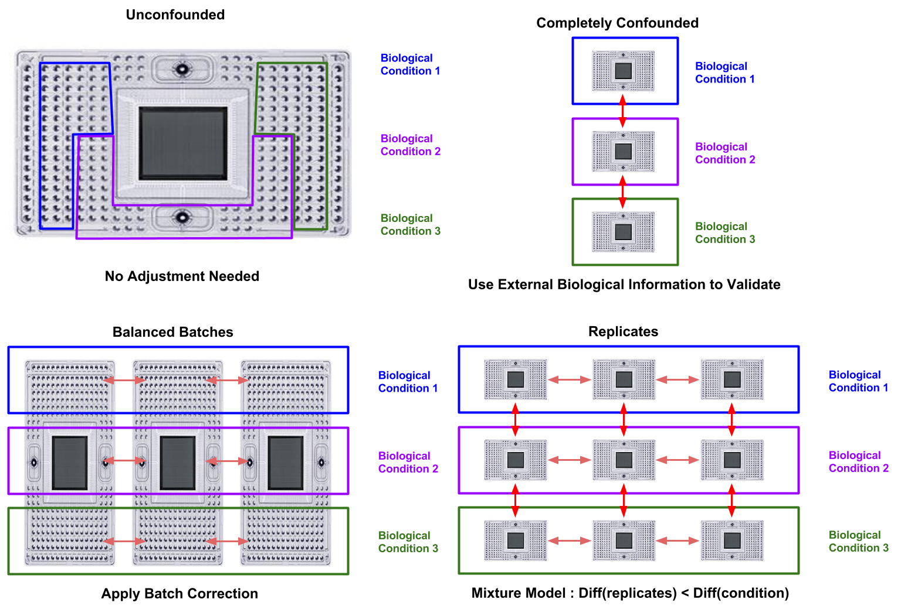

# "理想"scRANA-seq流程 {#Ideal-scRNA-seq-pipeline}

```{r, echo=FALSE}
library(knitr)
opts_chunk$set(fig.align = "center", echo=FALSE)
```

## 实验设计 {#Experimental-Design}

* 避免混淆生物效应和批次效应(Figure \@ref(fig:pipeline-batches))
    * 如果可以，同一实验多个条件
    * 每个条件多次重复，如果可以，不同条件重复一起执行
    * 统计不能完全校正完全混乱的实验!

* 唯一分子标识符(UMI)
    * 大大降低数据中的噪音
    * 可能会降低基因检测率
    * 丢失剪切信息
    * 使用更长的UMIs(~10bp)
    * 使用[UMI-tools](https://github.com/CGATOxford/UMI-tools)校正测序误差

* Spike-ins
    * 有助于质量控制
    * 可能对标准化read counts很有用
    * 可用于近似细胞大小/ RNA含量（如果与生物学问题相关）
    * 通常表现出比内源基因更高的噪音（移液错误，混合物质量）
    * 需要更深的测序才能获得每个细胞足够的内源性reads

* 细胞数量 vs Read深度
    * 基因检测平台每个细胞1百万reads数
    * 检测转录因子（调节网络）需要测序深度神和最敏感的protocol（比如Fluidigm C1）
    * 细胞聚类和细胞类型鉴定受益于大量细胞，并且不需要高测序深度（每个细胞约100,000个reads）

```{r pipeline-batches, out.width = '90%', fig.cap="Appropriate approaches to batch effects in scRNASeq. Red arrows indicate batch effects which are (pale) or are not (vibrant) correctable through batch-correction."}

```
## reads处理 {#Processing-Reads}
* 质控 & Trimming
    * [FASTQC](http://www.bioinformatics.babraham.ac.uk/projects/fastqc/), [cutadapt](http://cutadapt.readthedocs.io/en/stable/index.html)
    
* 比对
    * 小数据集或UMI数据集: 使用 [STAR](https://github.com/alexdobin/STAR)比对到基因组/转录组
    * 大数据集:使用 [Salmon](http://salmon.readthedocs.io/en/latest/salmon.html)或 [kallisto](https://pachterlab.github.io/kallisto/about)进行pseudo-alignment
  
* 定量
    * 小数据集，不是UMIs : [featureCounts](http://subread.sourceforge.net/)
    * 大数据集，不是UMIs: [Salmon](http://salmon.readthedocs.io/en/latest/salmon.html), [kallisto](https://pachterlab.github.io/kallisto/about)
    * UMI数据集: [UMI-tools](https://github.com/CGATOxford/UMI-tools) + [featureCounts](http://subread.sourceforge.net/)

## 准备表达矩阵 {#Preparing-Expression-Matrix}

* 细胞质控
    * [scater](http://bioconductor.org/packages/scater)
    * 考虑：mtRNA，rRNA，spike-ins（如果有的话），每个细胞检测到的基因数，每个细胞的总reads/分子数

* 文库大小标准化
    * [scran](http://bioconductor.org/packages/scran)

* 校正批次效应
    * 重复/混淆因子 [RUVs](http://bioconductor.org/packages/RUVSeq)
    * 未知或不平衡的生物群 [mnnCorrect](https://bioconductor.org/packages/release/bioc/html/scran.html)
    * 平衡设计 [ComBat](https://bioconductor.org/packages/release/bioc/html/sva.html)

## 生物学解释 {#Biological-Interpretation}

* 特征选择
    * [M3Drop](http://bioconductor.org/packages/M3Drop)

* 聚类和识别marker基因
    * $\le 5000$ 细胞 : [SC3](http://bioconductor.org/packages/SC3)
    * $>5000$ 细胞: [Seurat](http://satijalab.org/seurat/)

* Pseudotime
    * 不同时间点: [TSCAN](http://bioconductor.org/packages/TSCAN)
    * 小数据集/未知数量的分支: [Monocle2](https://bioconductor.org/packages/release/bioc/html/monocle.html)
    * 大型连续数据集: [destiny](http://bioconductor.org/packages/destiny)

* 差异表达
    * 少量细胞和少数组 : [scde](http://hms-dbmi.github.io/scde/)
    * 批次效应的重复实验 : 混合/线性模型
    * 平衡的批次: [edgeR](https://bioconductor.org/packages/release/bioc/html/edgeR.html) 或 [MAST](https://bioconductor.org/packages/release/bioc/html/MAST.html)
    * 大数据集: Kruskal-Wallis检验 (一次所有group), or Wilcox-test (一次比较2个group).
