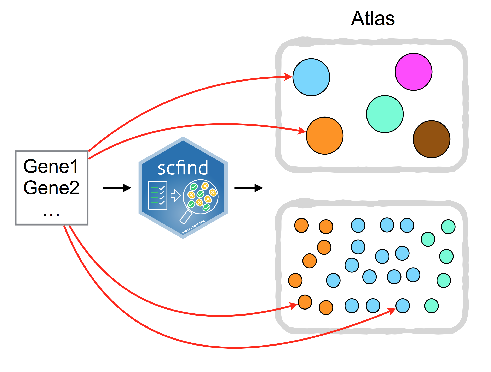

## Search scRNA-Seq data

```{r echo=FALSE, message=FALSE, warning=FALSE, paged.print=FALSE}
library(knitr)
opts_chunk$set(fig.align="center")
```

```{r, echo=TRUE, message=FALSE, warning=FALSE}
library(scfind)
library(SingleCellExperiment)
library(plotly)
set.seed(1234567)
```

### About 

`scfind` is a tool that allows one to search single cell RNA-Seq collections (Atlas) using lists of genes, e.g. searching for cells and cell-types where a specific set of genes are expressed. `scfind` is a [Github package](https://github.com/hemberg-lab/scfind). Cloud implementation of `scfind` with a large collection of datasets is available on our [website](https://scfind.sanger.ac.uk/).

```{r, echo = FALSE, out.width = '80%', fig.cap="scfind can be used to search large collection of scRNA-seq data by a list of gene IDs."}

```

### Dataset

We will run `scfind` on the Tabula Muris 10X dataset. `scfind` also operates on `SingleCellExperiment` class:
```{r, message=FALSE, warning=FALSE}
tm10x_heart <- readRDS("data/sce/Heart_10X.rds")
tm10x_heart
colData(tm10x_heart)
```

### Gene Index

Now we need to create a gene index using our dataset:
```{r}
heart_index <- buildCellTypeIndex(
  sce = tm10x_heart,
  assay.name = "counts",
  cell.type.label = "cell_type1",
  dataset.name = "Heart"
)
```

`scfind` adopts a two-step compression strategy which allows efficient compression of large cell-by-gene matrix and allows fast retrieval of data by gene query. We estimated that one can achieve 2 orders of magnitude compression with this method.

The input matrix for indexing is the raw count matrix of the `SingleCellExperiment` class. By default the `cell_type1` column of the `colData` slot of the `SingleCellExperiment` object is used to define cell types, however it can also be defined manually using the `cell.type.label` argument of the `buildCellTypeIndex`. For dataset with more than one tissue, you can also merge all tissues together to create a super index using the function `mergeDataset`.

The index can be saved in .rds format using `saveObject` function and loaded using `loadObject` function for future use.

```{r}
tm10x_thymus <- readRDS("data/sce/Thymus_10X.rds")
thymus_index <- buildCellTypeIndex(
  sce = tm10x_thymus, 
  assay.name = "counts", 
  cell.type.label = "cell_type1", 
  dataset.name = "Thymus"
)
scfind_index <- mergeDataset(heart_index, thymus_index)

scfind_index@datasets
cellTypeNames(scfind_index)
sample(scfindGenes(scfind_index),20)
```


To quickly and easily find the enriched cell type using an interactive Shiny application use the following method:
```{r eval=FALSE, message=FALSE, warning=FALSE, include=FALSE}
scfindShiny(scfind_index)
```


### Marker genes

Now let's find the marker genes for Thymus T cell in the datasets
```{r}
# Showing the top 5 marker genes for each cell type and sort by F1 score.
t_cell_markers <- cellTypeMarkers(scfind_index, cell.types = "Thymus.T cell", top.k = 5, sort.field = "f1") 

t_cell_markers
```

Next, you can evaluate the markers of Thymus T cell in Thymus stromal cell
```{r}
evaluateMarkers(
  scfind_index, 
  gene.list = as.character(t_cell_markers$genes), 
  cell.types = "Thymus.stromal cell", 
  sort.field = "f1"
)
```

```{r}
# By default, the marker evaluation takes all cell types in the dataset as background cell type, but you can use the argument `background.cell.types` to fine tune the evaluation

background <- cellTypeNames(scfind_index, datasets = "Thymus")
background

evaluateMarkers(
  scfind_index, 
  gene.list = as.character(t_cell_markers$genes), 
  cell.types = "Thymus.stromal cell", 
  sort.field = "f1", 
  background.cell.types = background
)
```


### Search cells by a gene list

`scfind` can instantly identify the cell type that best represents the genes of interest from large single cell dataset. We will use the marker genes identified in an original publication [Yanbin et al. 2015](https://www.nature.com/articles/cr201599). Cardiomyocyte-specific markers used in immunostaining as shown in Figure 1. 
```{r}
cardiomyocytes <- c("Mef2c", "Gata4", "Nkx2.5", "Myh6", "tnnt2", "tnni3", "CDH2", "Cx43", "GJA1") 
result <- markerGenes(
  scfind_index, 
  gene.list = cardiomyocytes
)
result
```


To allow search of enriched cell type from a long list of gene query, `scfind` features a query optimization routin. First, the function `markerGenes` will counter suggest subqueries that with the highest support in the dataset. The TF-IDF score for each gene set allows user to identify the best subquery for finding the most relevant cell type. 

```{r}
best_subquery <- result[which.max(result$tfidf),] # get the best subquery by ranking TF-IDF score
best_subquery <- strsplit(as.character(best_subquery$Query), ",")[[1]] # obtain gene list
hyperQueryCellTypes(
  scfind_index,
  gene.list = best_subquery
)
```

`hyperQueryCellTypes` function returns a list of p-values corresponding to all cell types in a given dataset. It also outputs a list of cells in which genes from the given gene list are co-expressed. 


__Exercise 1__

Find the marker genes of all cell types in the Heart dataset

```{r, echo=FALSE}
heart_cell_types <- cellTypeNames(scfind_index, "Heart")

for(cell_type_name in heart_cell_types)
{
  result <- cellTypeMarkers(
    scfind_index, 
    cell.types = cell_type_name, 
    sort.field = "f1", 
    background = heart_cell_types) 
  print(result)
}
```

```{r}
cardiac_contractility <- c("Ace2","Fkbp1b","Gh","Cacna1c","Cd59b","Ppp1r1a","Tnnt2","Nos1","Agtr1a","Camk2g","Grk2","Ins2","Dnah8","Igf1","Nos3","Nppa","Nppb","Il6","Myh6","Ren2","Tnni3","Apln","Kcnmb1","Pik3cg","Prkca","Aplnr","Slc8a1","Ace","Akt1","Edn1","Kcnmb2","Nos2","Tnf","Myh14","Adrb2","Agt","Adrb1","Atp2a2","Ryr2","Pln")
```

__Exercise 2__

Input the gene list relevant to "cardiac contractility" and find the best gene set with the highest support. Identify the enriched cell type for this query. 

```{r, echo=FALSE}
result <- markerGenes(scfind_index, cardiac_contractility)
best_sub_query <- as.character(result[which.max(result$tfidf), c("Query")])
best_sub_query <- strsplit(best_sub_query, ",")[[1]]
hyperQueryCellTypes(scfind_index, best_sub_query)
```

### In-silico gating

Using the `findCellTypes` function, you can perform in-silico gating to identify cell type subsets as if the way cell sorting works.
To do so, you can add logical operators including "-" and "*" for "no" and "intermediate" expression, respectively in front of the gene name. Here, we use operators to subset T cell of the Thymus dataset into effector T regulatory cells and effector memory T cell.

```{r}
effector_t_reg_cells <- c("*Ptprc", "-Il7r", "Ctla4", "-Il7r")
effector_memory_t_cells <- c("-Il2ra", "*Ptprc", "Il7r")

subset_treg <- findCellTypes(scfind_index, effector_t_reg_cells, "Thymus") 
subset_tmem <- findCellTypes(scfind_index, effector_memory_t_cells, "Thymus")

subset_treg
subset_tmem
```
Let's use the TSNE plot information from the `SingleCellExperiment` of Thymus to illustrate the gating result
```{r}
map <- data.frame(
  tm10x_thymus@reducedDims[['TSNE']], 
  cell_type = as.character(colData(tm10x_thymus)$cell_type1), 
  stringsAsFactors = F
  )

map <- subset(map, cell_type == "T cell") 

plot_ly(map, x = ~X1 , y = ~X2, type="scatter")

map$cell_type[subset_treg$`Thymus.T cell`] <- "Effector T Regulatory Cell"
map$cell_type[subset_tmem$`Thymus.T cell`] <- "Effector Memory T Cell"

plot_ly(map, x = ~X1 , y = ~X2, type="scatter", color = ~cell_type)
```


### sessionInfo()

```{r}
sessionInfo()
```
